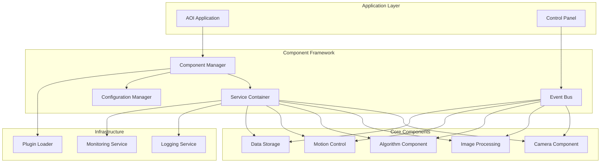
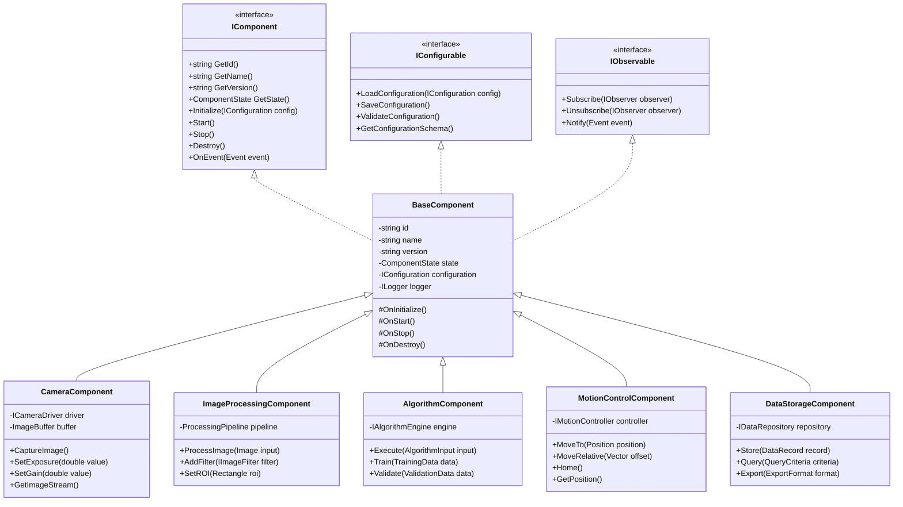
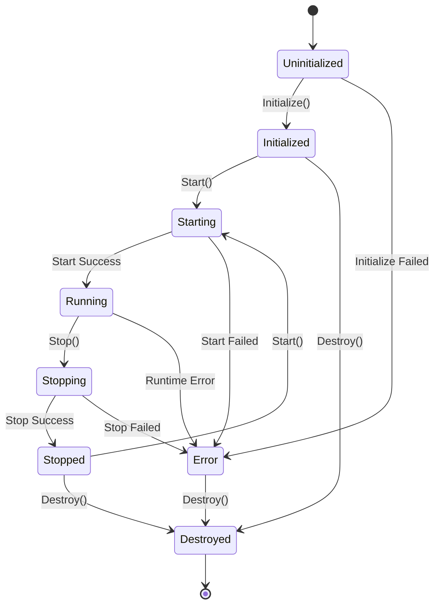

# 工業自動化AOI設備元件架構與介面標準化規範

## 1. 執行摘要

本文檔定義了工業自動化AOI（Automated Optical Inspection）設備的元件架構標準，提供完整的介面規範、生命週期管理、通訊協定和實作指南。

## 2. 系統架構概覽

### 2.1 整體架構圖



### 2.2 元件層級架構



## 3. 基礎元件介面設計

### 3.1 IComponent 基礎介面

```cpp
// IComponent.h
#pragma once
#include <string>
#include <memory>
#include <functional>
#include "ComponentTypes.h"
#include "IConfiguration.h"

namespace AOI::Components {

enum class ComponentState {
    Uninitialized,
    Initialized,
    Starting,
    Running,
    Stopping,
    Stopped,
    Error,
    Destroyed
};

enum class ComponentType {
    Camera,
    ImageProcessing,
    Algorithm,
    MotionControl,
    DataStorage,
    Custom
};

class IComponent {
public:
    virtual ~IComponent() = default;
    
    // 基本屬性
    virtual std::string GetId() const = 0;
    virtual std::string GetName() const = 0;
    virtual std::string GetVersion() const = 0;
    virtual ComponentType GetType() const = 0;
    virtual ComponentState GetState() const = 0;
    
    // 生命週期管理
    virtual bool Initialize(std::shared_ptr<IConfiguration> config) = 0;
    virtual bool Start() = 0;
    virtual bool Stop() = 0;
    virtual void Destroy() = 0;
    
    // 健康檢查
    virtual bool IsHealthy() const = 0;
    virtual HealthStatus GetHealthStatus() const = 0;
    
    // 事件處理
    virtual void OnEvent(const ComponentEvent& event) = 0;
    
    // 相依性管理
    virtual std::vector<std::string> GetDependencies() const = 0;
    virtual void InjectDependency(const std::string& name, 
                                  std::shared_ptr<IComponent> component) = 0;
};

} // namespace AOI::Components
```

### 3.2 BaseComponent 基類實作

```cpp
// BaseComponent.h
#pragma once
#include "IComponent.h"
#include "IConfigurable.h"
#include "IObservable.h"
#include "ILogger.h"
#include <mutex>
#include <condition_variable>

namespace AOI::Components {

class BaseComponent : public IComponent, 
                     public IConfigurable,
                     public IObservable {
protected:
    std::string id_;
    std::string name_;
    std::string version_;
    ComponentType type_;
    ComponentState state_;
    std::shared_ptr<IConfiguration> configuration_;
    std::shared_ptr<ILogger> logger_;
    std::map<std::string, std::shared_ptr<IComponent>> dependencies_;
    mutable std::mutex state_mutex_;
    std::condition_variable state_cv_;
    
    // 狀態轉換保護
    bool TransitionTo(ComponentState newState);
    
    // 虛擬方法供子類覆寫
    virtual bool OnInitialize() = 0;
    virtual bool OnStart() = 0;
    virtual bool OnStop() = 0;
    virtual void OnDestroy() = 0;
    
public:
    BaseComponent(const std::string& id, 
                 const std::string& name,
                 const std::string& version,
                 ComponentType type);
    
    virtual ~BaseComponent();
    
    // IComponent 介面實作
    std::string GetId() const override { return id_; }
    std::string GetName() const override { return name_; }
    std::string GetVersion() const override { return version_; }
    ComponentType GetType() const override { return type_; }
    ComponentState GetState() const override;
    
    bool Initialize(std::shared_ptr<IConfiguration> config) override;
    bool Start() override;
    bool Stop() override;
    void Destroy() override;
    
    bool IsHealthy() const override;
    HealthStatus GetHealthStatus() const override;
    
    void OnEvent(const ComponentEvent& event) override;
    
    std::vector<std::string> GetDependencies() const override;
    void InjectDependency(const std::string& name, 
                         std::shared_ptr<IComponent> component) override;
    
    // IConfigurable 介面
    bool LoadConfiguration(std::shared_ptr<IConfiguration> config) override;
    bool SaveConfiguration() override;
    bool ValidateConfiguration() const override;
    ConfigurationSchema GetConfigurationSchema() const override;
    
    // IObservable 介面
    void Subscribe(std::shared_ptr<IObserver> observer) override;
    void Unsubscribe(std::shared_ptr<IObserver> observer) override;
    void Notify(const Event& event) override;
    
protected:
    // 輔助方法
    void LogInfo(const std::string& message);
    void LogWarning(const std::string& message);
    void LogError(const std::string& message);
    void EmitEvent(const std::string& eventType, const EventData& data);
};

} // namespace AOI::Components
```

### 3.3 BaseComponent 實作

```cpp
// BaseComponent.cpp
#include "BaseComponent.h"
#include <chrono>

namespace AOI::Components {

BaseComponent::BaseComponent(const std::string& id,
                           const std::string& name,
                           const std::string& version,
                           ComponentType type)
    : id_(id), name_(name), version_(version), type_(type),
      state_(ComponentState::Uninitialized) {
}

BaseComponent::~BaseComponent() {
    if (state_ != ComponentState::Destroyed) {
        Destroy();
    }
}

bool BaseComponent::Initialize(std::shared_ptr<IConfiguration> config) {
    std::lock_guard<std::mutex> lock(state_mutex_);
    
    if (state_ != ComponentState::Uninitialized) {
        LogError("Cannot initialize component in state: " + 
                std::to_string(static_cast<int>(state_)));
        return false;
    }
    
    try {
        configuration_ = config;
        
        // 載入配置
        if (!LoadConfiguration(config)) {
            LogError("Failed to load configuration");
            state_ = ComponentState::Error;
            return false;
        }
        
        // 驗證配置
        if (!ValidateConfiguration()) {
            LogError("Configuration validation failed");
            state_ = ComponentState::Error;
            return false;
        }
        
        // 呼叫子類初始化
        if (!OnInitialize()) {
            LogError("Component initialization failed");
            state_ = ComponentState::Error;
            return false;
        }
        
        state_ = ComponentState::Initialized;
        LogInfo("Component initialized successfully");
        
        EmitEvent("ComponentInitialized", {{"id", id_}});
        return true;
        
    } catch (const std::exception& e) {
        LogError("Exception during initialization: " + std::string(e.what()));
        state_ = ComponentState::Error;
        return false;
    }
}

bool BaseComponent::Start() {
    std::unique_lock<std::mutex> lock(state_mutex_);
    
    if (state_ != ComponentState::Initialized && 
        state_ != ComponentState::Stopped) {
        LogError("Cannot start component in state: " + 
                std::to_string(static_cast<int>(state_)));
        return false;
    }
    
    try {
        state_ = ComponentState::Starting;
        lock.unlock();
        
        EmitEvent("ComponentStarting", {{"id", id_}});
        
        if (!OnStart()) {
            lock.lock();
            state_ = ComponentState::Error;
            LogError("Component start failed");
            return false;
        }
        
        lock.lock();
        state_ = ComponentState::Running;
        state_cv_.notify_all();
        
        LogInfo("Component started successfully");
        EmitEvent("ComponentStarted", {{"id", id_}});
        return true;
        
    } catch (const std::exception& e) {
        lock.lock();
        state_ = ComponentState::Error;
        LogError("Exception during start: " + std::string(e.what()));
        return false;
    }
}

bool BaseComponent::Stop() {
    std::unique_lock<std::mutex> lock(state_mutex_);
    
    if (state_ != ComponentState::Running) {
        LogWarning("Component not running, cannot stop");
        return false;
    }
    
    try {
        state_ = ComponentState::Stopping;
        lock.unlock();
        
        EmitEvent("ComponentStopping", {{"id", id_}});
        
        if (!OnStop()) {
            lock.lock();
            state_ = ComponentState::Error;
            LogError("Component stop failed");
            return false;
        }
        
        lock.lock();
        state_ = ComponentState::Stopped;
        state_cv_.notify_all();
        
        LogInfo("Component stopped successfully");
        EmitEvent("ComponentStopped", {{"id", id_}});
        return true;
        
    } catch (const std::exception& e) {
        lock.lock();
        state_ = ComponentState::Error;
        LogError("Exception during stop: " + std::string(e.what()));
        return false;
    }
}

void BaseComponent::Destroy() {
    std::lock_guard<std::mutex> lock(state_mutex_);
    
    if (state_ == ComponentState::Running) {
        Stop();
    }
    
    try {
        OnDestroy();
        state_ = ComponentState::Destroyed;
        EmitEvent("ComponentDestroyed", {{"id", id_}});
        LogInfo("Component destroyed");
    } catch (const std::exception& e) {
        LogError("Exception during destroy: " + std::string(e.what()));
    }
}

ComponentState BaseComponent::GetState() const {
    std::lock_guard<std::mutex> lock(state_mutex_);
    return state_;
}

bool BaseComponent::IsHealthy() const {
    auto state = GetState();
    return state == ComponentState::Running || 
           state == ComponentState::Initialized ||
           state == ComponentState::Stopped;
}

void BaseComponent::InjectDependency(const std::string& name,
                                    std::shared_ptr<IComponent> component) {
    dependencies_[name] = component;
    LogInfo("Dependency injected: " + name);
}

} // namespace AOI::Components
```

## 4. 元件生命週期管理

### 4.1 生命週期狀態機



### 4.2 Component Manager 實作

```cpp
// ComponentManager.h
#pragma once
#include <memory>
#include <unordered_map>
#include <vector>
#include "IComponent.h"
#include "IServiceLocator.h"

namespace AOI::Components {

class ComponentManager : public IServiceLocator {
private:
    std::unordered_map<std::string, std::shared_ptr<IComponent>> components_;
    std::unordered_map<std::string, std::vector<std::string>> dependencies_;
    std::shared_ptr<IEventBus> eventBus_;
    std::shared_ptr<ILogger> logger_;
    mutable std::mutex manager_mutex_;
    
    // 依賴解析
    bool ResolveDependencies(const std::string& componentId);
    std::vector<std::string> TopologicalSort();
    
public:
    ComponentManager(std::shared_ptr<IEventBus> eventBus,
                    std::shared_ptr<ILogger> logger);
    
    // 元件註冊與管理
    bool RegisterComponent(std::shared_ptr<IComponent> component);
    bool UnregisterComponent(const std::string& id);
    std::shared_ptr<IComponent> GetComponent(const std::string& id) const;
    
    // 生命週期管理
    bool InitializeAll();
    bool StartAll();
    bool StopAll();
    void DestroyAll();
    
    // 依賴管理
    bool AddDependency(const std::string& componentId,
                      const std::string& dependencyId);
    
    // 服務定位
    template<typename T>
    std::shared_ptr<T> GetService() const;
    
    // 健康檢查
    std::map<std::string, HealthStatus> GetHealthStatuses() const;
};

// ComponentManager.cpp
bool ComponentManager::InitializeAll() {
    std::lock_guard<std::mutex> lock(manager_mutex_);
    
    // 拓撲排序以確保依賴順序
    auto sortedIds = TopologicalSort();
    
    for (const auto& id : sortedIds) {
        auto component = components_[id];
        
        // 注入依賴
        if (!ResolveDependencies(id)) {
            logger_->Error("Failed to resolve dependencies for: " + id);
            return false;
        }
        
        // 初始化元件
        auto config = LoadConfiguration(id);
        if (!component->Initialize(config)) {
            logger_->Error("Failed to initialize component: " + id);
            return false;
        }
    }
    
    logger_->Info("All components initialized successfully");
    return true;
}

bool ComponentManager::StartAll() {
    std::lock_guard<std::mutex> lock(manager_mutex_);
    
    auto sortedIds = TopologicalSort();
    std::vector<std::string> startedComponents;
    
    for (const auto& id : sortedIds) {
        auto component = components_[id];
        
        if (!component->Start()) {
            logger_->Error("Failed to start component: " + id);
            
            // 回滾已啟動的元件
            for (auto it = startedComponents.rbegin(); 
                 it != startedComponents.rend(); ++it) {
                components_[*it]->Stop();
            }
            
            return false;
        }
        
        startedComponents.push_back(id);
    }
    
    logger_->Info("All components started successfully");
    return true;
}

bool ComponentManager::StopAll() {
    std::lock_guard<std::mutex> lock(manager_mutex_);
    
    // 反向停止元件
    auto sortedIds = TopologicalSort();
    std::reverse(sortedIds.begin(), sortedIds.end());
    
    bool allStopped = true;
    
    for (const auto& id : sortedIds) {
        auto component = components_[id];
        
        if (component->GetState() == ComponentState::Running) {
            if (!component->Stop()) {
                logger_->Error("Failed to stop component: " + id);
                allStopped = false;
            }
        }
    }
    
    return allStopped;
}

} // namespace AOI::Components
```

## 5. Signal/Slot 通訊介面標準化

### 5.1 事件系統設計

```cpp
// EventSystem.h
#pragma once
#include <functional>
#include <any>
#include <vector>
#include <unordered_map>

namespace AOI::Events {

// 事件資料基類
class EventData {
public:
    virtual ~EventData() = default;
    
    template<typename T>
    T GetValue(const std::string& key) const {
        auto it = data_.find(key);
        if (it != data_.end()) {
            return std::any_cast<T>(it->second);
        }
        throw std::runtime_error("Key not found: " + key);
    }
    
    void SetValue(const std::string& key, std::any value) {
        data_[key] = value;
    }
    
private:
    std::unordered_map<std::string, std::any> data_;
};

// 事件類
class Event {
public:
    Event(const std::string& type, 
          const std::string& source,
          std::shared_ptr<EventData> data = nullptr)
        : type_(type), source_(source), data_(data),
          timestamp_(std::chrono::steady_clock::now()) {}
    
    std::string GetType() const { return type_; }
    std::string GetSource() const { return source_; }
    std::shared_ptr<EventData> GetData() const { return data_; }
    auto GetTimestamp() const { return timestamp_; }
    
private:
    std::string type_;
    std::string source_;
    std::shared_ptr<EventData> data_;
    std::chrono::steady_clock::time_point timestamp_;
};

// Signal 類
template<typename... Args>
class Signal {
public:
    using Slot = std::function<void(Args...)>;
    using SlotId = size_t;
    
    SlotId Connect(Slot slot) {
        std::lock_guard<std::mutex> lock(mutex_);
        SlotId id = next_id_++;
        slots_[id] = slot;
        return id;
    }
    
    void Disconnect(SlotId id) {
        std::lock_guard<std::mutex> lock(mutex_);
        slots_.erase(id);
    }
    
    void Emit(Args... args) {
        std::lock_guard<std::mutex> lock(mutex_);
        for (const auto& [id, slot] : slots_) {
            slot(args...);
        }
    }
    
    void EmitAsync(Args... args) {
        auto slots_copy = [this]() {
            std::lock_guard<std::mutex> lock(mutex_);
            return slots_;
        }();
        
        std::async(std::launch::async, [slots_copy, args...]() {
            for (const auto& [id, slot] : slots_copy) {
                slot(args...);
            }
        });
    }
    
private:
    std::unordered_map<SlotId, Slot> slots_;
    SlotId next_id_ = 0;
    mutable std::mutex mutex_;
};

// Event Bus 實作
class EventBus {
public:
    using EventHandler = std::function<void(const Event&)>;
    using HandlerId = size_t;
    
    HandlerId Subscribe(const std::string& eventType, 
                       EventHandler handler) {
        std::lock_guard<std::mutex> lock(mutex_);
        HandlerId id = next_id_++;
        handlers_[eventType].emplace_back(id, handler);
        return id;
    }
    
    void Unsubscribe(const std::string& eventType, HandlerId id) {
        std::lock_guard<std::mutex> lock(mutex_);
        auto& handlers = handlers_[eventType];
        handlers.erase(
            std::remove_if(handlers.begin(), handlers.end(),
                          [id](const auto& pair) { 
                              return pair.first == id; 
                          }),
            handlers.end()
        );
    }
    
    void Publish(const Event& event) {
        std::vector<EventHandler> handlers_to_call;
        
        {
            std::lock_guard<std::mutex> lock(mutex_);
            auto it = handlers_.find(event.GetType());
            if (it != handlers_.end()) {
                for (const auto& [id, handler] : it->second) {
                    handlers_to_call.push_back(handler);
                }
            }
        }
        
        for (const auto& handler : handlers_to_call) {
            try {
                handler(event);
            } catch (const std::exception& e) {
                // Log error but don't propagate
            }
        }
    }
    
    void PublishAsync(const Event& event) {
        std::async(std::launch::async, 
                  [this, event]() { Publish(event); });
    }
    
private:
    std::unordered_map<std::string, 
                      std::vector<std::pair<HandlerId, EventHandler>>> handlers_;
    HandlerId next_id_ = 0;
    mutable std::mutex mutex_;
};

} // namespace AOI::Events
```

### 5.2 元件間通訊範例

```cpp
// ComponentCommunication.h
#pragma once
#include "EventSystem.h"

namespace AOI::Components {

// 定義標準事件類型
namespace EventTypes {
    constexpr const char* ImageCaptured = "ImageCaptured";
    constexpr const char* ImageProcessed = "ImageProcessed";
    constexpr const char* DefectDetected = "DefectDetected";
    constexpr const char* MotionCompleted = "MotionCompleted";
    constexpr const char* DataStored = "DataStored";
}

// 影像擷取事件資料
class ImageCapturedData : public EventData {
public:
    ImageCapturedData(const std::string& imageId,
                     const cv::Mat& image,
                     double timestamp)
        : imageId_(imageId), image_(image), timestamp_(timestamp) {
        SetValue("imageId", imageId);
        SetValue("timestamp", timestamp);
    }
    
    std::string GetImageId() const { return imageId_; }
    cv::Mat GetImage() const { return image_; }
    double GetTimestamp() const { return timestamp_; }
    
private:
    std::string imageId_;
    cv::Mat image_;
    double timestamp_;
};

// 缺陷檢測事件資料
class DefectDetectedData : public EventData {
public:
    struct Defect {
        std::string type;
        cv::Rect boundingBox;
        double confidence;
        std::map<std::string, std::any> attributes;
    };
    
    DefectDetectedData(const std::string& imageId,
                      const std::vector<Defect>& defects)
        : imageId_(imageId), defects_(defects) {
        SetValue("imageId", imageId);
        SetValue("defectCount", static_cast<int>(defects.size()));
    }
    
    std::string GetImageId() const { return imageId_; }
    std::vector<Defect> GetDefects() const { return defects_; }
    
private:
    std::string imageId_;
    std::vector<Defect> defects_;
};

// 元件通訊介面
class IComponentCommunicator {
public:
    virtual ~IComponentCommunicator() = default;
    
    // 發送事件
    virtual void SendEvent(const std::string& eventType,
                          std::shared_ptr<EventData> data) = 0;
    
    // 訂閱事件
    virtual void SubscribeToEvent(const std::string& eventType,
                                  std::function<void(const Event&)> handler) = 0;
    
    // 請求-回應模式
    virtual std::future<std::shared_ptr<EventData>> 
        SendRequest(const std::string& targetComponent,
                   const std::string& requestType,
                   std::shared_ptr<EventData> requestData) = 0;
    
    // 註冊請求處理器
    virtual void RegisterRequestHandler(
        const std::string& requestType,
        std::function<std::shared_ptr<EventData>(
            const std::shared_ptr<EventData>&)> handler) = 0;
};

} // namespace AOI::Components
```

## 6. 元件配置管理系統

### 6.1 配置管理介面

```cpp
// ConfigurationSystem.h
#pragma once
#include <json/json.h>
#include <yaml-cpp/yaml.h>

namespace AOI::Configuration {

// 配置架構定義
class ConfigurationSchema {
public:
    struct Field {
        std::string name;
        std::string type;
        std::string description;
        bool required;
        std::any defaultValue;
        std::function<bool(const std::any&)> validator;
    };
    
    void AddField(const Field& field) {
        fields_[field.name] = field;
    }
    
    bool Validate(const Json::Value& config) const;
    Json::Value GenerateTemplate() const;
    
private:
    std::unordered_map<std::string, Field> fields_;
};

// 配置介面
class IConfiguration {
public:
    virtual ~IConfiguration() = default;
    
    template<typename T>
    T Get(const std::string& key) const {
        return GetValue<T>(key);
    }
    
    template<typename T>
    T Get(const std::string& key, const T& defaultValue) const {
        try {
            return GetValue<T>(key);
        } catch (...) {
            return defaultValue;
        }
    }
    
    virtual bool Has(const std::string& key) const = 0;
    virtual void Set(const std::string& key, const std::any& value) = 0;
    
    virtual Json::Value ToJson() const = 0;
    virtual void FromJson(const Json::Value& json) = 0;
    
    virtual bool LoadFromFile(const std::string& filepath) = 0;
    virtual bool SaveToFile(const std::string& filepath) const = 0;
    
protected:
    template<typename T>
    virtual T GetValue(const std::string& key) const = 0;
};

// 配置實作
class Configuration : public IConfiguration {
private:
    Json::Value data_;
    mutable std::mutex mutex_;
    
public:
    Configuration() = default;
    explicit Configuration(const Json::Value& data) : data_(data) {}
    
    bool Has(const std::string& key) const override {
        std::lock_guard<std::mutex> lock(mutex_);
        return data_.isMember(key);
    }
    
    void Set(const std::string& key, const std::any& value) override {
        std::lock_guard<std::mutex> lock(mutex_);
        // Convert std::any to Json::Value
        data_[key] = ConvertToJson(value);
    }
    
    Json::Value ToJson() const override {
        std::lock_guard<std::mutex> lock(mutex_);
        return data_;
    }
    
    void FromJson(const Json::Value& json) override {
        std::lock_guard<std::mutex> lock(mutex_);
        data_ = json;
    }
    
    bool LoadFromFile(const std::string& filepath) override;
    bool SaveToFile(const std::string& filepath) const override;
    
protected:
    template<typename T>
    T GetValue(const std::string& key) const override {
        std::lock_guard<std::mutex> lock(mutex_);
        if (!data_.isMember(key)) {
            throw std::runtime_error("Configuration key not found: " + key);
        }
        return ConvertFromJson<T>(data_[key]);
    }
    
private:
    Json::Value ConvertToJson(const std::any& value);
    
    template<typename T>
    T ConvertFromJson(const Json::Value& json);
};

// 配置管理器
class ConfigurationManager {
private:
    std::unordered_map<std::string, std::shared_ptr<IConfiguration>> configs_;
    std::string configDirectory_;
    mutable std::mutex mutex_;
    
public:
    explicit ConfigurationManager(const std::string& configDir)
        : configDirectory_(configDir) {}
    
    // 載入元件配置
    std::shared_ptr<IConfiguration> LoadComponentConfig(
        const std::string& componentId);
    
    // 儲存元件配置
    bool SaveComponentConfig(const std::string& componentId,
                            std::shared_ptr<IConfiguration> config);
    
    // 配置版本管理
    bool CreateConfigBackup(const std::string& componentId);
    bool RestoreConfigBackup(const std::string& componentId,
                           const std::string& backupVersion);
    
    // 配置驗證
    bool ValidateConfig(const std::string& componentId,
                       const ConfigurationSchema& schema);
    
    // 配置熱更新
    void EnableHotReload(const std::string& componentId,
                        std::function<void(std::shared_ptr<IConfiguration>)> callback);
};

} // namespace AOI::Configuration
```

### 6.2 元件配置範例

```yaml
# camera_component.yaml
component:
  id: "camera_01"
  name: "Main Inspection Camera"
  version: "1.0.0"
  type: "Camera"

settings:
  driver:
    type: "GigE"
    vendor: "Basler"
    model: "acA2500-14gm"
  
  connection:
    ip_address: "192.168.1.100"
    port: 3956
    timeout: 5000
  
  acquisition:
    exposure_time: 1000  # microseconds
    gain: 1.0
    pixel_format: "Mono8"
    trigger_mode: "Software"
    
  buffer:
    count: 10
    mode: "Circular"
    
  calibration:
    file: "calibration/camera_01.xml"
    
dependencies:
  - "lighting_controller"
  - "trigger_manager"

monitoring:
  health_check_interval: 5000  # ms
  metrics:
    - "frame_rate"
    - "dropped_frames"
    - "temperature"
```

## 7. 元件依賴注入和服務定位模式

### 7.1 依賴注入容器

```cpp
// DependencyInjection.h
#pragma once
#include <typeindex>
#include <memory>
#include <functional>

namespace AOI::DI {

// 服務生命週期
enum class ServiceLifetime {
    Transient,  // 每次請求創建新實例
    Scoped,     // 每個作用域一個實例
    Singleton   // 全局單一實例
};

// 服務描述
class ServiceDescriptor {
public:
    std::type_index serviceType;
    std::type_index implementationType;
    ServiceLifetime lifetime;
    std::function<std::shared_ptr<void>(class IServiceProvider*)> factory;
    
    template<typename TService, typename TImplementation>
    static ServiceDescriptor Create(ServiceLifetime lifetime) {
        ServiceDescriptor descriptor;
        descriptor.serviceType = typeid(TService);
        descriptor.implementationType = typeid(TImplementation);
        descriptor.lifetime = lifetime;
        descriptor.factory = [](IServiceProvider* provider) {
            return std::static_pointer_cast<void>(
                std::make_shared<TImplementation>()
            );
        };
        return descriptor;
    }
};

// 服務提供者介面
class IServiceProvider {
public:
    virtual ~IServiceProvider() = default;
    
    template<typename T>
    std::shared_ptr<T> GetService() {
        auto service = GetServiceInternal(typeid(T));
        return std::static_pointer_cast<T>(service);
    }
    
    template<typename T>
    std::shared_ptr<T> GetRequiredService() {
        auto service = GetService<T>();
        if (!service) {
            throw std::runtime_error(
                "Required service not found: " + 
                std::string(typeid(T).name())
            );
        }
        return service;
    }
    
protected:
    virtual std::shared_ptr<void> GetServiceInternal(
        const std::type_index& type) = 0;
};

// 服務容器
class ServiceContainer : public IServiceProvider {
private:
    std::vector<ServiceDescriptor> descriptors_;
    std::unordered_map<std::type_index, std::shared_ptr<void>> singletons_;
    mutable std::mutex mutex_;
    
public:
    // 註冊服務
    template<typename TService, typename TImplementation>
    void AddTransient() {
        std::lock_guard<std::mutex> lock(mutex_);
        descriptors_.push_back(
            ServiceDescriptor::Create<TService, TImplementation>(
                ServiceLifetime::Transient)
        );
    }
    
    template<typename TService, typename TImplementation>
    void AddScoped() {
        std::lock_guard<std::mutex> lock(mutex_);
        descriptors_.push_back(
            ServiceDescriptor::Create<TService, TImplementation>(
                ServiceLifetime::Scoped)
        );
    }
    
    template<typename TService, typename TImplementation>
    void AddSingleton() {
        std::lock_guard<std::mutex> lock(mutex_);
        descriptors_.push_back(
            ServiceDescriptor::Create<TService, TImplementation>(
                ServiceLifetime::Singleton)
        );
    }
    
    // 註冊工廠方法
    template<typename TService>
    void AddFactory(
        std::function<std::shared_ptr<TService>(IServiceProvider*)> factory,
        ServiceLifetime lifetime = ServiceLifetime::Transient) {
        std::lock_guard<std::mutex> lock(mutex_);
        ServiceDescriptor descriptor;
        descriptor.serviceType = typeid(TService);
        descriptor.lifetime = lifetime;
        descriptor.factory = [factory](IServiceProvider* provider) {
            return std::static_pointer_cast<void>(factory(provider));
        };
        descriptors_.push_back(descriptor);
    }
    
    // 建立服務提供者
    std::shared_ptr<IServiceProvider> BuildServiceProvider();
    
protected:
    std::shared_ptr<void> GetServiceInternal(
        const std::type_index& type) override;
};

// 依賴注入屬性
template<typename T>
class Inject {
private:
    mutable std::shared_ptr<T> service_;
    IServiceProvider* provider_;
    
public:
    explicit Inject(IServiceProvider* provider = nullptr)
        : provider_(provider) {}
    
    T* operator->() const {
        if (!service_ && provider_) {
            service_ = provider_->GetRequiredService<T>();
        }
        return service_.get();
    }
    
    T& operator*() const {
        if (!service_ && provider_) {
            service_ = provider_->GetRequiredService<T>();
        }
        return *service_;
    }
    
    std::shared_ptr<T> Get() const {
        if (!service_ && provider_) {
            service_ = provider_->GetRequiredService<T>();
        }
        return service_;
    }
    
    void SetProvider(IServiceProvider* provider) {
        provider_ = provider;
        service_.reset();
    }
};

} // namespace AOI::DI
```

### 7.2 服務定位器模式

```cpp
// ServiceLocator.h
#pragma once

namespace AOI::Services {

class ServiceLocator {
private:
    static std::shared_ptr<IServiceProvider> provider_;
    static std::mutex mutex_;
    
public:
    static void SetServiceProvider(std::shared_ptr<IServiceProvider> provider) {
        std::lock_guard<std::mutex> lock(mutex_);
        provider_ = provider;
    }
    
    template<typename T>
    static std::shared_ptr<T> Get() {
        std::lock_guard<std::mutex> lock(mutex_);
        if (!provider_) {
            throw std::runtime_error("Service provider not set");
        }
        return provider_->GetService<T>();
    }
    
    template<typename T>
    static std::shared_ptr<T> GetRequired() {
        std::lock_guard<std::mutex> lock(mutex_);
        if (!provider_) {
            throw std::runtime_error("Service provider not set");
        }
        return provider_->GetRequiredService<T>();
    }
};

} // namespace AOI::Services
```

## 8. 插件化架構支援

### 8.1 插件介面定義

```cpp
// PluginSystem.h
#pragma once
#include <string>
#include <memory>
#include <vector>

namespace AOI::Plugins {

// 插件資訊
struct PluginInfo {
    std::string id;
    std::string name;
    std::string version;
    std::string author;
    std::string description;
    std::vector<std::string> dependencies;
    std::string minHostVersion;
    std::string maxHostVersion;
};

// 插件介面
class IPlugin {
public:
    virtual ~IPlugin() = default;
    
    virtual PluginInfo GetInfo() const = 0;
    virtual bool Initialize(std::shared_ptr<IServiceProvider> services) = 0;
    virtual void Activate() = 0;
    virtual void Deactivate() = 0;
    virtual void Unload() = 0;
    
    // 提供的服務
    virtual std::vector<std::type_index> GetProvidedServices() const = 0;
    virtual void RegisterServices(ServiceContainer& container) = 0;
};

// 插件載入器
class PluginLoader {
private:
    std::string pluginDirectory_;
    std::unordered_map<std::string, std::shared_ptr<IPlugin>> plugins_;
    std::unordered_map<std::string, void*> handles_;  // DLL handles
    std::shared_ptr<ILogger> logger_;
    
public:
    explicit PluginLoader(const std::string& pluginDir,
                         std::shared_ptr<ILogger> logger);
    ~PluginLoader();
    
    // 掃描並載入插件
    std::vector<PluginInfo> ScanPlugins();
    bool LoadPlugin(const std::string& pluginPath);
    bool UnloadPlugin(const std::string& pluginId);
    
    // 插件管理
    std::shared_ptr<IPlugin> GetPlugin(const std::string& pluginId);
    std::vector<std::shared_ptr<IPlugin>> GetAllPlugins();
    
    // 依賴解析
    bool ResolveDependencies();
    
private:
    // 動態庫載入
    void* LoadLibrary(const std::string& path);
    void UnloadLibrary(void* handle);
    
    // 符號解析
    template<typename T>
    T* GetSymbol(void* handle, const std::string& symbol);
};

// 插件工廠
using CreatePluginFunc = IPlugin* (*)();
using DestroyPluginFunc = void (*)(IPlugin*);

// 插件導出宏
#ifdef _WIN32
    #define PLUGIN_EXPORT extern "C" __declspec(dllexport)
#else
    #define PLUGIN_EXPORT extern "C" __attribute__((visibility("default")))
#endif

// 插件實作輔助宏
#define IMPLEMENT_PLUGIN(PluginClass) \
    PLUGIN_EXPORT IPlugin* CreatePlugin() { \
        return new PluginClass(); \
    } \
    PLUGIN_EXPORT void DestroyPlugin(IPlugin* plugin) { \
        delete plugin; \
    }

} // namespace AOI::Plugins
```

### 8.2 插件範例實作

```cpp
// CustomAlgorithmPlugin.cpp
#include "PluginSystem.h"
#include "BaseComponent.h"

namespace AOI::Plugins {

class CustomAlgorithmComponent : public BaseComponent {
private:
    // 自定義演算法實作
    
public:
    CustomAlgorithmComponent()
        : BaseComponent("custom_algo", "Custom Algorithm", 
                       "1.0.0", ComponentType::Algorithm) {}
    
    bool OnInitialize() override {
        // 初始化自定義演算法
        return true;
    }
    
    bool OnStart() override {
        // 啟動演算法處理
        return true;
    }
    
    bool OnStop() override {
        // 停止演算法處理
        return true;
    }
    
    void OnDestroy() override {
        // 清理資源
    }
};

class CustomAlgorithmPlugin : public IPlugin {
private:
    PluginInfo info_;
    std::shared_ptr<CustomAlgorithmComponent> component_;
    
public:
    CustomAlgorithmPlugin() {
        info_.id = "custom_algorithm_plugin";
        info_.name = "Custom Algorithm Plugin";
        info_.version = "1.0.0";
        info_.author = "AOI Team";
        info_.description = "Custom defect detection algorithm";
        info_.minHostVersion = "2.0.0";
    }
    
    PluginInfo GetInfo() const override {
        return info_;
    }
    
    bool Initialize(std::shared_ptr<IServiceProvider> services) override {
        component_ = std::make_shared<CustomAlgorithmComponent>();
        return true;
    }
    
    void Activate() override {
        // 啟用插件
    }
    
    void Deactivate() override {
        // 停用插件
    }
    
    void Unload() override {
        component_.reset();
    }
    
    std::vector<std::type_index> GetProvidedServices() const override {
        return { typeid(CustomAlgorithmComponent) };
    }
    
    void RegisterServices(ServiceContainer& container) override {
        container.AddSingleton<IComponent, CustomAlgorithmComponent>();
    }
};

// 導出插件
IMPLEMENT_PLUGIN(CustomAlgorithmPlugin)

} // namespace AOI::Plugins
```

## 9. 元件版本管理和相容性策略

### 9.1 版本管理系統

```cpp
// VersionManagement.h
#pragma once
#include <string>
#include <regex>

namespace AOI::Versioning {

// 語意化版本
class SemanticVersion {
private:
    int major_;
    int minor_;
    int patch_;
    std::string prerelease_;
    std::string build_;
    
public:
    SemanticVersion(int major = 0, int minor = 0, int patch = 0,
                   const std::string& prerelease = "",
                   const std::string& build = "")
        : major_(major), minor_(minor), patch_(patch),
          prerelease_(prerelease), build_(build) {}
    
    static SemanticVersion Parse(const std::string& version) {
        std::regex pattern(R"((\d+)\.(\d+)\.(\d+)(?:-([^+]+))?(?:\+(.+))?)");
        std::smatch matches;
        
        if (std::regex_match(version, matches, pattern)) {
            return SemanticVersion(
                std::stoi(matches[1]),
                std::stoi(matches[2]),
                std::stoi(matches[3]),
                matches[4].str(),
                matches[5].str()
            );
        }
        
        throw std::invalid_argument("Invalid version format: " + version);
    }
    
    std::string ToString() const {
        std::string result = std::to_string(major_) + "." +
                           std::to_string(minor_) + "." +
                           std::to_string(patch_);
        if (!prerelease_.empty()) {
            result += "-" + prerelease_;
        }
        if (!build_.empty()) {
            result += "+" + build_;
        }
        return result;
    }
    
    bool IsCompatibleWith(const SemanticVersion& other) const {
        // 主版本必須相同（不向後相容）
        if (major_ != other.major_) {
            return false;
        }
        
        // 次版本向後相容
        if (minor_ < other.minor_) {
            return false;
        }
        
        // 修訂版本總是相容
        return true;
    }
    
    bool operator==(const SemanticVersion& other) const {
        return major_ == other.major_ &&
               minor_ == other.minor_ &&
               patch_ == other.patch_ &&
               prerelease_ == other.prerelease_;
    }
    
    bool operator<(const SemanticVersion& other) const {
        if (major_ != other.major_) return major_ < other.major_;
        if (minor_ != other.minor_) return minor_ < other.minor_;
        if (patch_ != other.patch_) return patch_ < other.patch_;
        
        // Pre-release versions have lower precedence
        if (!prerelease_.empty() && other.prerelease_.empty()) return true;
        if (prerelease_.empty() && !other.prerelease_.empty()) return false;
        
        return prerelease_ < other.prerelease_;
    }
};

// 版本相容性檢查器
class CompatibilityChecker {
public:
    struct ComponentVersion {
        std::string componentId;
        SemanticVersion version;
        std::vector<std::pair<std::string, SemanticVersion>> dependencies;
    };
    
    bool CheckCompatibility(const std::vector<ComponentVersion>& components) {
        for (const auto& component : components) {
            for (const auto& [depId, depVersion] : component.dependencies) {
                auto it = std::find_if(components.begin(), components.end(),
                    [&depId](const ComponentVersion& c) {
                        return c.componentId == depId;
                    });
                
                if (it == components.end()) {
                    LogError("Missing dependency: " + depId);
                    return false;
                }
                
                if (!it->version.IsCompatibleWith(depVersion)) {
                    LogError("Incompatible version for " + depId);
                    return false;
                }
            }
        }
        
        return true;
    }
    
private:
    void LogError(const std::string& message) {
        // Log implementation
    }
};

// 版本遷移管理
class MigrationManager {
public:
    using MigrationFunc = std::function<bool(
        const SemanticVersion& from,
        const SemanticVersion& to,
        Json::Value& config)>;
    
    void RegisterMigration(const SemanticVersion& from,
                          const SemanticVersion& to,
                          MigrationFunc migration) {
        migrations_[{from, to}] = migration;
    }
    
    bool Migrate(const SemanticVersion& currentVersion,
                const SemanticVersion& targetVersion,
                Json::Value& config) {
        // 找出遷移路徑
        auto path = FindMigrationPath(currentVersion, targetVersion);
        
        // 執行遷移
        for (size_t i = 0; i < path.size() - 1; ++i) {
            auto key = std::make_pair(path[i], path[i + 1]);
            auto it = migrations_.find(key);
            
            if (it != migrations_.end()) {
                if (!it->second(path[i], path[i + 1], config)) {
                    return false;
                }
            }
        }
        
        return true;
    }
    
private:
    std::map<std::pair<SemanticVersion, SemanticVersion>, 
             MigrationFunc> migrations_;
    
    std::vector<SemanticVersion> FindMigrationPath(
        const SemanticVersion& from,
        const SemanticVersion& to);
};

} // namespace AOI::Versioning
```

## 10. 錯誤處理和日誌記錄標準

### 10.1 錯誤處理系統

```cpp
// ErrorHandling.h
#pragma once
#include <exception>
#include <string>
#include <chrono>
#include <stacktrace>

namespace AOI::Error {

// 錯誤嚴重性等級
enum class ErrorSeverity {
    Debug,
    Info,
    Warning,
    Error,
    Critical,
    Fatal
};

// 錯誤類別
enum class ErrorCategory {
    System,
    Configuration,
    Communication,
    Hardware,
    Algorithm,
    Data,
    Unknown
};

// 錯誤資訊
struct ErrorInfo {
    std::string code;
    std::string message;
    ErrorSeverity severity;
    ErrorCategory category;
    std::string componentId;
    std::chrono::system_clock::time_point timestamp;
    std::string stackTrace;
    std::map<std::string, std::string> context;
};

// 基礎異常類
class ComponentException : public std::exception {
protected:
    ErrorInfo errorInfo_;
    
public:
    ComponentException(const std::string& code,
                      const std::string& message,
                      ErrorSeverity severity = ErrorSeverity::Error,
                      ErrorCategory category = ErrorCategory::Unknown)
        : errorInfo_{code, message, severity, category, "",
                    std::chrono::system_clock::now()} {
        CaptureStackTrace();
    }
    
    const char* what() const noexcept override {
        return errorInfo_.message.c_str();
    }
    
    const ErrorInfo& GetErrorInfo() const {
        return errorInfo_;
    }
    
    void AddContext(const std::string& key, const std::string& value) {
        errorInfo_.context[key] = value;
    }
    
private:
    void CaptureStackTrace() {
        // C++23 stack trace capture
        auto trace = std::stacktrace::current();
        std::stringstream ss;
        ss << trace;
        errorInfo_.stackTrace = ss.str();
    }
};

// 特定異常類型
class ConfigurationException : public ComponentException {
public:
    ConfigurationException(const std::string& message)
        : ComponentException("CONFIG_ERROR", message,
                           ErrorSeverity::Error,
                           ErrorCategory::Configuration) {}
};

class HardwareException : public ComponentException {
public:
    HardwareException(const std::string& message)
        : ComponentException("HW_ERROR", message,
                           ErrorSeverity::Critical,
                           ErrorCategory::Hardware) {}
};

// 錯誤處理器
class ErrorHandler {
public:
    using ErrorCallback = std::function<void(const ErrorInfo&)>;
    
    void RegisterHandler(ErrorSeverity severity, ErrorCallback handler) {
        handlers_[severity].push_back(handler);
    }
    
    void HandleError(const ErrorInfo& error) {
        auto it = handlers_.find(error.severity);
        if (it != handlers_.end()) {
            for (const auto& handler : it->second) {
                try {
                    handler(error);
                } catch (...) {
                    // Prevent handler exceptions from propagating
                }
            }
        }
        
        // 記錄到日誌
        LogError(error);
        
        // 如果是致命錯誤，可能需要關閉系統
        if (error.severity == ErrorSeverity::Fatal) {
            InitiateShutdown();
        }
    }
    
    void HandleException(const ComponentException& ex) {
        HandleError(ex.GetErrorInfo());
    }
    
private:
    std::unordered_map<ErrorSeverity, std::vector<ErrorCallback>> handlers_;
    
    void LogError(const ErrorInfo& error);
    void InitiateShutdown();
};

} // namespace AOI::Error
```

### 10.2 日誌記錄系統

```cpp
// Logging.h
#pragma once
#include <spdlog/spdlog.h>
#include <spdlog/sinks/rotating_file_sink.h>
#include <spdlog/sinks/daily_file_sink.h>
#include <spdlog/async.h>

namespace AOI::Logging {

// 日誌等級
enum class LogLevel {
    Trace = 0,
    Debug = 1,
    Info = 2,
    Warning = 3,
    Error = 4,
    Critical = 5,
    Off = 6
};

// 日誌記錄器介面
class ILogger {
public:
    virtual ~ILogger() = default;
    
    virtual void Log(LogLevel level, const std::string& message) = 0;
    virtual void LogFormat(LogLevel level, const char* format, ...) = 0;
    
    // 便利方法
    void Trace(const std::string& msg) { Log(LogLevel::Trace, msg); }
    void Debug(const std::string& msg) { Log(LogLevel::Debug, msg); }
    void Info(const std::string& msg) { Log(LogLevel::Info, msg); }
    void Warning(const std::string& msg) { Log(LogLevel::Warning, msg); }
    void Error(const std::string& msg) { Log(LogLevel::Error, msg); }
    void Critical(const std::string& msg) { Log(LogLevel::Critical, msg); }
    
    // 結構化日誌
    virtual void LogStructured(LogLevel level, 
                              const std::string& message,
                              const std::map<std::string, std::any>& fields) = 0;
};

// Spdlog 實作
class SpdLogger : public ILogger {
private:
    std::shared_ptr<spdlog::logger> logger_;
    std::string componentId_;
    
public:
    SpdLogger(const std::string& componentId,
             const std::string& logPath = "logs/aoi.log")
        : componentId_(componentId) {
        
        // 設定異步日誌
        spdlog::init_thread_pool(8192, 2);
        
        // 建立 rotating file sink
        auto rotating_sink = std::make_shared<spdlog::sinks::rotating_file_sink_mt>(
            logPath, 1024 * 1024 * 10, 5);  // 10MB, 5 files
        
        // 建立 daily file sink
        auto daily_sink = std::make_shared<spdlog::sinks::daily_file_sink_mt>(
            "logs/daily.log", 0, 0);
        
        // 建立 logger
        std::vector<spdlog::sink_ptr> sinks {rotating_sink, daily_sink};
        logger_ = std::make_shared<spdlog::async_logger>(
            componentId,
            sinks.begin(),
            sinks.end(),
            spdlog::thread_pool(),
            spdlog::async_overflow_policy::block);
        
        // 設定格式
        logger_->set_pattern("[%Y-%m-%d %H:%M:%S.%e] [%n] [%l] [%t] %v");
        
        // 註冊 logger
        spdlog::register_logger(logger_);
    }
    
    void Log(LogLevel level, const std::string& message) override {
        switch (level) {
            case LogLevel::Trace:
                logger_->trace(message);
                break;
            case LogLevel::Debug:
                logger_->debug(message);
                break;
            case LogLevel::Info:
                logger_->info(message);
                break;
            case LogLevel::Warning:
                logger_->warn(message);
                break;
            case LogLevel::Error:
                logger_->error(message);
                break;
            case LogLevel::Critical:
                logger_->critical(message);
                break;
            default:
                break;
        }
    }
    
    void LogFormat(LogLevel level, const char* format, ...) override {
        va_list args;
        va_start(args, format);
        
        char buffer[4096];
        vsnprintf(buffer, sizeof(buffer), format, args);
        
        va_end(args);
        
        Log(level, std::string(buffer));
    }
    
    void LogStructured(LogLevel level,
                      const std::string& message,
                      const std::map<std::string, std::any>& fields) override {
        Json::Value json;
        json["message"] = message;
        json["component"] = componentId_;
        json["timestamp"] = std::chrono::system_clock::now().time_since_epoch().count();
        
        for (const auto& [key, value] : fields) {
            // Convert std::any to JSON
            json["fields"][key] = ConvertToJson(value);
        }
        
        Log(level, json.toStyledString());
    }
    
private:
    Json::Value ConvertToJson(const std::any& value);
};

// 日誌管理器
class LogManager {
private:
    static std::shared_ptr<LogManager> instance_;
    std::unordered_map<std::string, std::shared_ptr<ILogger>> loggers_;
    std::mutex mutex_;
    
    LogManager() = default;
    
public:
    static std::shared_ptr<LogManager> GetInstance() {
        if (!instance_) {
            instance_ = std::shared_ptr<LogManager>(new LogManager());
        }
        return instance_;
    }
    
    std::shared_ptr<ILogger> GetLogger(const std::string& componentId) {
        std::lock_guard<std::mutex> lock(mutex_);
        
        auto it = loggers_.find(componentId);
        if (it != loggers_.end()) {
            return it->second;
        }
        
        auto logger = std::make_shared<SpdLogger>(componentId);
        loggers_[componentId] = logger;
        return logger;
    }
    
    void SetGlobalLogLevel(LogLevel level) {
        auto spdLevel = static_cast<spdlog::level::level_enum>(level);
        spdlog::set_level(spdLevel);
    }
    
    void FlushAll() {
        spdlog::apply_all([](std::shared_ptr<spdlog::logger> l) {
            l->flush();
        });
    }
};

// 便利宏
#define LOG_COMPONENT(component, level, message) \
    AOI::Logging::LogManager::GetInstance()->GetLogger(component)->level(message)

#define LOG_TRACE(component, message) LOG_COMPONENT(component, Trace, message)
#define LOG_DEBUG(component, message) LOG_COMPONENT(component, Debug, message)
#define LOG_INFO(component, message) LOG_COMPONENT(component, Info, message)
#define LOG_WARNING(component, message) LOG_COMPONENT(component, Warning, message)
#define LOG_ERROR(component, message) LOG_COMPONENT(component, Error, message)
#define LOG_CRITICAL(component, message) LOG_COMPONENT(component, Critical, message)

} // namespace AOI::Logging
```

## 11. 具體元件實作範例

### 11.1 相機元件實作

```cpp
// CameraComponent.cpp
#include "BaseComponent.h"
#include "ICameraDriver.h"

namespace AOI::Components {

class CameraComponent : public BaseComponent {
private:
    std::unique_ptr<ICameraDriver> driver_;
    std::shared_ptr<ImageBuffer> buffer_;
    std::thread captureThread_;
    std::atomic<bool> capturing_;
    
    // 相機參數
    double exposureTime_;
    double gain_;
    std::string pixelFormat_;
    TriggerMode triggerMode_;
    
public:
    CameraComponent(const std::string& id)
        : BaseComponent(id, "Camera Component", "1.0.0", ComponentType::Camera),
          capturing_(false) {}
    
protected:
    bool OnInitialize() override {
        try {
            // 從配置創建相機驅動
            auto driverType = configuration_->Get<std::string>("driver.type");
            driver_ = CameraDriverFactory::Create(driverType, configuration_);
            
            // 初始化緩衝區
            auto bufferCount = configuration_->Get<int>("buffer.count", 10);
            buffer_ = std::make_shared<ImageBuffer>(bufferCount);
            
            // 載入相機參數
            exposureTime_ = configuration_->Get<double>("acquisition.exposure_time");
            gain_ = configuration_->Get<double>("acquisition.gain");
            pixelFormat_ = configuration_->Get<std::string>("acquisition.pixel_format");
            
            // 連接相機
            if (!driver_->Connect()) {
                LogError("Failed to connect to camera");
                return false;
            }
            
            // 設定相機參數
            driver_->SetExposureTime(exposureTime_);
            driver_->SetGain(gain_);
            driver_->SetPixelFormat(pixelFormat_);
            
            LogInfo("Camera initialized successfully");
            return true;
            
        } catch (const std::exception& e) {
            LogError("Camera initialization failed: " + std::string(e.what()));
            return false;
        }
    }
    
    bool OnStart() override {
        if (!driver_->StartAcquisition()) {
            LogError("Failed to start acquisition");
            return false;
        }
        
        capturing_ = true;
        captureThread_ = std::thread([this]() {
            CaptureLoop();
        });
        
        LogInfo("Camera started");
        return true;
    }
    
    bool OnStop() override {
        capturing_ = false;
        
        if (captureThread_.joinable()) {
            captureThread_.join();
        }
        
        driver_->StopAcquisition();
        LogInfo("Camera stopped");
        return true;
    }
    
    void OnDestroy() override {
        if (driver_) {
            driver_->Disconnect();
        }
        buffer_.reset();
        LogInfo("Camera destroyed");
    }
    
private:
    void CaptureLoop() {
        while (capturing_) {
            try {
                // 擷取影像
                auto image = driver_->CaptureImage();
                
                if (image) {
                    // 加入時間戳記
                    image->SetTimestamp(std::chrono::steady_clock::now());
                    
                    // 存入緩衝區
                    buffer_->Push(image);
                    
                    // 發送事件
                    auto eventData = std::make_shared<ImageCapturedData>(
                        image->GetId(),
                        image->GetData(),
                        image->GetTimestamp()
                    );
                    
                    EmitEvent(EventTypes::ImageCaptured, *eventData);
                    
                    // 更新統計
                    UpdateStatistics();
                }
                
            } catch (const std::exception& e) {
                LogError("Error in capture loop: " + std::string(e.what()));
            }
        }
    }
    
    void UpdateStatistics() {
        static auto lastTime = std::chrono::steady_clock::now();
        static size_t frameCount = 0;
        
        frameCount++;
        auto now = std::chrono::steady_clock::now();
        auto elapsed = std::chrono::duration_cast<std::chrono::seconds>(
            now - lastTime).count();
        
        if (elapsed >= 1) {
            double fps = frameCount / static_cast<double>(elapsed);
            
            // 發送效能指標
            std::map<std::string, std::any> metrics;
            metrics["fps"] = fps;
            metrics["dropped_frames"] = driver_->GetDroppedFrameCount();
            metrics["temperature"] = driver_->GetTemperature();
            
            LogStructured(LogLevel::Info, "Camera statistics", metrics);
            
            frameCount = 0;
            lastTime = now;
        }
    }
    
public:
    // 公開方法
    void SetExposureTime(double value) {
        exposureTime_ = value;
        driver_->SetExposureTime(value);
        LogInfo("Exposure time set to: " + std::to_string(value));
    }
    
    void SetGain(double value) {
        gain_ = value;
        driver_->SetGain(value);
        LogInfo("Gain set to: " + std::to_string(value));
    }
    
    std::shared_ptr<Image> GetLatestImage() {
        return buffer_->GetLatest();
    }
    
    void TriggerCapture() {
        if (triggerMode_ == TriggerMode::Software) {
            driver_->TriggerSoftware();
        }
    }
};

} // namespace AOI::Components
```

### 11.2 演算法元件實作

```cpp
// AlgorithmComponent.cpp
#include "BaseComponent.h"
#include "IAlgorithmEngine.h"

namespace AOI::Components {

class AlgorithmComponent : public BaseComponent {
private:
    std::unique_ptr<IAlgorithmEngine> engine_;
    std::queue<AlgorithmTask> taskQueue_;
    std::thread processingThread_;
    std::atomic<bool> processing_;
    std::mutex queueMutex_;
    std::condition_variable queueCV_;
    
    // 演算法參數
    AlgorithmConfig algorithmConfig_;
    
public:
    AlgorithmComponent(const std::string& id)
        : BaseComponent(id, "Algorithm Component", "1.0.0", 
                       ComponentType::Algorithm),
          processing_(false) {}
    
protected:
    bool OnInitialize() override {
        try {
            // 載入演算法引擎
            auto engineType = configuration_->Get<std::string>("engine.type");
            engine_ = AlgorithmEngineFactory::Create(engineType);
            
            // 載入演算法配置
            algorithmConfig_.LoadFromJson(
                configuration_->Get<Json::Value>("algorithm_config"));
            
            // 初始化引擎
            if (!engine_->Initialize(algorithmConfig_)) {
                LogError("Failed to initialize algorithm engine");
                return false;
            }
            
            // 載入模型
            auto modelPath = configuration_->Get<std::string>("model.path");
            if (!engine_->LoadModel(modelPath)) {
                LogError("Failed to load model: " + modelPath);
                return false;
            }
            
            // 訂閱影像處理完成事件
            auto eventBus = ServiceLocator::Get<IEventBus>();
            eventBus->Subscribe(EventTypes::ImageProcessed,
                [this](const Event& event) {
                    OnImageProcessed(event);
                });
            
            LogInfo("Algorithm component initialized");
            return true;
            
        } catch (const std::exception& e) {
            LogError("Algorithm initialization failed: " + std::string(e.what()));
            return false;
        }
    }
    
    bool OnStart() override {
        processing_ = true;
        processingThread_ = std::thread([this]() {
            ProcessingLoop();
        });
        
        LogInfo("Algorithm component started");
        return true;
    }
    
    bool OnStop() override {
        processing_ = false;
        queueCV_.notify_all();
        
        if (processingThread_.joinable()) {
            processingThread_.join();
        }
        
        LogInfo("Algorithm component stopped");
        return true;
    }
    
    void OnDestroy() override {
        engine_.reset();
        LogInfo("Algorithm component destroyed");
    }
    
private:
    void OnImageProcessed(const Event& event) {
        auto data = std::dynamic_pointer_cast<ImageProcessedData>(
            event.GetData());
        
        if (data) {
            // 建立演算法任務
            AlgorithmTask task;
            task.id = GenerateTaskId();
            task.image = data->GetProcessedImage();
            task.metadata = data->GetMetadata();
            task.timestamp = std::chrono::steady_clock::now();
            
            // 加入處理佇列
            {
                std::lock_guard<std::mutex> lock(queueMutex_);
                taskQueue_.push(task);
            }
            queueCV_.notify_one();
        }
    }
    
    void ProcessingLoop() {
        while (processing_) {
            std::unique_lock<std::mutex> lock(queueMutex_);
            
            queueCV_.wait(lock, [this]() {
                return !taskQueue_.empty() || !processing_;
            });
            
            while (!taskQueue_.empty() && processing_) {
                auto task = taskQueue_.front();
                taskQueue_.pop();
                lock.unlock();
                
                ProcessTask(task);
                
                lock.lock();
            }
        }
    }
    
    void ProcessTask(const AlgorithmTask& task) {
        try {
            auto startTime = std::chrono::steady_clock::now();
            
            // 執行演算法
            auto result = engine_->Execute(task.image, task.metadata);
            
            auto endTime = std::chrono::steady_clock::now();
            auto duration = std::chrono::duration_cast<std::chrono::milliseconds>(
                endTime - startTime).count();
            
            // 檢查結果
            if (result->HasDefects()) {
                // 發送缺陷檢測事件
                auto eventData = std::make_shared<DefectDetectedData>(
                    task.id,
                    result->GetDefects()
                );
                
                EmitEvent(EventTypes::DefectDetected, *eventData);
                
                LogInfo("Defects detected in image " + task.id +
                       ", count: " + std::to_string(result->GetDefects().size()) +
                       ", processing time: " + std::to_string(duration) + "ms");
            }
            
            // 更新統計
            UpdateStatistics(duration, result);
            
        } catch (const std::exception& e) {
            LogError("Error processing task " + task.id + ": " + e.what());
        }
    }
    
    void UpdateStatistics(int64_t processingTime, 
                         const AlgorithmResult& result) {
        static std::atomic<size_t> totalProcessed{0};
        static std::atomic<size_t> totalDefects{0};
        static std::atomic<int64_t> totalTime{0};
        
        totalProcessed++;
        totalDefects += result->GetDefects().size();
        totalTime += processingTime;
        
        if (totalProcessed % 100 == 0) {
            double avgTime = totalTime / static_cast<double>(totalProcessed);
            double defectRate = totalDefects / static_cast<double>(totalProcessed);
            
            std::map<std::string, std::any> metrics;
            metrics["total_processed"] = totalProcessed.load();
            metrics["total_defects"] = totalDefects.load();
            metrics["avg_processing_time_ms"] = avgTime;
            metrics["defect_rate"] = defectRate;
            
            LogStructured(LogLevel::Info, "Algorithm statistics", metrics);
        }
    }
    
public:
    // 公開方法
    void UpdateModel(const std::string& modelPath) {
        engine_->LoadModel(modelPath);
        LogInfo("Model updated: " + modelPath);
    }
    
    void SetSensitivity(double sensitivity) {
        algorithmConfig_.sensitivity = sensitivity;
        engine_->UpdateConfig(algorithmConfig_);
        LogInfo("Sensitivity set to: " + std::to_string(sensitivity));
    }
    
    AlgorithmStatistics GetStatistics() const {
        return engine_->GetStatistics();
    }
};

} // namespace AOI::Components
```

## 12. 元件開發模板

### 12.1 元件模板生成器

```cpp
// ComponentTemplate.h
#pragma once

namespace AOI::Templates {

class ComponentTemplateGenerator {
public:
    static void GenerateComponent(const std::string& componentName,
                                 ComponentType type,
                                 const std::string& outputDir) {
        // 生成標頭檔
        GenerateHeaderFile(componentName, type, outputDir);
        
        // 生成實作檔
        GenerateImplementationFile(componentName, type, outputDir);
        
        // 生成配置檔
        GenerateConfigFile(componentName, type, outputDir);
        
        // 生成測試檔
        GenerateTestFile(componentName, type, outputDir);
    }
    
private:
    static void GenerateHeaderFile(const std::string& name,
                                  ComponentType type,
                                  const std::string& dir) {
        std::string headerContent = R"(
#pragma once
#include "BaseComponent.h"

namespace AOI::Components {

class )" + name + R"(Component : public BaseComponent {
private:
    // TODO: Add private members
    
public:
    explicit )" + name + R"(Component(const std::string& id);
    virtual ~)" + name + R"(Component() = default;
    
protected:
    bool OnInitialize() override;
    bool OnStart() override;
    bool OnStop() override;
    void OnDestroy() override;
    
public:
    // TODO: Add public methods
};

} // namespace AOI::Components
)";
        
        WriteToFile(dir + "/" + name + "Component.h", headerContent);
    }
    
    static void GenerateImplementationFile(const std::string& name,
                                          ComponentType type,
                                          const std::string& dir) {
        std::string implContent = R"(
#include ")" + name + R"(Component.h"

namespace AOI::Components {

)" + name + R"(Component::)" + name + R"(Component(const std::string& id)
    : BaseComponent(id, ")" + name + R"( Component", "1.0.0", 
                   ComponentType::)" + ToString(type) + R"() {
}

bool )" + name + R"(Component::OnInitialize() {
    try {
        // TODO: Implement initialization logic
        
        LogInfo(")" + name + R"( component initialized");
        return true;
        
    } catch (const std::exception& e) {
        LogError("Initialization failed: " + std::string(e.what()));
        return false;
    }
}

bool )" + name + R"(Component::OnStart() {
    try {
        // TODO: Implement start logic
        
        LogInfo(")" + name + R"( component started");
        return true;
        
    } catch (const std::exception& e) {
        LogError("Start failed: " + std::string(e.what()));
        return false;
    }
}

bool )" + name + R"(Component::OnStop() {
    try {
        // TODO: Implement stop logic
        
        LogInfo(")" + name + R"( component stopped");
        return true;
        
    } catch (const std::exception& e) {
        LogError("Stop failed: " + std::string(e.what()));
        return false;
    }
}

void )" + name + R"(Component::OnDestroy() {
    // TODO: Implement cleanup logic
    
    LogInfo(")" + name + R"( component destroyed");
}

} // namespace AOI::Components
)";
        
        WriteToFile(dir + "/" + name + "Component.cpp", implContent);
    }
};

} // namespace AOI::Templates
```

## 13. 設計模式應用指南

### 13.1 常用設計模式

#### 單例模式（Singleton）
用於全局唯一的服務，如日誌管理器、配置管理器。

#### 工廠模式（Factory）
用於創建不同類型的元件和驅動。

#### 觀察者模式（Observer）
用於事件系統和元件間通訊。

#### 策略模式（Strategy）
用於可替換的演算法實作。

#### 命令模式（Command）
用於封裝操作請求。

#### 責任鏈模式（Chain of Responsibility）
用於處理管線和過濾器鏈。

### 13.2 最佳實踐

1. **依賴倒置原則**：元件依賴於介面而非具體實作
2. **單一職責原則**：每個元件負責單一功能
3. **開放封閉原則**：對擴展開放，對修改封閉
4. **介面隔離原則**：提供精簡的介面
5. **依賴注入**：通過構造函數或屬性注入依賴

## 14. 總結

本規範提供了完整的工業自動化AOI設備元件架構標準，包括：

- ✅ 標準化的元件介面設計
- ✅ 完整的生命週期管理
- ✅ 解耦的通訊機制
- ✅ 靈活的配置系統
- ✅ 強大的依賴管理
- ✅ 可擴展的插件架構
- ✅ 完善的版本控制
- ✅ 健全的錯誤處理和日誌系統

這套架構確保了系統的可維護性、可擴展性和可靠性，為AOI設備的長期發展提供了堅實的技術基礎。

## 附錄 A：快速開始指南

### 建立新元件的步驟

1. 使用元件模板生成器創建基礎程式碼
2. 實作必要的虛擬方法
3. 編寫配置檔案
4. 註冊到元件管理器
5. 編寫單元測試
6. 整合測試

### 範例程式碼

```cpp
// main.cpp
int main() {
    // 建立服務容器
    auto container = std::make_shared<ServiceContainer>();
    
    // 註冊服務
    container->AddSingleton<IEventBus, EventBus>();
    container->AddSingleton<ILogger, SpdLogger>();
    container->AddSingleton<IConfigurationManager, ConfigurationManager>();
    
    // 建立服務提供者
    auto serviceProvider = container->BuildServiceProvider();
    
    // 建立元件管理器
    auto componentManager = std::make_shared<ComponentManager>(
        serviceProvider->GetService<IEventBus>(),
        serviceProvider->GetService<ILogger>()
    );
    
    // 註冊元件
    componentManager->RegisterComponent(
        std::make_shared<CameraComponent>("camera_01"));
    componentManager->RegisterComponent(
        std::make_shared<ImageProcessingComponent>("image_proc_01"));
    componentManager->RegisterComponent(
        std::make_shared<AlgorithmComponent>("algo_01"));
    
    // 初始化所有元件
    if (!componentManager->InitializeAll()) {
        std::cerr << "Failed to initialize components" << std::endl;
        return -1;
    }
    
    // 啟動所有元件
    if (!componentManager->StartAll()) {
        std::cerr << "Failed to start components" << std::endl;
        return -1;
    }
    
    // 執行應用程式邏輯
    // ...
    
    // 停止所有元件
    componentManager->StopAll();
    
    // 銷毀所有元件
    componentManager->DestroyAll();
    
    return 0;
}
```

## 附錄 B：效能優化建議

1. 使用物件池減少記憶體分配
2. 實作零拷貝影像傳遞
3. 使用無鎖資料結構提升並發性能
4. 批次處理減少系統調用
5. 使用SIMD指令加速影像處理
6. 實作智慧快取策略
7. 優化執行緒親和性設定

## 附錄 C：故障排除指南

### 常見問題與解決方案

1. **元件初始化失敗**
   - 檢查配置檔案
   - 驗證依賴關係
   - 查看日誌檔案

2. **記憶體洩漏**
   - 使用智慧指標
   - 實作RAII
   - 定期執行記憶體分析

3. **效能問題**
   - 分析熱點
   - 優化演算法
   - 調整執行緒配置

4. **通訊延遲**
   - 檢查事件佇列大小
   - 優化序列化
   - 考慮使用共享記憶體