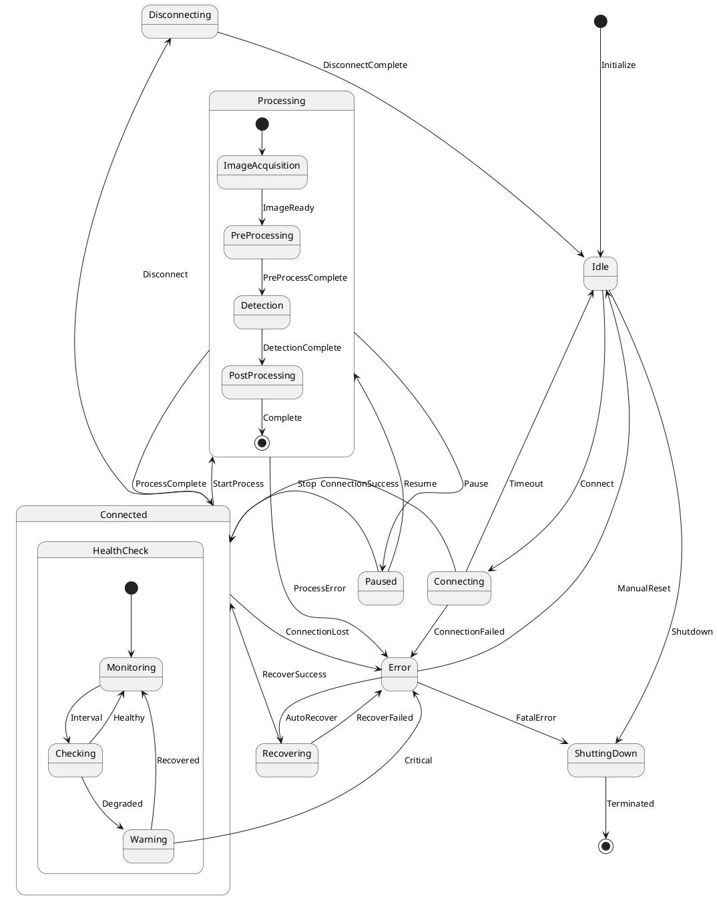
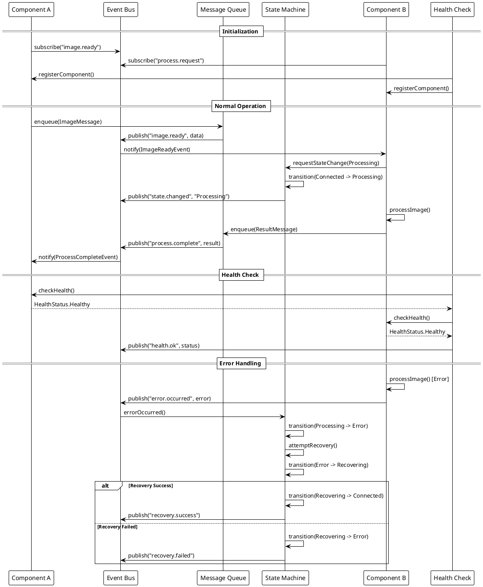

# 工業AOI設備元件通訊協定與狀態機設計規範

## 目錄
1. [系統架構概述](#系統架構概述)
2. [元件間通訊協定設計](#元件間通訊協定設計)
3. [狀態機設計模式](#狀態機設計模式)
4. [通訊協定實現](#通訊協定實現)
5. [錯誤處理與容錯機制](#錯誤處理與容錯機制)
6. [效能優化策略](#效能優化策略)
7. [實作範例程式碼](#實作範例程式碼)
8. [效能測試方法](#效能測試方法)

## 1. 系統架構概述

### 1.1 整體架構
```
┌─────────────────────────────────────────────────────────────┐
│                     Application Layer                        │
├─────────────────────────────────────────────────────────────┤
│                  Communication Framework                     │
│  ┌──────────┐  ┌──────────┐  ┌──────────┐  ┌──────────┐  │
│  │ Message  │  │  Event   │  │  State   │  │ Command  │  │
│  │  Queue   │  │   Bus    │  │ Machine  │  │ Processor│  │
│  └──────────┘  └──────────┘  └──────────┘  └──────────┘  │
├─────────────────────────────────────────────────────────────┤
│                    Transport Layer                           │
│         (TCP/IP, Shared Memory, Named Pipes)                │
└─────────────────────────────────────────────────────────────┘
```

### 1.2 核心設計原則
- **模組化**: 各元件獨立運作，透過標準協定通訊
- **可擴展性**: 支援新元件的無縫整合
- **高效能**: 最小化通訊延遲，支援批次處理
- **容錯性**: 自動錯誤恢復，健康檢查機制
- **可追蹤性**: 完整的訊息追蹤和日誌記錄

## 2. 元件間通訊協定設計

### 2.1 Signal/Slot 命名規範

#### 2.1.1 Signal 命名規範
```cpp
// 格式: [動詞][對象][狀態/結果]
// 範例:
signal:
    void imageAcquired(const ImageData& data);
    void processingStarted(const QString& taskId);
    void errorOccurred(const ErrorInfo& error);
    void stateChanged(State oldState, State newState);
    void dataReceived(const QByteArray& data);
```

#### 2.1.2 Slot 命名規範
```cpp
// 格式: on[對象][動作]
// 範例:
public slots:
    void onImageProcess(const ImageData& data);
    void onCommandExecute(const Command& cmd);
    void onStateUpdate(State newState);
    void onErrorHandle(const ErrorInfo& error);
```

### 2.2 訊息格式定義

#### 2.2.1 JSON 格式標準
```json
{
    "header": {
        "messageId": "uuid-v4",
        "timestamp": "2024-01-01T12:00:00.000Z",
        "source": "ComponentA",
        "destination": "ComponentB",
        "messageType": "REQUEST|RESPONSE|EVENT|COMMAND",
        "priority": 1,
        "version": "1.0"
    },
    "body": {
        "action": "processImage",
        "parameters": {
            "imageId": "img_001",
            "algorithm": "edge_detection"
        }
    },
    "metadata": {
        "correlationId": "parent-message-id",
        "sessionId": "session-uuid",
        "ttl": 5000
    }
}
```

#### 2.2.2 Protocol Buffers 定義
```protobuf
syntax = "proto3";

package aoi.communication;

message Message {
    MessageHeader header = 1;
    MessageBody body = 2;
    MessageMetadata metadata = 3;
}

message MessageHeader {
    string message_id = 1;
    int64 timestamp = 2;
    string source = 3;
    string destination = 4;
    MessageType type = 5;
    int32 priority = 6;
    string version = 7;
}

enum MessageType {
    REQUEST = 0;
    RESPONSE = 1;
    EVENT = 2;
    COMMAND = 3;
}

message MessageBody {
    string action = 1;
    google.protobuf.Any parameters = 2;
}

message MessageMetadata {
    string correlation_id = 1;
    string session_id = 2;
    int32 ttl_ms = 3;
}
```

### 2.3 通訊模式實現

#### 2.3.1 同步通訊模式
```cpp
class SyncCommunicator : public QObject {
    Q_OBJECT
public:
    template<typename Response>
    Response sendRequest(const Request& request, int timeoutMs = 5000) {
        QEventLoop loop;
        Response response;
        bool received = false;
        
        connect(this, &SyncCommunicator::responseReceived,
                [&](const Response& resp) {
                    response = resp;
                    received = true;
                    loop.quit();
                });
        
        QTimer::singleShot(timeoutMs, &loop, &QEventLoop::quit);
        
        emit requestSent(request);
        loop.exec();
        
        if (!received) {
            throw TimeoutException("Request timeout");
        }
        
        return response;
    }
    
signals:
    void requestSent(const Request& request);
    void responseReceived(const Response& response);
};
```

#### 2.3.2 異步通訊模式
```cpp
class AsyncCommunicator : public QObject {
    Q_OBJECT
public:
    using ResponseCallback = std::function<void(const Response&)>;
    using ErrorCallback = std::function<void(const Error&)>;
    
    void sendAsyncRequest(const Request& request,
                         ResponseCallback onSuccess,
                         ErrorCallback onError) {
        QString requestId = QUuid::createUuid().toString();
        
        PendingRequest pending;
        pending.request = request;
        pending.onSuccess = onSuccess;
        pending.onError = onError;
        pending.timestamp = QDateTime::currentDateTime();
        
        m_pendingRequests[requestId] = pending;
        
        emit requestQueued(requestId, request);
        
        // Start timeout timer
        QTimer::singleShot(m_timeoutMs, [this, requestId]() {
            if (m_pendingRequests.contains(requestId)) {
                auto pending = m_pendingRequests.take(requestId);
                pending.onError(Error("Request timeout"));
            }
        });
    }
    
private:
    struct PendingRequest {
        Request request;
        ResponseCallback onSuccess;
        ErrorCallback onError;
        QDateTime timestamp;
    };
    
    QMap<QString, PendingRequest> m_pendingRequests;
    int m_timeoutMs = 5000;
    
signals:
    void requestQueued(const QString& id, const Request& request);
};
```

### 2.4 發布-訂閱模式
```cpp
class EventBus : public QObject {
    Q_OBJECT
    
public:
    static EventBus& instance() {
        static EventBus instance;
        return instance;
    }
    
    // 訂閱事件
    template<typename EventType>
    void subscribe(const QString& topic, 
                   std::function<void(const EventType&)> handler) {
        QMutexLocker locker(&m_mutex);
        m_handlers[topic].append(
            [handler](const QVariant& data) {
                handler(data.value<EventType>());
            }
        );
    }
    
    // 發布事件
    template<typename EventType>
    void publish(const QString& topic, const EventType& event) {
        QMutexLocker locker(&m_mutex);
        
        // 記錄事件
        logEvent(topic, event);
        
        // 同步處理高優先級事件
        if (event.priority() >= HIGH_PRIORITY) {
            processEvent(topic, QVariant::fromValue(event));
        } else {
            // 異步處理低優先級事件
            QMetaObject::invokeMethod(this, 
                [this, topic, event]() {
                    processEvent(topic, QVariant::fromValue(event));
                },
                Qt::QueuedConnection);
        }
    }
    
private:
    void processEvent(const QString& topic, const QVariant& data) {
        auto handlers = m_handlers.value(topic);
        for (const auto& handler : handlers) {
            try {
                handler(data);
            } catch (const std::exception& e) {
                qWarning() << "Event handler error:" << e.what();
            }
        }
    }
    
    void logEvent(const QString& topic, const auto& event) {
        EventLog log;
        log.timestamp = QDateTime::currentDateTime();
        log.topic = topic;
        log.eventType = typeid(event).name();
        m_eventHistory.append(log);
    }
    
    QMutex m_mutex;
    QMap<QString, QList<std::function<void(const QVariant&)>>> m_handlers;
    QList<EventLog> m_eventHistory;
};
```

## 3. 狀態機設計模式

### 3.1 主StateMachine架構

#### 3.1.1 狀態機UML圖 (PlantUML格式)


### 3.2 階層式狀態機實現
```cpp
class HierarchicalStateMachine : public QStateMachine {
    Q_OBJECT
    
public:
    HierarchicalStateMachine(QObject* parent = nullptr)
        : QStateMachine(parent) {
        setupStates();
        setupTransitions();
        setupActions();
    }
    
private:
    void setupStates() {
        // 頂層狀態
        m_idle = new QState();
        m_connecting = new QState();
        m_connected = new QState();
        m_processing = new QState(m_connected); // 子狀態
        m_error = new QState();
        m_recovering = new QState();
        m_shuttingDown = new QFinalState();
        
        // Processing 子狀態
        m_imageAcquisition = new QState(m_processing);
        m_preProcessing = new QState(m_processing);
        m_detection = new QState(m_processing);
        m_postProcessing = new QState(m_processing);
        
        // 健康檢查並行狀態
        m_healthCheck = new QState(QState::ParallelStates, m_connected);
        m_monitoring = new QState(m_healthCheck);
        m_checking = new QState(m_healthCheck);
        
        // 添加到狀態機
        addState(m_idle);
        addState(m_connecting);
        addState(m_connected);
        addState(m_error);
        addState(m_recovering);
        addState(m_shuttingDown);
        
        setInitialState(m_idle);
        m_processing->setInitialState(m_imageAcquisition);
    }
    
    void setupTransitions() {
        // Idle transitions
        m_idle->addTransition(this, &HierarchicalStateMachine::connectRequested, 
                             m_connecting);
        m_idle->addTransition(this, &HierarchicalStateMachine::shutdownRequested,
                             m_shuttingDown);
        
        // Connecting transitions
        m_connecting->addTransition(this, &HierarchicalStateMachine::connected,
                                   m_connected);
        m_connecting->addTransition(this, &HierarchicalStateMachine::connectionFailed,
                                   m_error);
        
        // Connected transitions
        m_connected->addTransition(this, &HierarchicalStateMachine::processRequested,
                                  m_processing);
        m_connected->addTransition(this, &HierarchicalStateMachine::disconnectRequested,
                                  m_idle);
        
        // Processing sub-state transitions
        m_imageAcquisition->addTransition(this, &HierarchicalStateMachine::imageReady,
                                         m_preProcessing);
        m_preProcessing->addTransition(this, &HierarchicalStateMachine::preProcessComplete,
                                       m_detection);
        m_detection->addTransition(this, &HierarchicalStateMachine::detectionComplete,
                                  m_postProcessing);
        m_postProcessing->addTransition(this, &HierarchicalStateMachine::processComplete,
                                        m_connected);
        
        // Error handling
        setupErrorTransitions();
    }
    
    void setupErrorTransitions() {
        // 全局錯誤轉換
        for (auto state : {m_connecting, m_connected, m_processing}) {
            state->addTransition(this, &HierarchicalStateMachine::errorOccurred,
                                m_error);
        }
        
        // Error recovery
        m_error->addTransition(this, &HierarchicalStateMachine::recoverRequested,
                              m_recovering);
        m_error->addTransition(this, &HierarchicalStateMachine::resetRequested,
                              m_idle);
        
        m_recovering->addTransition(this, &HierarchicalStateMachine::recoverSuccess,
                                   m_connected);
        m_recovering->addTransition(this, &HierarchicalStateMachine::recoverFailed,
                                   m_error);
    }
    
    void setupActions() {
        // 進入狀態動作
        connect(m_idle, &QState::entered, [this]() {
            qDebug() << "Entered Idle state";
            emit stateChanged("Idle");
            resetInternalState();
        });
        
        connect(m_connecting, &QState::entered, [this]() {
            qDebug() << "Entered Connecting state";
            emit stateChanged("Connecting");
            startConnectionTimer();
        });
        
        connect(m_connected, &QState::entered, [this]() {
            qDebug() << "Entered Connected state";
            emit stateChanged("Connected");
            startHealthCheck();
        });
        
        connect(m_processing, &QState::entered, [this]() {
            qDebug() << "Entered Processing state";
            emit stateChanged("Processing");
            m_processingStartTime = QDateTime::currentDateTime();
        });
        
        // 離開狀態動作
        connect(m_processing, &QState::exited, [this]() {
            auto duration = m_processingStartTime.msecsTo(
                QDateTime::currentDateTime());
            emit processingTimeRecorded(duration);
        });
        
        connect(m_error, &QState::entered, [this]() {
            qDebug() << "Entered Error state";
            emit stateChanged("Error");
            logError();
            checkAutoRecovery();
        });
    }
    
    void startHealthCheck() {
        if (!m_healthCheckTimer) {
            m_healthCheckTimer = new QTimer(this);
            connect(m_healthCheckTimer, &QTimer::timeout,
                    this, &HierarchicalStateMachine::performHealthCheck);
        }
        m_healthCheckTimer->start(5000); // 5秒檢查一次
    }
    
    void performHealthCheck() {
        HealthStatus status = checkSystemHealth();
        
        switch(status) {
        case HealthStatus::Healthy:
            emit healthCheckPassed();
            break;
        case HealthStatus::Degraded:
            emit healthCheckWarning();
            break;
        case HealthStatus::Critical:
            emit errorOccurred(Error("Critical health check failure"));
            break;
        }
    }
    
signals:
    void connectRequested();
    void connected();
    void connectionFailed();
    void processRequested();
    void imageReady();
    void preProcessComplete();
    void detectionComplete();
    void processComplete();
    void errorOccurred(const Error& error);
    void recoverRequested();
    void recoverSuccess();
    void recoverFailed();
    void resetRequested();
    void disconnectRequested();
    void shutdownRequested();
    void stateChanged(const QString& stateName);
    void processingTimeRecorded(qint64 msecs);
    void healthCheckPassed();
    void healthCheckWarning();
    
private:
    // 狀態指針
    QState* m_idle;
    QState* m_connecting;
    QState* m_connected;
    QState* m_processing;
    QState* m_error;
    QState* m_recovering;
    QFinalState* m_shuttingDown;
    
    // Processing 子狀態
    QState* m_imageAcquisition;
    QState* m_preProcessing;
    QState* m_detection;
    QState* m_postProcessing;
    
    // 健康檢查狀態
    QState* m_healthCheck;
    QState* m_monitoring;
    QState* m_checking;
    
    // 內部變量
    QTimer* m_healthCheckTimer = nullptr;
    QDateTime m_processingStartTime;
};
```

### 3.3 狀態持久化和恢復
```cpp
class StatePersistence : public QObject {
    Q_OBJECT
    
public:
    struct StateSnapshot {
        QString stateName;
        QDateTime timestamp;
        QVariantMap context;
        QStringList stateHistory;
    };
    
    void saveState(const HierarchicalStateMachine* stateMachine) {
        StateSnapshot snapshot;
        snapshot.stateName = getCurrentStateName(stateMachine);
        snapshot.timestamp = QDateTime::currentDateTime();
        snapshot.context = captureContext();
        snapshot.stateHistory = m_stateHistory;
        
        QJsonObject json;
        json["stateName"] = snapshot.stateName;
        json["timestamp"] = snapshot.timestamp.toString(Qt::ISODate);
        json["context"] = QJsonObject::fromVariantMap(snapshot.context);
        json["history"] = QJsonArray::fromStringList(snapshot.stateHistory);
        
        QJsonDocument doc(json);
        
        QFile file(m_persistenceFile);
        if (file.open(QIODevice::WriteOnly)) {
            file.write(doc.toJson());
            file.close();
            
            emit stateSaved(snapshot);
        }
    }
    
    StateSnapshot loadState() {
        QFile file(m_persistenceFile);
        if (!file.open(QIODevice::ReadOnly)) {
            return StateSnapshot();
        }
        
        QJsonDocument doc = QJsonDocument::fromJson(file.readAll());
        file.close();
        
        QJsonObject json = doc.object();
        
        StateSnapshot snapshot;
        snapshot.stateName = json["stateName"].toString();
        snapshot.timestamp = QDateTime::fromString(
            json["timestamp"].toString(), Qt::ISODate);
        snapshot.context = json["context"].toObject().toVariantMap();
        
        QJsonArray history = json["history"].toArray();
        for (const auto& value : history) {
            snapshot.stateHistory.append(value.toString());
        }
        
        return snapshot;
    }
    
    void restoreState(HierarchicalStateMachine* stateMachine,
                     const StateSnapshot& snapshot) {
        // 恢復上下文
        restoreContext(snapshot.context);
        
        // 恢復歷史
        m_stateHistory = snapshot.stateHistory;
        
        // 根據保存的狀態名稱恢復到相應狀態
        if (snapshot.stateName == "Processing") {
            emit stateMachine->connectRequested();
            emit stateMachine->connected();
            emit stateMachine->processRequested();
        } else if (snapshot.stateName == "Connected") {
            emit stateMachine->connectRequested();
            emit stateMachine->connected();
        } else if (snapshot.stateName == "Error") {
            emit stateMachine->errorOccurred(Error("Restored from error state"));
        }
        
        emit stateRestored(snapshot);
    }
    
    void enableAutoSave(int intervalMs = 30000) {
        if (!m_autoSaveTimer) {
            m_autoSaveTimer = new QTimer(this);
            connect(m_autoSaveTimer, &QTimer::timeout,
                    [this]() { 
                        if (m_stateMachine) {
                            saveState(m_stateMachine);
                        }
                    });
        }
        m_autoSaveTimer->start(intervalMs);
    }
    
private:
    QString getCurrentStateName(const HierarchicalStateMachine* sm) const {
        // 獲取當前活動狀態的名稱
        for (const auto& state : sm->configuration()) {
            if (state->objectName().isEmpty()) {
                continue;
            }
            return state->objectName();
        }
        return "Unknown";
    }
    
    QVariantMap captureContext() {
        QVariantMap context;
        context["processId"] = QCoreApplication::applicationPid();
        context["sessionId"] = m_sessionId;
        context["memoryUsage"] = getCurrentMemoryUsage();
        context["cpuUsage"] = getCurrentCpuUsage();
        return context;
    }
    
    void restoreContext(const QVariantMap& context) {
        m_sessionId = context["sessionId"].toString();
        // 恢復其他上下文信息
    }
    
signals:
    void stateSaved(const StateSnapshot& snapshot);
    void stateRestored(const StateSnapshot& snapshot);
    
private:
    QString m_persistenceFile = "state_snapshot.json";
    QStringList m_stateHistory;
    QString m_sessionId;
    QTimer* m_autoSaveTimer = nullptr;
    HierarchicalStateMachine* m_stateMachine = nullptr;
};
```

## 4. 通訊協定實現

### 4.1 Message Queue 設計
```cpp
template<typename MessageType>
class MessageQueue : public QObject {
    Q_OBJECT
    
public:
    enum class QueuePolicy {
        FIFO,
        LIFO,
        Priority
    };
    
    MessageQueue(size_t maxSize = 10000, QueuePolicy policy = QueuePolicy::FIFO)
        : m_maxSize(maxSize), m_policy(policy) {
        m_processingThread = new QThread();
        moveToThread(m_processingThread);
        
        connect(m_processingThread, &QThread::started,
                this, &MessageQueue::processMessages);
        
        m_processingThread->start();
    }
    
    ~MessageQueue() {
        m_running = false;
        m_condition.wakeAll();
        m_processingThread->quit();
        m_processingThread->wait();
        delete m_processingThread;
    }
    
    bool enqueue(const MessageType& message, int priority = 0) {
        QMutexLocker locker(&m_mutex);
        
        if (m_queue.size() >= m_maxSize) {
            // 實施背壓策略
            if (m_overflowPolicy == OverflowPolicy::DropOldest) {
                m_queue.dequeue();
            } else if (m_overflowPolicy == OverflowPolicy::DropNewest) {
                return false;
            } else if (m_overflowPolicy == OverflowPolicy::Block) {
                m_fullCondition.wait(&m_mutex);
            }
        }
        
        QueueItem item;
        item.message = message;
        item.priority = priority;
        item.timestamp = QDateTime::currentDateTime();
        
        if (m_policy == QueuePolicy::Priority) {
            insertByPriority(item);
        } else {
            m_queue.enqueue(item);
        }
        
        m_condition.wakeOne();
        
        emit messageEnqueued(message);
        updateStatistics();
        
        return true;
    }
    
    std::optional<MessageType> dequeue(int timeoutMs = -1) {
        QMutexLocker locker(&m_mutex);
        
        if (m_queue.isEmpty()) {
            if (timeoutMs < 0) {
                m_condition.wait(&m_mutex);
            } else if (timeoutMs > 0) {
                if (!m_condition.wait(&m_mutex, timeoutMs)) {
                    return std::nullopt;
                }
            } else {
                return std::nullopt;
            }
        }
        
        if (!m_queue.isEmpty()) {
            auto item = m_queue.dequeue();
            m_fullCondition.wakeOne();
            
            updateProcessingTime(item.timestamp);
            emit messageDequeued(item.message);
            
            return item.message;
        }
        
        return std::nullopt;
    }
    
    // 批次處理
    QList<MessageType> dequeueBatch(size_t maxBatchSize) {
        QMutexLocker locker(&m_mutex);
        QList<MessageType> batch;
        
        size_t count = std::min(maxBatchSize, 
                                static_cast<size_t>(m_queue.size()));
        
        for (size_t i = 0; i < count; ++i) {
            auto item = m_queue.dequeue();
            batch.append(item.message);
        }
        
        if (!batch.isEmpty()) {
            m_fullCondition.wakeAll();
            emit batchDequeued(batch);
        }
        
        return batch;
    }
    
    size_t size() const {
        QMutexLocker locker(&m_mutex);
        return m_queue.size();
    }
    
    bool isEmpty() const {
        QMutexLocker locker(&m_mutex);
        return m_queue.isEmpty();
    }
    
    void clear() {
        QMutexLocker locker(&m_mutex);
        m_queue.clear();
        m_fullCondition.wakeAll();
    }
    
    struct Statistics {
        size_t totalEnqueued = 0;
        size_t totalDequeued = 0;
        size_t currentSize = 0;
        size_t peakSize = 0;
        double averageProcessingTime = 0;
        QDateTime lastActivity;
    };
    
    Statistics getStatistics() const {
        QMutexLocker locker(&m_mutex);
        return m_stats;
    }
    
private slots:
    void processMessages() {
        while (m_running) {
            auto message = dequeue(1000); // 1秒超時
            if (message.has_value()) {
                emit messageReady(message.value());
            }
        }
    }
    
private:
    struct QueueItem {
        MessageType message;
        int priority;
        QDateTime timestamp;
        
        bool operator<(const QueueItem& other) const {
            return priority < other.priority;
        }
    };
    
    void insertByPriority(const QueueItem& item) {
        auto it = std::lower_bound(m_queue.begin(), m_queue.end(), item);
        m_queue.insert(it, item);
    }
    
    void updateStatistics() {
        m_stats.totalEnqueued++;
        m_stats.currentSize = m_queue.size();
        m_stats.peakSize = std::max(m_stats.peakSize, m_stats.currentSize);
        m_stats.lastActivity = QDateTime::currentDateTime();
    }
    
    void updateProcessingTime(const QDateTime& enqueueTime) {
        auto processingTime = enqueueTime.msecsTo(QDateTime::currentDateTime());
        m_stats.totalDequeued++;
        
        // 計算移動平均
        m_stats.averageProcessingTime = 
            (m_stats.averageProcessingTime * (m_stats.totalDequeued - 1) + 
             processingTime) / m_stats.totalDequeued;
    }
    
signals:
    void messageEnqueued(const MessageType& message);
    void messageDequeued(const MessageType& message);
    void messageReady(const MessageType& message);
    void batchDequeued(const QList<MessageType>& batch);
    void queueFull();
    void queueEmpty();
    
private:
    mutable QMutex m_mutex;
    QWaitCondition m_condition;
    QWaitCondition m_fullCondition;
    QQueue<QueueItem> m_queue;
    size_t m_maxSize;
    QueuePolicy m_policy;
    
    enum class OverflowPolicy {
        DropOldest,
        DropNewest,
        Block
    } m_overflowPolicy = OverflowPolicy::Block;
    
    Statistics m_stats;
    QThread* m_processingThread;
    std::atomic<bool> m_running{true};
};
```

### 4.2 Command Pattern 實現
```cpp
class ICommand {
public:
    virtual ~ICommand() = default;
    virtual void execute() = 0;
    virtual void undo() = 0;
    virtual bool canUndo() const { return false; }
    virtual QString getName() const = 0;
    virtual QJsonObject serialize() const = 0;
    virtual void deserialize(const QJsonObject& json) = 0;
};

class CommandManager : public QObject {
    Q_OBJECT
    
public:
    void executeCommand(std::shared_ptr<ICommand> command) {
        try {
            command->execute();
            
            if (command->canUndo()) {
                m_undoStack.push(command);
                m_redoStack.clear(); // 清空重做堆疊
                
                // 限制撤銷堆疊大小
                if (m_undoStack.size() > m_maxUndoLevels) {
                    m_undoStack.removeFirst();
                }
            }
            
            emit commandExecuted(command->getName());
            
        } catch (const std::exception& e) {
            emit commandFailed(command->getName(), e.what());
        }
    }
    
    void undo() {
        if (canUndo()) {
            auto command = m_undoStack.pop();
            
            try {
                command->undo();
                m_redoStack.push(command);
                emit commandUndone(command->getName());
            } catch (const std::exception& e) {
                emit undoFailed(command->getName(), e.what());
            }
        }
    }
    
    void redo() {
        if (canRedo()) {
            auto command = m_redoStack.pop();
            
            try {
                command->execute();
                m_undoStack.push(command);
                emit commandRedone(command->getName());
            } catch (const std::exception& e) {
                emit redoFailed(command->getName(), e.what());
            }
        }
    }
    
    bool canUndo() const {
        return !m_undoStack.isEmpty();
    }
    
    bool canRedo() const {
        return !m_redoStack.isEmpty();
    }
    
    // 批次執行命令
    void executeBatch(const QList<std::shared_ptr<ICommand>>& commands) {
        auto batchCommand = std::make_shared<BatchCommand>(commands);
        executeCommand(batchCommand);
    }
    
    // 異步執行命令
    void executeAsync(std::shared_ptr<ICommand> command) {
        QtConcurrent::run([this, command]() {
            try {
                command->execute();
                
                QMetaObject::invokeMethod(this,
                    [this, command]() {
                        if (command->canUndo()) {
                            m_undoStack.push(command);
                        }
                        emit commandExecuted(command->getName());
                    },
                    Qt::QueuedConnection);
                    
            } catch (const std::exception& e) {
                QMetaObject::invokeMethod(this,
                    [this, command, msg = QString(e.what())]() {
                        emit commandFailed(command->getName(), msg);
                    },
                    Qt::QueuedConnection);
            }
        });
    }
    
signals:
    void commandExecuted(const QString& name);
    void commandFailed(const QString& name, const QString& error);
    void commandUndone(const QString& name);
    void commandRedone(const QString& name);
    void undoFailed(const QString& name, const QString& error);
    void redoFailed(const QString& name, const QString& error);
    
private:
    QStack<std::shared_ptr<ICommand>> m_undoStack;
    QStack<std::shared_ptr<ICommand>> m_redoStack;
    size_t m_maxUndoLevels = 100;
};

// 批次命令實現
class BatchCommand : public ICommand {
public:
    BatchCommand(const QList<std::shared_ptr<ICommand>>& commands)
        : m_commands(commands) {}
    
    void execute() override {
        for (auto& command : m_commands) {
            command->execute();
            m_executed.append(command);
        }
    }
    
    void undo() override {
        // 反向撤銷
        for (auto it = m_executed.rbegin(); it != m_executed.rend(); ++it) {
            (*it)->undo();
        }
        m_executed.clear();
    }
    
    bool canUndo() const override {
        return std::all_of(m_commands.begin(), m_commands.end(),
                          [](const auto& cmd) { return cmd->canUndo(); });
    }
    
    QString getName() const override {
        return QString("Batch[%1 commands]").arg(m_commands.size());
    }
    
    QJsonObject serialize() const override {
        QJsonArray commandArray;
        for (const auto& command : m_commands) {
            commandArray.append(command->serialize());
        }
        
        QJsonObject json;
        json["type"] = "BatchCommand";
        json["commands"] = commandArray;
        return json;
    }
    
    void deserialize(const QJsonObject& json) override {
        // 實現反序列化邏輯
    }
    
private:
    QList<std::shared_ptr<ICommand>> m_commands;
    QList<std::shared_ptr<ICommand>> m_executed;
};
```

### 4.3 Observer Pattern 整合
```cpp
template<typename EventType>
class Observable {
public:
    using Observer = std::function<void(const EventType&)>;
    using ObserverId = size_t;
    
    ObserverId attach(Observer observer) {
        std::lock_guard<std::mutex> lock(m_mutex);
        ObserverId id = m_nextId++;
        m_observers[id] = observer;
        return id;
    }
    
    void detach(ObserverId id) {
        std::lock_guard<std::mutex> lock(m_mutex);
        m_observers.erase(id);
    }
    
    void notify(const EventType& event) {
        std::vector<Observer> observers;
        
        {
            std::lock_guard<std::mutex> lock(m_mutex);
            for (const auto& [id, observer] : m_observers) {
                observers.push_back(observer);
            }
        }
        
        // 在鎖外調用觀察者，避免死鎖
        for (const auto& observer : observers) {
            try {
                observer(event);
            } catch (const std::exception& e) {
                // 記錄錯誤但不中斷其他觀察者
                qWarning() << "Observer error:" << e.what();
            }
        }
    }
    
    size_t observerCount() const {
        std::lock_guard<std::mutex> lock(m_mutex);
        return m_observers.size();
    }
    
private:
    mutable std::mutex m_mutex;
    std::unordered_map<ObserverId, Observer> m_observers;
    ObserverId m_nextId = 1;
};

// 具體應用範例
class SystemEventManager : public QObject {
    Q_OBJECT
    
public:
    enum class EventType {
        StateChanged,
        DataReceived,
        ErrorOccurred,
        PerformanceMetric
    };
    
    struct SystemEvent {
        EventType type;
        QDateTime timestamp;
        QString source;
        QVariant data;
        int priority;
    };
    
    using EventHandler = std::function<void(const SystemEvent&)>;
    
    void subscribe(EventType type, EventHandler handler) {
        m_handlers[type].attach(handler);
    }
    
    void publish(const SystemEvent& event) {
        // 記錄事件
        logEvent(event);
        
        // 通知訂閱者
        if (m_handlers.count(event.type)) {
            m_handlers[event.type].notify(event);
        }
        
        // 發送 Qt 信號
        emit eventPublished(event);
    }
    
    // 條件訂閱
    void subscribeWithFilter(EventType type,
                            std::function<bool(const SystemEvent&)> filter,
                            EventHandler handler) {
        m_handlers[type].attach([filter, handler](const SystemEvent& event) {
            if (filter(event)) {
                handler(event);
            }
        });
    }
    
    // 優先級訂閱
    void subscribeWithPriority(EventType type,
                              int minPriority,
                              EventHandler handler) {
        subscribeWithFilter(type,
            [minPriority](const SystemEvent& event) {
                return event.priority >= minPriority;
            },
            handler);
    }
    
private:
    void logEvent(const SystemEvent& event) {
        m_eventLog.append(event);
        
        // 限制日誌大小
        if (m_eventLog.size() > m_maxLogSize) {
            m_eventLog.removeFirst();
        }
    }
    
signals:
    void eventPublished(const SystemEvent& event);
    
private:
    std::unordered_map<EventType, Observable<SystemEvent>> m_handlers;
    QList<SystemEvent> m_eventLog;
    size_t m_maxLogSize = 10000;
};
```

## 5. 錯誤處理與容錯機制

### 5.1 通訊超時處理
```cpp
class TimeoutManager : public QObject {
    Q_OBJECT
    
public:
    struct TimeoutConfig {
        int connectionTimeout = 5000;      // 連接超時
        int requestTimeout = 10000;        // 請求超時
        int heartbeatInterval = 3000;      // 心跳間隔
        int heartbeatTimeout = 9000;       // 心跳超時
        int retryInterval = 1000;          // 重試間隔
        int maxRetries = 3;                // 最大重試次數
    };
    
    class TimeoutGuard {
    public:
        TimeoutGuard(int timeoutMs, std::function<void()> onTimeout)
            : m_timer(new QTimer()) {
            m_timer->setSingleShot(true);
            m_timer->setInterval(timeoutMs);
            
            QObject::connect(m_timer, &QTimer::timeout, [onTimeout]() {
                if (onTimeout) {
                    onTimeout();
                }
            });
            
            m_timer->start();
        }
        
        ~TimeoutGuard() {
            cancel();
            delete m_timer;
        }
        
        void cancel() {
            if (m_timer && m_timer->isActive()) {
                m_timer->stop();
            }
        }
        
    private:
        QTimer* m_timer;
    };
    
    std::unique_ptr<TimeoutGuard> createTimeout(
        int timeoutMs,
        const QString& operation,
        std::function<void()> onTimeout) {
        
        return std::make_unique<TimeoutGuard>(timeoutMs,
            [this, operation, onTimeout]() {
                emit timeoutOccurred(operation);
                
                if (onTimeout) {
                    onTimeout();
                }
                
                recordTimeout(operation);
            });
    }
    
    // 自適應超時調整
    void adjustTimeout(const QString& operation, int actualTime) {
        auto& stats = m_operationStats[operation];
        stats.samples.append(actualTime);
        
        if (stats.samples.size() > 100) {
            stats.samples.removeFirst();
        }
        
        // 計算新的超時值（平均值 + 2倍標準差）
        double mean = calculateMean(stats.samples);
        double stdDev = calculateStdDev(stats.samples, mean);
        
        int newTimeout = static_cast<int>(mean + 2 * stdDev);
        
        // 限制在合理範圍內
        newTimeout = std::max(1000, std::min(60000, newTimeout));
        
        stats.adjustedTimeout = newTimeout;
        
        emit timeoutAdjusted(operation, newTimeout);
    }
    
private:
    struct OperationStats {
        QList<int> samples;
        int adjustedTimeout = 10000;
        int timeoutCount = 0;
        QDateTime lastTimeout;
    };
    
    void recordTimeout(const QString& operation) {
        auto& stats = m_operationStats[operation];
        stats.timeoutCount++;
        stats.lastTimeout = QDateTime::currentDateTime();
    }
    
    double calculateMean(const QList<int>& samples) {
        if (samples.isEmpty()) return 0;
        
        double sum = std::accumulate(samples.begin(), samples.end(), 0.0);
        return sum / samples.size();
    }
    
    double calculateStdDev(const QList<int>& samples, double mean) {
        if (samples.size() < 2) return 0;
        
        double variance = 0;
        for (int sample : samples) {
            variance += std::pow(sample - mean, 2);
        }
        
        return std::sqrt(variance / (samples.size() - 1));
    }
    
signals:
    void timeoutOccurred(const QString& operation);
    void timeoutAdjusted(const QString& operation, int newTimeout);
    
private:
    TimeoutConfig m_config;
    QMap<QString, OperationStats> m_operationStats;
};
```

### 5.2 重試機制
```cpp
class RetryManager : public QObject {
    Q_OBJECT
    
public:
    enum class RetryStrategy {
        Fixed,          // 固定間隔
        Linear,         // 線性增長
        Exponential,    // 指數退避
        Fibonacci       // 斐波那契數列
    };
    
    struct RetryConfig {
        RetryStrategy strategy = RetryStrategy::Exponential;
        int maxRetries = 3;
        int baseInterval = 1000;
        int maxInterval = 30000;
        double multiplier = 2.0;
        bool jitter = true;  // 添加隨機抖動
    };
    
    template<typename Func, typename... Args>
    auto executeWithRetry(Func func, Args&&... args) 
        -> decltype(func(std::forward<Args>(args)...)) {
        
        using ReturnType = decltype(func(std::forward<Args>(args)...));
        
        int attempt = 0;
        std::exception_ptr lastException;
        
        while (attempt <= m_config.maxRetries) {
            try {
                auto result = func(std::forward<Args>(args)...);
                
                if (attempt > 0) {
                    emit retrySucceeded(attempt);
                }
                
                return result;
                
            } catch (const std::exception& e) {
                lastException = std::current_exception();
                
                if (attempt < m_config.maxRetries) {
                    int delay = calculateDelay(attempt);
                    
                    emit retryAttempt(attempt + 1, delay, e.what());
                    
                    QThread::msleep(delay);
                    attempt++;
                } else {
                    break;
                }
            }
        }
        
        emit retryFailed(m_config.maxRetries);
        
        if (lastException) {
            std::rethrow_exception(lastException);
        }
        
        throw std::runtime_error("Retry failed");
    }
    
    // 異步重試
    template<typename Func>
    void executeWithRetryAsync(Func func,
                              std::function<void()> onSuccess,
                              std::function<void(const QString&)> onFailure) {
        QtConcurrent::run([this, func, onSuccess, onFailure]() {
            try {
                executeWithRetry(func);
                
                QMetaObject::invokeMethod(this,
                    [onSuccess]() {
                        if (onSuccess) onSuccess();
                    },
                    Qt::QueuedConnection);
                    
            } catch (const std::exception& e) {
                QMetaObject::invokeMethod(this,
                    [onFailure, msg = QString(e.what())]() {
                        if (onFailure) onFailure(msg);
                    },
                    Qt::QueuedConnection);
            }
        });
    }
    
private:
    int calculateDelay(int attempt) {
        int delay = m_config.baseInterval;
        
        switch (m_config.strategy) {
        case RetryStrategy::Fixed:
            // 固定間隔
            break;
            
        case RetryStrategy::Linear:
            delay = m_config.baseInterval * (attempt + 1);
            break;
            
        case RetryStrategy::Exponential:
            delay = static_cast<int>(
                m_config.baseInterval * std::pow(m_config.multiplier, attempt));
            break;
            
        case RetryStrategy::Fibonacci:
            delay = m_config.baseInterval * fibonacci(attempt + 1);
            break;
        }
        
        // 限制最大延遲
        delay = std::min(delay, m_config.maxInterval);
        
        // 添加隨機抖動
        if (m_config.jitter) {
            std::random_device rd;
            std::mt19937 gen(rd());
            std::uniform_int_distribution<> dis(-delay/4, delay/4);
            delay += dis(gen);
        }
        
        return std::max(0, delay);
    }
    
    int fibonacci(int n) {
        if (n <= 1) return n;
        
        int prev = 0, curr = 1;
        for (int i = 2; i <= n; ++i) {
            int temp = curr;
            curr = prev + curr;
            prev = temp;
        }
        
        return curr;
    }
    
signals:
    void retryAttempt(int attempt, int delayMs, const QString& reason);
    void retrySucceeded(int attempts);
    void retryFailed(int maxAttempts);
    
private:
    RetryConfig m_config;
};
```

### 5.3 健康檢查協定
```cpp
class HealthCheckManager : public QObject {
    Q_OBJECT
    
public:
    enum class HealthStatus {
        Healthy,
        Degraded,
        Unhealthy,
        Unknown
    };
    
    struct ComponentHealth {
        QString componentId;
        HealthStatus status;
        QDateTime lastCheck;
        QVariantMap metrics;
        QString message;
    };
    
    struct HealthCheckConfig {
        int checkInterval = 5000;
        int unhealthyThreshold = 3;
        int healthyThreshold = 2;
        int timeout = 3000;
    };
    
    class IHealthCheckable {
    public:
        virtual ~IHealthCheckable() = default;
        virtual ComponentHealth checkHealth() = 0;
        virtual QString getComponentId() const = 0;
    };
    
    void registerComponent(std::shared_ptr<IHealthCheckable> component) {
        QMutexLocker locker(&m_mutex);
        
        m_components[component->getComponentId()] = component;
        
        ComponentStatus status;
        status.consecutiveFailures = 0;
        status.consecutiveSuccesses = 0;
        status.currentStatus = HealthStatus::Unknown;
        
        m_componentStatus[component->getComponentId()] = status;
    }
    
    void startHealthChecks() {
        if (!m_timer) {
            m_timer = new QTimer(this);
            connect(m_timer, &QTimer::timeout,
                    this, &HealthCheckManager::performHealthChecks);
        }
        
        m_timer->start(m_config.checkInterval);
        emit healthCheckStarted();
    }
    
    void stopHealthChecks() {
        if (m_timer) {
            m_timer->stop();
        }
        emit healthCheckStopped();
    }
    
    HealthStatus getOverallHealth() const {
        QMutexLocker locker(&m_mutex);
        
        if (m_componentStatus.isEmpty()) {
            return HealthStatus::Unknown;
        }
        
        int unhealthyCount = 0;
        int degradedCount = 0;
        
        for (const auto& status : m_componentStatus) {
            if (status.currentStatus == HealthStatus::Unhealthy) {
                unhealthyCount++;
            } else if (status.currentStatus == HealthStatus::Degraded) {
                degradedCount++;
            }
        }
        
        if (unhealthyCount > 0) {
            return HealthStatus::Unhealthy;
        } else if (degradedCount > 0) {
            return HealthStatus::Degraded;
        } else {
            return HealthStatus::Healthy;
        }
    }
    
    QList<ComponentHealth> getAllComponentHealth() const {
        QMutexLocker locker(&m_mutex);
        return m_lastHealthResults.values();
    }
    
private slots:
    void performHealthChecks() {
        QMutexLocker locker(&m_mutex);
        
        for (auto& [componentId, component] : m_components) {
            QtConcurrent::run([this, componentId, component]() {
                performSingleHealthCheck(componentId, component);
            });
        }
    }
    
private:
    void performSingleHealthCheck(const QString& componentId,
                                 std::shared_ptr<IHealthCheckable> component) {
        try {
            // 使用超時保護
            QFuture<ComponentHealth> future = QtConcurrent::run(
                [component]() { return component->checkHealth(); });
            
            if (future.waitForFinished(m_config.timeout)) {
                ComponentHealth health = future.result();
                updateComponentStatus(componentId, health);
            } else {
                // 超時
                ComponentHealth health;
                health.componentId = componentId;
                health.status = HealthStatus::Unhealthy;
                health.message = "Health check timeout";
                health.lastCheck = QDateTime::currentDateTime();
                
                updateComponentStatus(componentId, health);
            }
            
        } catch (const std::exception& e) {
            ComponentHealth health;
            health.componentId = componentId;
            health.status = HealthStatus::Unhealthy;
            health.message = QString("Exception: %1").arg(e.what());
            health.lastCheck = QDateTime::currentDateTime();
            
            updateComponentStatus(componentId, health);
        }
    }
    
    void updateComponentStatus(const QString& componentId,
                              const ComponentHealth& health) {
        QMutexLocker locker(&m_mutex);
        
        auto& status = m_componentStatus[componentId];
        HealthStatus oldStatus = status.currentStatus;
        
        // 更新統計
        if (health.status == HealthStatus::Healthy) {
            status.consecutiveSuccesses++;
            status.consecutiveFailures = 0;
        } else {
            status.consecutiveFailures++;
            status.consecutiveSuccesses = 0;
        }
        
        // 判斷狀態轉換
        if (health.status == HealthStatus::Unhealthy &&
            status.consecutiveFailures >= m_config.unhealthyThreshold) {
            status.currentStatus = HealthStatus::Unhealthy;
        } else if (health.status == HealthStatus::Healthy &&
                  status.consecutiveSuccesses >= m_config.healthyThreshold) {
            status.currentStatus = HealthStatus::Healthy;
        } else if (status.currentStatus == HealthStatus::Unknown) {
            status.currentStatus = health.status;
        }
        
        m_lastHealthResults[componentId] = health;
        
        // 發送狀態變更通知
        if (oldStatus != status.currentStatus) {
            emit componentHealthChanged(componentId, 
                                       oldStatus, 
                                       status.currentStatus);
        }
        
        // 檢查整體健康狀態
        HealthStatus overallHealth = getOverallHealth();
        if (overallHealth != m_lastOverallHealth) {
            m_lastOverallHealth = overallHealth;
            emit overallHealthChanged(overallHealth);
        }
    }
    
    struct ComponentStatus {
        int consecutiveFailures;
        int consecutiveSuccesses;
        HealthStatus currentStatus;
    };
    
signals:
    void healthCheckStarted();
    void healthCheckStopped();
    void componentHealthChanged(const QString& componentId,
                               HealthStatus oldStatus,
                               HealthStatus newStatus);
    void overallHealthChanged(HealthStatus status);
    
private:
    mutable QMutex m_mutex;
    QTimer* m_timer = nullptr;
    HealthCheckConfig m_config;
    
    QMap<QString, std::shared_ptr<IHealthCheckable>> m_components;
    QMap<QString, ComponentStatus> m_componentStatus;
    QMap<QString, ComponentHealth> m_lastHealthResults;
    
    HealthStatus m_lastOverallHealth = HealthStatus::Unknown;
};
```

## 6. 效能優化策略

### 6.1 批次處理實現
```cpp
template<typename T>
class BatchProcessor : public QObject {
    Q_OBJECT
    
public:
    struct BatchConfig {
        size_t maxBatchSize = 100;
        int maxWaitTime = 100;  // ms
        bool processInParallel = false;
    };
    
    using ProcessFunc = std::function<void(const QList<T>&)>;
    
    BatchProcessor(ProcessFunc processFunc, const BatchConfig& config = {})
        : m_processFunc(processFunc), m_config(config) {
        
        m_timer = new QTimer(this);
        m_timer->setSingleShot(true);
        connect(m_timer, &QTimer::timeout,
                this, &BatchProcessor::processBatch);
    }
    
    void add(const T& item) {
        QMutexLocker locker(&m_mutex);
        
        m_batch.append(item);
        
        if (m_batch.size() >= m_config.maxBatchSize) {
            // 立即處理滿批
            processBatchInternal();
        } else if (!m_timer->isActive()) {
            // 啟動計時器等待更多項目
            m_timer->start(m_config.maxWaitTime);
        }
    }
    
    void addBatch(const QList<T>& items) {
        QMutexLocker locker(&m_mutex);
        
        m_batch.append(items);
        
        while (m_batch.size() >= m_config.maxBatchSize) {
            QList<T> currentBatch = m_batch.mid(0, m_config.maxBatchSize);
            m_batch = m_batch.mid(m_config.maxBatchSize);
            
            locker.unlock();
            processItems(currentBatch);
            locker.relock();
        }
        
        if (!m_batch.isEmpty() && !m_timer->isActive()) {
            m_timer->start(m_config.maxWaitTime);
        }
    }
    
    void flush() {
        processBatch();
    }
    
    size_t pendingCount() const {
        QMutexLocker locker(&m_mutex);
        return m_batch.size();
    }
    
private slots:
    void processBatch() {
        QMutexLocker locker(&m_mutex);
        processBatchInternal();
    }
    
private:
    void processBatchInternal() {
        if (m_batch.isEmpty()) {
            return;
        }
        
        QList<T> currentBatch = std::move(m_batch);
        m_batch.clear();
        m_timer->stop();
        
        m_mutex.unlock();
        processItems(currentBatch);
        m_mutex.lock();
    }
    
    void processItems(const QList<T>& items) {
        auto startTime = QDateTime::currentMSecsSinceEpoch();
        
        try {
            if (m_config.processInParallel) {
                QtConcurrent::run([this, items]() {
                    m_processFunc(items);
                });
            } else {
                m_processFunc(items);
            }
            
            auto duration = QDateTime::currentMSecsSinceEpoch() - startTime;
            emit batchProcessed(items.size(), duration);
            
        } catch (const std::exception& e) {
            emit processingError(QString::fromStdString(e.what()));
        }
    }
    
signals:
    void batchProcessed(size_t count, qint64 durationMs);
    void processingError(const QString& error);
    
private:
    mutable QMutex m_mutex;
    QList<T> m_batch;
    ProcessFunc m_processFunc;
    BatchConfig m_config;
    QTimer* m_timer;
};
```

### 6.2 訊息壓縮
```cpp
class MessageCompressor {
public:
    enum class CompressionType {
        None,
        Gzip,
        Zlib,
        LZ4
    };
    
    struct CompressionConfig {
        CompressionType type = CompressionType::Gzip;
        int compressionLevel = 6;  // 1-9
        size_t minSizeToCompress = 1024;  // 最小壓縮大小
    };
    
    static QByteArray compress(const QByteArray& data,
                              const CompressionConfig& config = {}) {
        if (data.size() < config.minSizeToCompress) {
            return data;
        }
        
        switch (config.type) {
        case CompressionType::None:
            return data;
            
        case CompressionType::Gzip:
            return compressGzip(data, config.compressionLevel);
            
        case CompressionType::Zlib:
            return qCompress(data, config.compressionLevel);
            
        case CompressionType::LZ4:
            return compressLZ4(data);
            
        default:
            return data;
        }
    }
    
    static QByteArray decompress(const QByteArray& data,
                                CompressionType type) {
        switch (type) {
        case CompressionType::None:
            return data;
            
        case CompressionType::Gzip:
            return decompressGzip(data);
            
        case CompressionType::Zlib:
            return qUncompress(data);
            
        case CompressionType::LZ4:
            return decompressLZ4(data);
            
        default:
            return data;
        }
    }
    
    // 壓縮率統計
    struct CompressionStats {
        size_t originalSize;
        size_t compressedSize;
        double compressionRatio;
        qint64 compressionTime;
        CompressionType type;
    };
    
    static CompressionStats analyzeCompression(const QByteArray& data) {
        CompressionStats stats;
        stats.originalSize = data.size();
        
        auto startTime = QDateTime::currentMSecsSinceEpoch();
        
        // 測試不同壓縮方法
        QByteArray compressed = compress(data);
        
        stats.compressionTime = QDateTime::currentMSecsSinceEpoch() - startTime;
        stats.compressedSize = compressed.size();
        stats.compressionRatio = 
            1.0 - (double)stats.compressedSize / stats.originalSize;
        
        return stats;
    }
    
private:
    static QByteArray compressGzip(const QByteArray& data, int level) {
        // Gzip 壓縮實現
        z_stream stream;
        stream.zalloc = Z_NULL;
        stream.zfree = Z_NULL;
        stream.opaque = Z_NULL;
        
        if (deflateInit2(&stream, level, Z_DEFLATED, 
                        16 + MAX_WBITS, 8, Z_DEFAULT_STRATEGY) != Z_OK) {
            return data;
        }
        
        stream.avail_in = data.size();
        stream.next_in = (Bytef*)data.data();
        
        QByteArray result;
        result.resize(deflateBound(&stream, data.size()));
        
        stream.avail_out = result.size();
        stream.next_out = (Bytef*)result.data();
        
        if (deflate(&stream, Z_FINISH) != Z_STREAM_END) {
            deflateEnd(&stream);
            return data;
        }
        
        result.resize(stream.total_out);
        deflateEnd(&stream);
        
        return result;
    }
    
    static QByteArray decompressGzip(const QByteArray& data) {
        // Gzip 解壓縮實現
        z_stream stream;
        stream.zalloc = Z_NULL;
        stream.zfree = Z_NULL;
        stream.opaque = Z_NULL;
        stream.avail_in = data.size();
        stream.next_in = (Bytef*)data.data();
        
        if (inflateInit2(&stream, 16 + MAX_WBITS) != Z_OK) {
            return QByteArray();
        }
        
        QByteArray result;
        char buffer[4096];
        
        do {
            stream.avail_out = sizeof(buffer);
            stream.next_out = (Bytef*)buffer;
            
            int ret = inflate(&stream, Z_NO_FLUSH);
            
            if (ret == Z_STREAM_ERROR || ret == Z_DATA_ERROR || 
                ret == Z_MEM_ERROR) {
                inflateEnd(&stream);
                return QByteArray();
            }
            
            result.append(buffer, sizeof(buffer) - stream.avail_out);
            
        } while (stream.avail_out == 0);
        
        inflateEnd(&stream);
        return result;
    }
    
    static QByteArray compressLZ4(const QByteArray& data) {
        // LZ4 壓縮實現（需要 LZ4 庫）
        // 這裡提供接口，實際實現需要鏈接 LZ4 庫
        return data;
    }
    
    static QByteArray decompressLZ4(const QByteArray& data) {
        // LZ4 解壓縮實現
        return data;
    }
};
```

### 6.3 連接池管理
```cpp
template<typename ConnectionType>
class ConnectionPool : public QObject {
    Q_OBJECT
    
public:
    struct PoolConfig {
        size_t minConnections = 2;
        size_t maxConnections = 10;
        int connectionTimeout = 5000;
        int idleTimeout = 300000;  // 5分鐘
        int validationInterval = 30000;  // 30秒
        bool testOnBorrow = true;
        bool testOnReturn = false;
    };
    
    using ConnectionFactory = std::function<std::shared_ptr<ConnectionType>()>;
    using ConnectionValidator = std::function<bool(ConnectionType*)>;
    
    ConnectionPool(ConnectionFactory factory,
                  ConnectionValidator validator,
                  const PoolConfig& config = {})
        : m_factory(factory),
          m_validator(validator),
          m_config(config) {
        
        initialize();
    }
    
    ~ConnectionPool() {
        shutdown();
    }
    
    class PooledConnection {
    public:
        PooledConnection(ConnectionPool* pool,
                        std::shared_ptr<ConnectionType> conn)
            : m_pool(pool), m_connection(conn) {}
        
        ~PooledConnection() {
            if (m_connection && m_pool) {
                m_pool->returnConnection(m_connection);
            }
        }
        
        ConnectionType* operator->() { return m_connection.get(); }
        ConnectionType& operator*() { return *m_connection; }
        
    private:
        ConnectionPool* m_pool;
        std::shared_ptr<ConnectionType> m_connection;
    };
    
    std::unique_ptr<PooledConnection> borrowConnection(int timeoutMs = -1) {
        auto conn = getConnection(timeoutMs);
        if (conn) {
            return std::make_unique<PooledConnection>(this, conn);
        }
        return nullptr;
    }
    
    struct PoolStats {
        size_t totalConnections;
        size_t activeConnections;
        size_t idleConnections;
        size_t totalBorrowed;
        size_t totalReturned;
        size_t totalCreated;
        size_t totalDestroyed;
        double averageWaitTime;
    };
    
    PoolStats getStats() const {
        QMutexLocker locker(&m_mutex);
        return m_stats;
    }
    
private:
    void initialize() {
        // 創建最小連接數
        for (size_t i = 0; i < m_config.minConnections; ++i) {
            createConnection();
        }
        
        // 啟動驗證定時器
        m_validationTimer = new QTimer(this);
        connect(m_validationTimer, &QTimer::timeout,
                this, &ConnectionPool::validateConnections);
        m_validationTimer->start(m_config.validationInterval);
        
        // 啟動清理定時器
        m_cleanupTimer = new QTimer(this);
        connect(m_cleanupTimer, &QTimer::timeout,
                this, &ConnectionPool::cleanupIdleConnections);
        m_cleanupTimer->start(60000);  // 每分鐘清理一次
    }
    
    void shutdown() {
        QMutexLocker locker(&m_mutex);
        
        m_shutdown = true;
        m_condition.wakeAll();
        
        if (m_validationTimer) {
            m_validationTimer->stop();
        }
        
        if (m_cleanupTimer) {
            m_cleanupTimer->stop();
        }
        
        m_idleConnections.clear();
        m_activeConnections.clear();
    }
    
    std::shared_ptr<ConnectionType> getConnection(int timeoutMs) {
        QMutexLocker locker(&m_mutex);
        
        auto startTime = QDateTime::currentMSecsSinceEpoch();
        
        while (!m_shutdown) {
            // 嘗試從空閒連接池獲取
            if (!m_idleConnections.isEmpty()) {
                auto connInfo = m_idleConnections.dequeue();
                
                // 測試連接
                if (m_config.testOnBorrow && 
                    !m_validator(connInfo.connection.get())) {
                    // 連接無效，銷毀並重試
                    m_stats.totalDestroyed++;
                    continue;
                }
                
                m_activeConnections.insert(connInfo.connection);
                m_stats.activeConnections++;
                m_stats.idleConnections--;
                m_stats.totalBorrowed++;
                
                auto waitTime = QDateTime::currentMSecsSinceEpoch() - startTime;
                updateAverageWaitTime(waitTime);
                
                return connInfo.connection;
            }
            
            // 檢查是否可以創建新連接
            if (m_stats.totalConnections < m_config.maxConnections) {
                auto conn = createConnection();
                if (conn) {
                    m_activeConnections.insert(conn);
                    m_stats.activeConnections++;
                    m_stats.totalBorrowed++;
                    
                    auto waitTime = QDateTime::currentMSecsSinceEpoch() - startTime;
                    updateAverageWaitTime(waitTime);
                    
                    return conn;
                }
            }
            
            // 等待連接可用
            if (timeoutMs < 0) {
                m_condition.wait(&m_mutex);
            } else {
                int remainingTime = timeoutMs - 
                    (QDateTime::currentMSecsSinceEpoch() - startTime);
                
                if (remainingTime <= 0 || 
                    !m_condition.wait(&m_mutex, remainingTime)) {
                    throw std::runtime_error("Connection pool timeout");
                }
            }
        }
        
        return nullptr;
    }
    
    void returnConnection(std::shared_ptr<ConnectionType> connection) {
        QMutexLocker locker(&m_mutex);
        
        m_activeConnections.remove(connection);
        m_stats.activeConnections--;
        m_stats.totalReturned++;
        
        // 測試連接
        if (m_config.testOnReturn && 
            !m_validator(connection.get())) {
            // 連接無效，銷毀
            m_stats.totalDestroyed++;
            m_stats.totalConnections--;
            return;
        }
        
        // 返回到空閒池
        ConnectionInfo info;
        info.connection = connection;
        info.lastUsed = QDateTime::currentDateTime();
        
        m_idleConnections.enqueue(info);
        m_stats.idleConnections++;
        
        m_condition.wakeOne();
    }
    
    std::shared_ptr<ConnectionType> createConnection() {
        try {
            auto conn = m_factory();
            if (conn) {
                m_stats.totalConnections++;
                m_stats.totalCreated++;
                emit connectionCreated();
                return conn;
            }
        } catch (const std::exception& e) {
            emit connectionCreationFailed(e.what());
        }
        return nullptr;
    }
    
private slots:
    void validateConnections() {
        QMutexLocker locker(&m_mutex);
        
        QQueue<ConnectionInfo> validConnections;
        
        while (!m_idleConnections.isEmpty()) {
            auto info = m_idleConnections.dequeue();
            
            if (m_validator(info.connection.get())) {
                validConnections.enqueue(info);
            } else {
                m_stats.totalDestroyed++;
                m_stats.totalConnections--;
                m_stats.idleConnections--;
            }
        }
        
        m_idleConnections = validConnections;
    }
    
    void cleanupIdleConnections() {
        QMutexLocker locker(&m_mutex);
        
        auto now = QDateTime::currentDateTime();
        QQueue<ConnectionInfo> activeConnections;
        
        while (!m_idleConnections.isEmpty()) {
            auto info = m_idleConnections.dequeue();
            
            if (info.lastUsed.msecsTo(now) < m_config.idleTimeout) {
                activeConnections.enqueue(info);
            } else if (m_stats.totalConnections > m_config.minConnections) {
                // 銷毀超時的連接
                m_stats.totalDestroyed++;
                m_stats.totalConnections--;
                m_stats.idleConnections--;
            } else {
                // 保留最小連接數
                activeConnections.enqueue(info);
            }
        }
        
        m_idleConnections = activeConnections;
    }
    
    void updateAverageWaitTime(qint64 waitTime) {
        m_stats.averageWaitTime = 
            (m_stats.averageWaitTime * (m_stats.totalBorrowed - 1) + waitTime) /
            m_stats.totalBorrowed;
    }
    
    struct ConnectionInfo {
        std::shared_ptr<ConnectionType> connection;
        QDateTime lastUsed;
    };
    
signals:
    void connectionCreated();
    void connectionCreationFailed(const QString& error);
    void connectionDestroyed();
    
private:
    mutable QMutex m_mutex;
    QWaitCondition m_condition;
    
    ConnectionFactory m_factory;
    ConnectionValidator m_validator;
    PoolConfig m_config;
    
    QQueue<ConnectionInfo> m_idleConnections;
    QSet<std::shared_ptr<ConnectionType>> m_activeConnections;
    
    PoolStats m_stats{};
    
    QTimer* m_validationTimer = nullptr;
    QTimer* m_cleanupTimer = nullptr;
    
    bool m_shutdown = false;
};
```

## 7. 實作範例程式碼

### 7.1 完整的通訊系統整合範例
```cpp
// CommunicationSystem.h
class CommunicationSystem : public QObject {
    Q_OBJECT
    
public:
    static CommunicationSystem& instance() {
        static CommunicationSystem instance;
        return instance;
    }
    
    void initialize() {
        setupEventBus();
        setupMessageQueue();
        setupStateMachine();
        setupHealthCheck();
        setupConnectionPool();
    }
    
    // 發送請求
    template<typename Response>
    QFuture<Response> sendRequest(const Request& request) {
        return QtConcurrent::run([this, request]() {
            return m_syncComm->sendRequest<Response>(request);
        });
    }
    
    // 發布事件
    void publishEvent(const QString& topic, const QVariant& data) {
        m_eventBus->publish(topic, data);
    }
    
    // 執行命令
    void executeCommand(std::shared_ptr<ICommand> command) {
        m_commandManager->executeCommand(command);
    }
    
    // 獲取狀態機
    HierarchicalStateMachine* getStateMachine() {
        return m_stateMachine;
    }
    
private:
    CommunicationSystem() = default;
    
    void setupEventBus() {
        m_eventBus = new EventBus(this);
        
        // 註冊系統事件處理
        m_eventBus->subscribe("system.error",
            [this](const QVariant& data) {
                handleSystemError(data);
            });
    }
    
    void setupMessageQueue() {
        m_messageQueue = new MessageQueue<Message>(10000);
        
        connect(m_messageQueue, &MessageQueue<Message>::messageReady,
                this, &CommunicationSystem::processMessage);
    }
    
    void setupStateMachine() {
        m_stateMachine = new HierarchicalStateMachine(this);
        
        connect(m_stateMachine, &HierarchicalStateMachine::stateChanged,
                [this](const QString& state) {
                    qDebug() << "State changed to:" << state;
                    m_eventBus->publish("state.changed", state);
                });
        
        m_stateMachine->start();
    }
    
    void setupHealthCheck() {
        m_healthManager = new HealthCheckManager(this);
        
        // 註冊系統元件
        registerSystemComponents();
        
        m_healthManager->startHealthChecks();
    }
    
    void setupConnectionPool() {
        // 設置連接池
        ConnectionPool<QTcpSocket>::PoolConfig config;
        config.minConnections = 5;
        config.maxConnections = 20;
        
        m_connectionPool = new ConnectionPool<QTcpSocket>(
            []() { return createTcpConnection(); },
            [](QTcpSocket* socket) { return socket->state() == QTcpSocket::ConnectedState; },
            config,
            this
        );
    }
    
private slots:
    void processMessage(const Message& message) {
        // 處理接收到的訊息
        switch (message.header.type) {
        case MessageType::REQUEST:
            handleRequest(message);
            break;
        case MessageType::RESPONSE:
            handleResponse(message);
            break;
        case MessageType::EVENT:
            handleEvent(message);
            break;
        case MessageType::COMMAND:
            handleCommand(message);
            break;
        }
    }
    
private:
    EventBus* m_eventBus = nullptr;
    MessageQueue<Message>* m_messageQueue = nullptr;
    HierarchicalStateMachine* m_stateMachine = nullptr;
    HealthCheckManager* m_healthManager = nullptr;
    ConnectionPool<QTcpSocket>* m_connectionPool = nullptr;
    CommandManager* m_commandManager = nullptr;
    SyncCommunicator* m_syncComm = nullptr;
};
```

### 7.2 通訊序列圖 (PlantUML格式)



## 8. 效能測試方法

### 8.1 效能測試框架
```cpp
class PerformanceTestFramework : public QObject {
    Q_OBJECT
    
public:
    struct TestResult {
        QString testName;
        qint64 totalTime;
        qint64 minTime;
        qint64 maxTime;
        double averageTime;
        double standardDeviation;
        size_t sampleCount;
        double throughput;  // operations per second
    };
    
    // 測試通訊延遲
    TestResult testCommunicationLatency(size_t iterations = 1000) {
        TestResult result;
        result.testName = "Communication Latency";
        
        QList<qint64> samples;
        
        for (size_t i = 0; i < iterations; ++i) {
            Message msg = createTestMessage();
            
            auto start = QElapsedTimer();
            start.start();
            
            // 發送並等待回應
            auto response = m_commSystem->sendRequest<Response>(msg).result();
            
            qint64 elapsed = start.elapsed();
            samples.append(elapsed);
        }
        
        calculateStatistics(samples, result);
        return result;
    }
    
    // 測試訊息吞吐量
    TestResult testMessageThroughput(size_t messageCount = 10000) {
        TestResult result;
        result.testName = "Message Throughput";
        
        auto queue = new MessageQueue<Message>(messageCount);
        std::atomic<size_t> processedCount{0};
        
        connect(queue, &MessageQueue<Message>::messageDequeued,
                [&processedCount](const Message&) {
                    processedCount++;
                });
        
        auto start = QElapsedTimer();
        start.start();
        
        // 批量發送訊息
        for (size_t i = 0; i < messageCount; ++i) {
            queue->enqueue(createTestMessage());
        }
        
        // 等待所有訊息處理完成
        while (processedCount < messageCount) {
            QThread::msleep(10);
        }
        
        qint64 totalTime = start.elapsed();
        
        result.totalTime = totalTime;
        result.sampleCount = messageCount;
        result.throughput = (messageCount * 1000.0) / totalTime;
        result.averageTime = totalTime / (double)messageCount;
        
        delete queue;
        return result;
    }
    
    // 測試狀態機轉換效能
    TestResult testStateMachineTransitions(size_t iterations = 1000) {
        TestResult result;
        result.testName = "State Machine Transitions";
        
        auto stateMachine = new HierarchicalStateMachine();
        QList<qint64> samples;
        
        stateMachine->start();
        
        for (size_t i = 0; i < iterations; ++i) {
            auto start = QElapsedTimer();
            start.start();
            
            // 執行狀態轉換序列
            emit stateMachine->connectRequested();
            emit stateMachine->connected();
            emit stateMachine->processRequested();
            emit stateMachine->processComplete();
            emit stateMachine->disconnectRequested();
            
            qint64 elapsed = start.elapsed();
            samples.append(elapsed);
        }
        
        calculateStatistics(samples, result);
        
        delete stateMachine;
        return result;
    }
    
    // 測試批次處理效能
    TestResult testBatchProcessing(size_t itemCount = 10000,
                                  size_t batchSize = 100) {
        TestResult result;
        result.testName = QString("Batch Processing (size=%1)").arg(batchSize);
        
        BatchProcessor<TestItem>::BatchConfig config;
        config.maxBatchSize = batchSize;
        config.maxWaitTime = 10;
        
        std::atomic<size_t> processedCount{0};
        QList<qint64> batchTimes;
        
        BatchProcessor<TestItem> processor(
            [&processedCount, &batchTimes](const QList<TestItem>& batch) {
                auto start = QElapsedTimer();
                start.start();
                
                // 模擬處理
                for (const auto& item : batch) {
                    processItem(item);
                }
                
                processedCount += batch.size();
                batchTimes.append(start.elapsed());
            },
            config
        );
        
        auto totalStart = QElapsedTimer();
        totalStart.start();
        
        // 添加項目
        for (size_t i = 0; i < itemCount; ++i) {
            processor.add(TestItem{i});
        }
        
        processor.flush();
        
        // 等待處理完成
        while (processedCount < itemCount) {
            QThread::msleep(10);
        }
        
        qint64 totalTime = totalStart.elapsed();
        
        result.totalTime = totalTime;
        result.sampleCount = itemCount;
        result.throughput = (itemCount * 1000.0) / totalTime;
        
        calculateStatistics(batchTimes, result);
        
        return result;
    }
    
    // 測試連接池效能
    TestResult testConnectionPool(size_t operations = 1000,
                                 size_t concurrency = 10) {
        TestResult result;
        result.testName = QString("Connection Pool (concurrency=%1)").arg(concurrency);
        
        ConnectionPool<TestConnection>::PoolConfig config;
        config.minConnections = 5;
        config.maxConnections = 20;
        
        ConnectionPool<TestConnection> pool(
            []() { return std::make_shared<TestConnection>(); },
            [](TestConnection* conn) { return conn->isValid(); },
            config
        );
        
        QList<qint64> samples;
        std::atomic<size_t> completedOps{0};
        
        auto totalStart = QElapsedTimer();
        totalStart.start();
        
        // 並發執行操作
        QList<QFuture<void>> futures;
        
        for (size_t i = 0; i < concurrency; ++i) {
            futures.append(QtConcurrent::run([&]() {
                size_t opsPerThread = operations / concurrency;
                
                for (size_t j = 0; j < opsPerThread; ++j) {
                    auto start = QElapsedTimer();
                    start.start();
                    
                    auto conn = pool.borrowConnection(5000);
                    if (conn) {
                        // 模擬使用連接
                        QThread::msleep(10);
                    }
                    
                    qint64 elapsed = start.elapsed();
                    
                    QMutexLocker locker(&m_sampleMutex);
                    samples.append(elapsed);
                    completedOps++;
                }
            }));
        }
        
        // 等待所有操作完成
        for (auto& future : futures) {
            future.waitForFinished();
        }
        
        qint64 totalTime = totalStart.elapsed();
        
        result.totalTime = totalTime;
        result.sampleCount = completedOps;
        result.throughput = (completedOps * 1000.0) / totalTime;
        
        calculateStatistics(samples, result);
        
        // 添加連接池統計
        auto poolStats = pool.getStats();
        qDebug() << "Pool Stats:"
                 << "Total Created:" << poolStats.totalCreated
                 << "Total Destroyed:" << poolStats.totalDestroyed
                 << "Average Wait Time:" << poolStats.averageWaitTime;
        
        return result;
    }
    
    // 運行所有測試
    void runAllTests() {
        QList<TestResult> results;
        
        results.append(testCommunicationLatency());
        results.append(testMessageThroughput());
        results.append(testStateMachineTransitions());
        results.append(testBatchProcessing());
        results.append(testConnectionPool());
        
        generateReport(results);
    }
    
private:
    void calculateStatistics(const QList<qint64>& samples,
                            TestResult& result) {
        if (samples.isEmpty()) {
            return;
        }
        
        // 計算總和
        qint64 sum = 0;
        for (qint64 sample : samples) {
            sum += sample;
        }
        
        // 計算平均值
        result.averageTime = sum / (double)samples.size();
        result.sampleCount = samples.size();
        
        // 找出最小和最大值
        result.minTime = *std::min_element(samples.begin(), samples.end());
        result.maxTime = *std::max_element(samples.begin(), samples.end());
        
        // 計算標準差
        double variance = 0;
        for (qint64 sample : samples) {
            variance += std::pow(sample - result.averageTime, 2);
        }
        result.standardDeviation = std::sqrt(variance / samples.size());
    }
    
    void generateReport(const QList<TestResult>& results) {
        qDebug() << "\n========== Performance Test Report ==========\n";
        
        for (const auto& result : results) {
            qDebug() << "Test:" << result.testName;
            qDebug() << "  Samples:" << result.sampleCount;
            qDebug() << "  Total Time:" << result.totalTime << "ms";
            qDebug() << "  Average:" << result.averageTime << "ms";
            qDebug() << "  Min:" << result.minTime << "ms";
            qDebug() << "  Max:" << result.maxTime << "ms";
            qDebug() << "  Std Dev:" << result.standardDeviation;
            qDebug() << "  Throughput:" << result.throughput << "ops/sec";
            qDebug() << "";
        }
        
        // 生成 CSV 報告
        generateCSVReport(results);
        
        // 生成圖表數據
        generateChartData(results);
    }
    
    void generateCSVReport(const QList<TestResult>& results) {
        QFile file("performance_report.csv");
        if (file.open(QIODevice::WriteOnly | QIODevice::Text)) {
            QTextStream stream(&file);
            
            // 寫入標題
            stream << "Test Name,Samples,Total Time (ms),Average (ms),"
                   << "Min (ms),Max (ms),Std Dev,Throughput (ops/sec)\n";
            
            // 寫入數據
            for (const auto& result : results) {
                stream << result.testName << ","
                       << result.sampleCount << ","
                       << result.totalTime << ","
                       << result.averageTime << ","
                       << result.minTime << ","
                       << result.maxTime << ","
                       << result.standardDeviation << ","
                       << result.throughput << "\n";
            }
            
            file.close();
        }
    }
    
    void generateChartData(const QList<TestResult>& results) {
        // 生成可視化圖表數據
        // 可以輸出為 JSON 格式供前端圖表庫使用
    }
    
private:
    CommunicationSystem* m_commSystem;
    QMutex m_sampleMutex;
    
    struct TestItem {
        size_t id;
        QByteArray data;
    };
    
    class TestConnection {
    public:
        bool isValid() const { return true; }
    };
    
    Message createTestMessage() {
        Message msg;
        msg.header.messageId = QUuid::createUuid().toString();
        msg.header.timestamp = QDateTime::currentMSecsSinceEpoch();
        msg.body.action = "test";
        return msg;
    }
    
    void processItem(const TestItem& item) {
        // 模擬處理
        QThread::usleep(100);
    }
};
```

## 總結

本文檔提供了一套完整的工業AOI設備元件通訊協定與狀態機設計規範，包括：

1. **通訊協定設計**
   - 標準化的Signal/Slot命名規範
   - JSON和Protocol Buffers訊息格式
   - 同步/異步通訊模式
   - 發布-訂閱模式實現

2. **狀態機架構**
   - 階層式狀態機設計
   - 並行狀態區域
   - 狀態持久化和恢復
   - 完整的狀態轉換邏輯

3. **通訊框架實現**
   - 高效能訊息隊列
   - Command Pattern
   - Observer Pattern
   - 連接池管理

4. **容錯機制**
   - 超時處理
   - 自動重試
   - 健康檢查
   - 優雅降級

5. **效能優化**
   - 批次處理
   - 訊息壓縮
   - 連接復用
   - 異步處理

6. **測試框架**
   - 延遲測試
   - 吞吐量測試
   - 並發測試
   - 效能報告生成

這套框架可以直接應用於實際的工業AOI設備開發，提供高可靠性、高效能的元件間通訊解決方案。