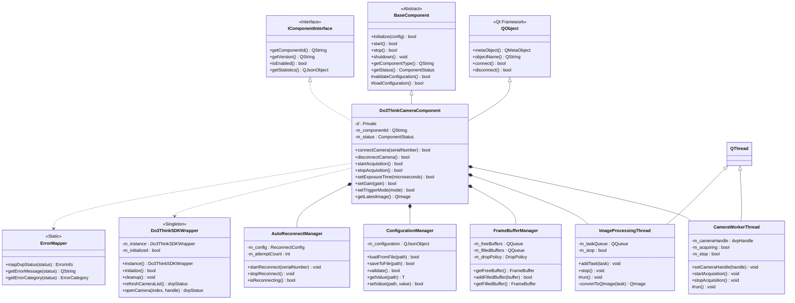
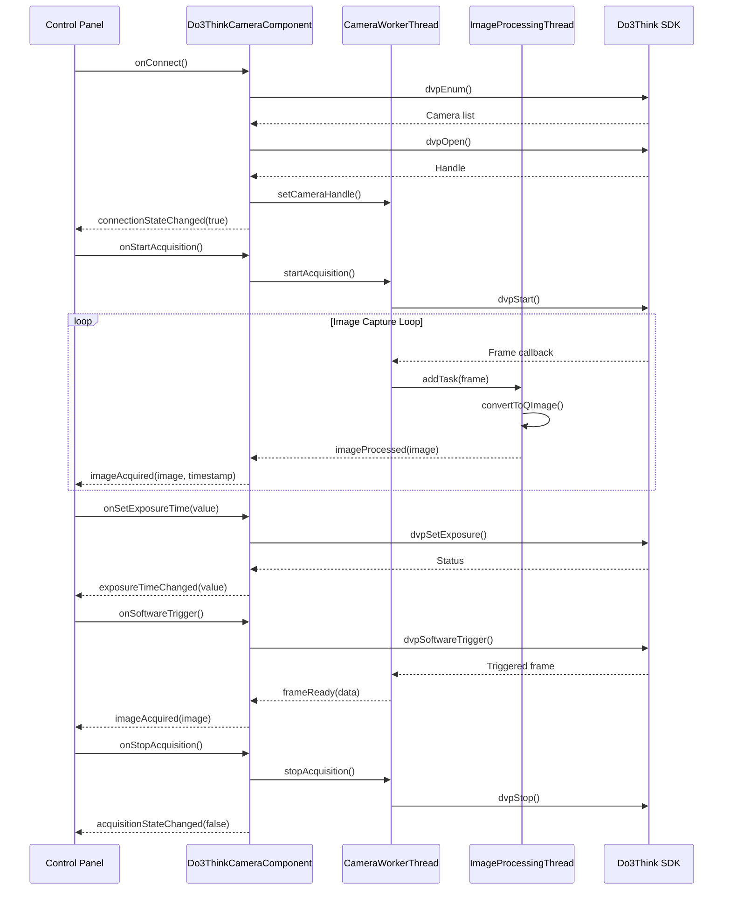
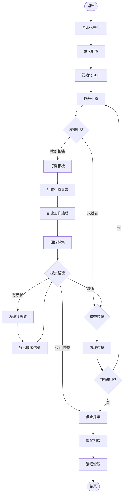

# Do3ThinkCamera Component 架構設計文檔

## 目錄
1. [元件架構設計](#1-元件架構設計)
2. [Signal/Slot介面設計](#2-signalslot介面設計)
3. [屬性系統(Q_PROPERTY)](#3-屬性系統q_property)
4. [配置管理](#4-配置管理)
5. [錯誤處理策略](#5-錯誤處理策略)
6. [資源管理](#6-資源管理)
7. [性能優化](#7-性能優化)
8. [UML類圖](#8-uml類圖)

## 1. 元件架構設計

### 1.1 繼承架構

Do3ThinkCameraComponent遵循ComponentsForest架構規範，繼承自BaseComponent基類，並整合Qt的QObject以支援Signal/Slot機制。

```cpp
// Do3ThinkCameraComponent.h
#pragma once

#include <QObject>
#include <QThread>
#include <QImage>
#include <QMutex>
#include <QTimer>
#include <QQueue>
#include <memory>
#include <atomic>

#include "BaseComponent.h"
#include "DVPCamera.h"
#include "IComponentInterface.h"

namespace ComponentsForest {

// 前向聲明
class CameraWorkerThread;
class ImageProcessingThread;
class FrameBufferManager;

class Do3ThinkCameraComponent : public QObject, public BaseComponent {
    Q_OBJECT
    
    // Q_PROPERTY宏定義
    Q_PROPERTY(bool connected READ isConnected NOTIFY connectionStateChanged)
    Q_PROPERTY(bool acquiring READ isAcquiring NOTIFY acquisitionStateChanged)
    Q_PROPERTY(double exposureTime READ getExposureTime WRITE setExposureTime NOTIFY exposureTimeChanged)
    Q_PROPERTY(double gain READ getGain WRITE setGain NOTIFY gainChanged)
    Q_PROPERTY(double frameRate READ getFrameRate NOTIFY frameRateChanged)
    Q_PROPERTY(QString cameraModel READ getCameraModel NOTIFY cameraModelChanged)
    Q_PROPERTY(QString serialNumber READ getSerialNumber NOTIFY serialNumberChanged)
    Q_PROPERTY(TriggerMode triggerMode READ getTriggerMode WRITE setTriggerMode NOTIFY triggerModeChanged)
    Q_PROPERTY(QSize resolution READ getResolution WRITE setResolution NOTIFY resolutionChanged)
    Q_PROPERTY(QRect roi READ getROI WRITE setROI NOTIFY roiChanged)
    
    Q_ENUMS(TriggerMode)
    Q_ENUMS(ComponentStatus)
    Q_ENUMS(PixelFormat)

public:
    // 觸發模式枚舉
    enum class TriggerMode {
        Continuous,     // 連續採集
        Software,       // 軟體觸發
        Hardware,       // 硬體觸發
        Line            // 線觸發（線掃相機）
    };
    
    // 元件狀態枚舉
    enum class ComponentStatus {
        Uninitialized,
        Initialized,
        Connected,
        Acquiring,
        Stopped,
        Error
    };
    
    // 像素格式枚舉
    enum class PixelFormat {
        Mono8,
        Mono10,
        Mono12,
        Mono16,
        BayerRG8,
        BayerGB8,
        BayerGR8,
        BayerBG8,
        RGB24,
        BGR24
    };

public:
    explicit Do3ThinkCameraComponent(const QString& componentId, QObject* parent = nullptr);
    virtual ~Do3ThinkCameraComponent();
    
    // BaseComponent介面實現
    bool initialize(const QJsonObject& config) override;
    bool start() override;
    bool stop() override;
    void shutdown() override;
    QString getComponentType() const override { return "Do3ThinkCamera"; }
    ComponentStatus getStatus() const override { return m_status; }
    
    // 相機控制介面
    bool connectCamera(const QString& serialNumber = QString());
    bool disconnectCamera();
    bool startAcquisition();
    bool stopAcquisition();
    bool softwareTrigger();
    
    // 參數獲取介面
    bool isConnected() const;
    bool isAcquiring() const;
    double getExposureTime() const;
    double getGain() const;
    double getFrameRate() const;
    QString getCameraModel() const;
    QString getSerialNumber() const;
    TriggerMode getTriggerMode() const;
    QSize getResolution() const;
    QRect getROI() const;
    QStringList getAvailablePixelFormats() const;
    
    // 參數設置介面
    bool setExposureTime(double microseconds);
    bool setGain(double gain);
    bool setTriggerMode(TriggerMode mode);
    bool setResolution(const QSize& resolution);
    bool setROI(const QRect& roi);
    bool setPixelFormat(PixelFormat format);
    bool setFrameRate(double fps);
    
    // 進階功能
    bool setAutoExposure(bool enabled);
    bool setAutoGain(bool enabled);
    bool setAutoWhiteBalance(bool enabled);
    bool setGamma(double gamma);
    bool setContrast(int contrast);
    bool setBrightness(int brightness);
    
    // 圖像獲取
    QImage getLatestImage() const;
    bool saveImage(const QString& filePath, const QString& format = "PNG") const;
    
public slots:
    // 配置槽
    void onConfigurationChanged(const QJsonObject& config);
    void onLoadConfiguration(const QString& configPath);
    void onSaveConfiguration(const QString& configPath);
    
    // 控制槽
    void onConnect();
    void onDisconnect();
    void onStartAcquisition();
    void onStopAcquisition();
    void onSoftwareTrigger();
    
    // 參數設置槽
    void onSetExposureTime(double microseconds);
    void onSetGain(double gain);
    void onSetTriggerMode(int mode);
    void onSetROI(const QRect& roi);
    void onSetPixelFormat(const QString& format);
    
    // 自動調節槽
    void onAutoExposureToggled(bool enabled);
    void onAutoGainToggled(bool enabled);
    void onAutoWhiteBalanceToggled(bool enabled);

signals:
    // 圖像信號
    void imageAcquired(const QImage& image, qint64 timestamp);
    void rawDataAcquired(const QByteArray& data, const QJsonObject& metadata);
    
    // 狀態信號
    void statusChanged(ComponentStatus status);
    void connectionStateChanged(bool connected);
    void acquisitionStateChanged(bool acquiring);
    
    // 錯誤信號
    void errorOccurred(const QString& error, int errorCode);
    void warningOccurred(const QString& warning);
    
    // 參數變更信號
    void parameterChanged(const QString& paramName, const QVariant& value);
    void exposureTimeChanged(double microseconds);
    void gainChanged(double gain);
    void frameRateChanged(double fps);
    void triggerModeChanged(TriggerMode mode);
    void resolutionChanged(const QSize& resolution);
    void roiChanged(const QRect& roi);
    
    // 資訊信號
    void cameraModelChanged(const QString& model);
    void serialNumberChanged(const QString& serialNumber);
    void statisticsUpdated(const QJsonObject& stats);
    
    // 配置信號
    void configurationLoaded(const QJsonObject& config);
    void configurationSaved(const QString& path);

private:
    // 內部實現
    class Private;
    std::unique_ptr<Private> d;
    
    // 內部方法
    bool initializeSDK();
    bool enumCameras();
    bool openCamera(int index);
    bool closeCamera();
    bool configureCamera();
    bool startWorkerThread();
    bool stopWorkerThread();
    void updateStatistics();
    void processFrame(const dvpFrame& frame);
    dvpStatus mapErrorCode(dvpStatus status);
    
private slots:
    // 內部槽
    void onWorkerThreadFinished();
    void onFrameReceived(const QByteArray& data, qint64 timestamp);
    void onStatisticsTimerTimeout();
    void onErrorFromWorker(const QString& error, int code);
};

} // namespace ComponentsForest
```

### 1.2 Do3Think SDK封裝策略

#### 1.2.1 SDK管理類

```cpp
// Do3ThinkSDKWrapper.h
#pragma once

#include "DVPCamera.h"
#include <QMutex>
#include <memory>

namespace ComponentsForest {

class Do3ThinkSDKWrapper {
public:
    static Do3ThinkSDKWrapper& instance();
    
    // SDK初始化與清理
    bool initialize();
    void cleanup();
    
    // 相機枚舉
    dvpStatus refreshCameraList();
    uint32_t getCameraCount() const;
    dvpStatus getCameraInfo(uint32_t index, dvpCameraInfo& info) const;
    
    // 相機操作封裝
    dvpStatus openCamera(uint32_t index, dvpHandle& handle);
    dvpStatus closeCamera(dvpHandle handle);
    
    // 錯誤處理
    QString getErrorString(dvpStatus status) const;
    
private:
    Do3ThinkSDKWrapper();
    ~Do3ThinkSDKWrapper();
    
    // 禁止複製
    Do3ThinkSDKWrapper(const Do3ThinkSDKWrapper&) = delete;
    Do3ThinkSDKWrapper& operator=(const Do3ThinkSDKWrapper&) = delete;
    
private:
    mutable QMutex m_mutex;
    bool m_initialized;
    uint32_t m_cameraCount;
    std::vector<dvpCameraInfo> m_cameraInfoList;
};

} // namespace ComponentsForest
```

#### 1.2.2 相機句柄RAII封裝

```cpp
// CameraHandle.h
#pragma once

#include "DVPCamera.h"
#include <memory>

namespace ComponentsForest {

class CameraHandle {
public:
    CameraHandle() : m_handle(0), m_isValid(false) {}
    
    explicit CameraHandle(dvpHandle handle) 
        : m_handle(handle), m_isValid(true) {}
    
    ~CameraHandle() {
        if (m_isValid && m_handle != 0) {
            dvpClose(m_handle);
        }
    }
    
    // 移動語義
    CameraHandle(CameraHandle&& other) noexcept
        : m_handle(other.m_handle), m_isValid(other.m_isValid) {
        other.m_handle = 0;
        other.m_isValid = false;
    }
    
    CameraHandle& operator=(CameraHandle&& other) noexcept {
        if (this != &other) {
            reset();
            m_handle = other.m_handle;
            m_isValid = other.m_isValid;
            other.m_handle = 0;
            other.m_isValid = false;
        }
        return *this;
    }
    
    // 禁止複製
    CameraHandle(const CameraHandle&) = delete;
    CameraHandle& operator=(const CameraHandle&) = delete;
    
    // 訪問器
    dvpHandle get() const { return m_handle; }
    bool isValid() const { return m_isValid && m_handle != 0; }
    
    // 重置
    void reset() {
        if (m_isValid && m_handle != 0) {
            dvpClose(m_handle);
            m_handle = 0;
            m_isValid = false;
        }
    }
    
    // 釋放所有權
    dvpHandle release() {
        dvpHandle temp = m_handle;
        m_handle = 0;
        m_isValid = false;
        return temp;
    }

private:
    dvpHandle m_handle;
    bool m_isValid;
};

using CameraHandlePtr = std::unique_ptr<CameraHandle>;

} // namespace ComponentsForest
```

### 1.3 生命週期管理實現

```cpp
// Do3ThinkCameraComponent.cpp (部分實現)

bool Do3ThinkCameraComponent::initialize(const QJsonObject& config) {
    QMutexLocker locker(&d->mutex);
    
    if (d->status != ComponentStatus::Uninitialized) {
        emit errorOccurred("Component already initialized", -1);
        return false;
    }
    
    try {
        // 1. 初始化SDK
        if (!Do3ThinkSDKWrapper::instance().initialize()) {
            throw std::runtime_error("Failed to initialize Do3Think SDK");
        }
        
        // 2. 載入配置
        d->configuration = config;
        if (!loadConfiguration(config)) {
            throw std::runtime_error("Failed to load configuration");
        }
        
        // 3. 枚舉相機
        auto status = Do3ThinkSDKWrapper::instance().refreshCameraList();
        if (status != DVP_STATUS_OK) {
            throw std::runtime_error("Failed to enumerate cameras");
        }
        
        // 4. 創建工作線程
        d->workerThread = std::make_unique<CameraWorkerThread>(this);
        connect(d->workerThread.get(), &CameraWorkerThread::frameReady,
                this, &Do3ThinkCameraComponent::onFrameReceived);
        connect(d->workerThread.get(), &CameraWorkerThread::errorOccurred,
                this, &Do3ThinkCameraComponent::onErrorFromWorker);
        
        // 5. 初始化緩衝區管理器
        d->bufferManager = std::make_unique<FrameBufferManager>(
            config["bufferSize"].toInt(10));
        
        // 6. 設置統計定時器
        d->statisticsTimer = new QTimer(this);
        connect(d->statisticsTimer, &QTimer::timeout,
                this, &Do3ThinkCameraComponent::updateStatistics);
        d->statisticsTimer->setInterval(1000); // 每秒更新
        
        // 7. 更新狀態
        d->status = ComponentStatus::Initialized;
        emit statusChanged(d->status);
        
        return true;
        
    } catch (const std::exception& e) {
        emit errorOccurred(QString("Initialization failed: %1").arg(e.what()), -1);
        return false;
    }
}

bool Do3ThinkCameraComponent::start() {
    QMutexLocker locker(&d->mutex);
    
    if (d->status != ComponentStatus::Connected) {
        emit errorOccurred("Camera not connected", -1);
        return false;
    }
    
    // 開始採集
    if (!startAcquisition()) {
        return false;
    }
    
    // 啟動統計定時器
    d->statisticsTimer->start();
    
    return true;
}

bool Do3ThinkCameraComponent::stop() {
    QMutexLocker locker(&d->mutex);
    
    if (d->status != ComponentStatus::Acquiring) {
        return true; // Already stopped
    }
    
    // 停止採集
    stopAcquisition();
    
    // 停止統計定時器
    d->statisticsTimer->stop();
    
    return true;
}

void Do3ThinkCameraComponent::shutdown() {
    QMutexLocker locker(&d->mutex);
    
    // 1. 停止採集
    if (d->status == ComponentStatus::Acquiring) {
        stop();
    }
    
    // 2. 斷開相機
    if (d->status == ComponentStatus::Connected) {
        disconnectCamera();
    }
    
    // 3. 停止工作線程
    if (d->workerThread && d->workerThread->isRunning()) {
        d->workerThread->stop();
        d->workerThread->wait();
    }
    
    // 4. 清理資源
    d->bufferManager.reset();
    d->workerThread.reset();
    
    // 5. 清理SDK
    Do3ThinkSDKWrapper::instance().cleanup();
    
    // 6. 更新狀態
    d->status = ComponentStatus::Uninitialized;
    emit statusChanged(d->status);
}
```

### 1.4 線程模型設計

#### 1.4.1 工作線程類

```cpp
// CameraWorkerThread.h
#pragma once

#include <QThread>
#include <QMutex>
#include <QWaitCondition>
#include <atomic>
#include "DVPCamera.h"

namespace ComponentsForest {

class CameraWorkerThread : public QThread {
    Q_OBJECT

public:
    explicit CameraWorkerThread(QObject* parent = nullptr);
    ~CameraWorkerThread();
    
    void setCameraHandle(dvpHandle handle);
    void startAcquisition();
    void stopAcquisition();
    void stop();
    
signals:
    void frameReady(const QByteArray& data, qint64 timestamp);
    void errorOccurred(const QString& error, int code);
    void statisticsUpdated(double fps, int droppedFrames);

protected:
    void run() override;

private:
    void processFrame();
    void updateFrameRate();
    
private:
    dvpHandle m_cameraHandle;
    std::atomic<bool> m_acquiring;
    std::atomic<bool> m_stop;
    
    QMutex m_mutex;
    QWaitCondition m_condition;
    
    // 統計信息
    std::atomic<uint64_t> m_frameCount;
    std::atomic<uint64_t> m_droppedFrames;
    std::chrono::steady_clock::time_point m_lastFpsTime;
};

} // namespace ComponentsForest
```

#### 1.4.2 圖像處理線程

```cpp
// ImageProcessingThread.h
#pragma once

#include <QThread>
#include <QQueue>
#include <QMutex>
#include <QWaitCondition>

namespace ComponentsForest {

struct ImageTask {
    QByteArray rawData;
    dvpImageFormat format;
    QSize resolution;
    qint64 timestamp;
};

class ImageProcessingThread : public QThread {
    Q_OBJECT

public:
    explicit ImageProcessingThread(QObject* parent = nullptr);
    ~ImageProcessingThread();
    
    void addTask(const ImageTask& task);
    void stop();
    
signals:
    void imageProcessed(const QImage& image, qint64 timestamp);
    void processingError(const QString& error);

protected:
    void run() override;

private:
    QImage convertToQImage(const ImageTask& task);
    QImage debayerImage(const QByteArray& data, dvpImageFormat format, const QSize& size);
    
private:
    QQueue<ImageTask> m_taskQueue;
    QMutex m_mutex;
    QWaitCondition m_condition;
    std::atomic<bool> m_stop;
};

} // namespace ComponentsForest
```

## 2. Signal/Slot介面設計

### 2.1 輸入Slots詳細設計

```cpp
// 連接控制槽
public slots:
    /**
     * @brief 連接到指定序列號的相機
     * @param serialNumber 相機序列號，為空則連接第一個可用相機
     */
    void onConnect(const QString& serialNumber = QString()) {
        if (!connectCamera(serialNumber)) {
            emit errorOccurred("Failed to connect camera", -1);
        }
    }
    
    /**
     * @brief 斷開當前連接的相機
     */
    void onDisconnect() {
        disconnectCamera();
    }
    
    /**
     * @brief 開始圖像採集
     */
    void onStartAcquisition() {
        if (!startAcquisition()) {
            emit errorOccurred("Failed to start acquisition", -1);
        }
    }
    
    /**
     * @brief 停止圖像採集
     */
    void onStopAcquisition() {
        stopAcquisition();
    }
    
    /**
     * @brief 執行軟體觸發
     */
    void onSoftwareTrigger() {
        if (d->triggerMode != TriggerMode::Software) {
            emit warningOccurred("Software trigger ignored: not in software trigger mode");
            return;
        }
        
        if (d->cameraHandle && d->cameraHandle->isValid()) {
            dvpStatus status = dvpSoftwareTrigger(d->cameraHandle->get());
            if (status != DVP_STATUS_OK) {
                emit errorOccurred("Software trigger failed", status);
            }
        }
    }

// 參數設置槽
public slots:
    /**
     * @brief 設置曝光時間
     * @param microseconds 曝光時間（微秒）
     */
    void onSetExposureTime(double microseconds) {
        if (!setExposureTime(microseconds)) {
            emit errorOccurred(QString("Failed to set exposure time: %1").arg(microseconds), -1);
        }
    }
    
    /**
     * @brief 設置增益
     * @param gain 增益值
     */
    void onSetGain(double gain) {
        if (!setGain(gain)) {
            emit errorOccurred(QString("Failed to set gain: %1").arg(gain), -1);
        }
    }
    
    /**
     * @brief 設置觸發模式
     * @param mode 觸發模式枚舉值
     */
    void onSetTriggerMode(int mode) {
        if (!setTriggerMode(static_cast<TriggerMode>(mode))) {
            emit errorOccurred("Failed to set trigger mode", -1);
        }
    }
    
    /**
     * @brief 設置ROI區域
     * @param roi 感興趣區域
     */
    void onSetROI(const QRect& roi) {
        if (!setROI(roi)) {
            emit errorOccurred("Failed to set ROI", -1);
        }
    }
    
    /**
     * @brief 設置像素格式
     * @param format 像素格式字符串
     */
    void onSetPixelFormat(const QString& format) {
        // 轉換字符串到枚舉
        PixelFormat pixelFormat = stringToPixelFormat(format);
        if (!setPixelFormat(pixelFormat)) {
            emit errorOccurred(QString("Failed to set pixel format: %1").arg(format), -1);
        }
    }

// 自動調節槽
public slots:
    /**
     * @brief 切換自動曝光
     * @param enabled 是否啟用
     */
    void onAutoExposureToggled(bool enabled) {
        if (!setAutoExposure(enabled)) {
            emit errorOccurred("Failed to toggle auto exposure", -1);
        }
    }
    
    /**
     * @brief 切換自動增益
     * @param enabled 是否啟用
     */
    void onAutoGainToggled(bool enabled) {
        if (!setAutoGain(enabled)) {
            emit errorOccurred("Failed to toggle auto gain", -1);
        }
    }
    
    /**
     * @brief 切換自動白平衡
     * @param enabled 是否啟用
     */
    void onAutoWhiteBalanceToggled(bool enabled) {
        if (!setAutoWhiteBalance(enabled)) {
            emit errorOccurred("Failed to toggle auto white balance", -1);
        }
    }
```

### 2.2 輸出Signals詳細設計

```cpp
signals:
    /**
     * @brief 圖像採集完成信號
     * @param image 處理後的QImage對象
     * @param timestamp 時間戳（微秒）
     * 
     * 此信號在每次成功採集並處理圖像後發出。
     * 圖像已經過debayer、顏色校正等處理，可直接顯示。
     */
    void imageAcquired(const QImage& image, qint64 timestamp);
    
    /**
     * @brief 原始數據採集完成信號
     * @param data 原始圖像數據
     * @param metadata 元數據（JSON格式）
     * 
     * 元數據包含：
     * - format: 像素格式
     * - width: 圖像寬度
     * - height: 圖像高度
     * - timestamp: 時間戳
     * - frameId: 幀序號
     * - exposureTime: 曝光時間
     * - gain: 增益值
     */
    void rawDataAcquired(const QByteArray& data, const QJsonObject& metadata);
    
    /**
     * @brief 元件狀態變更信號
     * @param status 新的狀態
     */
    void statusChanged(ComponentStatus status);
    
    /**
     * @brief 連接狀態變更信號
     * @param connected 是否已連接
     */
    void connectionStateChanged(bool connected);
    
    /**
     * @brief 採集狀態變更信號
     * @param acquiring 是否正在採集
     */
    void acquisitionStateChanged(bool acquiring);
    
    /**
     * @brief 錯誤發生信號
     * @param error 錯誤描述
     * @param errorCode 錯誤代碼
     */
    void errorOccurred(const QString& error, int errorCode);
    
    /**
     * @brief 警告發生信號
     * @param warning 警告描述
     */
    void warningOccurred(const QString& warning);
    
    /**
     * @brief 參數變更通用信號
     * @param paramName 參數名稱
     * @param value 新的參數值
     */
    void parameterChanged(const QString& paramName, const QVariant& value);
    
    /**
     * @brief 統計信息更新信號
     * @param stats 統計信息（JSON格式）
     * 
     * 統計信息包含：
     * - fps: 當前幀率
     * - totalFrames: 總幀數
     * - droppedFrames: 丟失幀數
     * - temperature: 相機溫度
     * - bandwidth: 帶寬使用
     * - bufferUsage: 緩衝區使用率
     */
    void statisticsUpdated(const QJsonObject& stats);
```

### 2.3 Signal/Slot連接示例

```cpp
// 使用示例
void MainWindow::setupCameraComponent() {
    // 創建相機元件
    m_cameraComponent = new Do3ThinkCameraComponent("Camera_01", this);
    
    // 連接圖像信號
    connect(m_cameraComponent, &Do3ThinkCameraComponent::imageAcquired,
            this, &MainWindow::onImageReceived);
    
    // 連接狀態信號
    connect(m_cameraComponent, &Do3ThinkCameraComponent::statusChanged,
            this, &MainWindow::onCameraStatusChanged);
    
    // 連接錯誤信號
    connect(m_cameraComponent, &Do3ThinkCameraComponent::errorOccurred,
            this, &MainWindow::onCameraError);
    
    // 連接統計信號
    connect(m_cameraComponent, &Do3ThinkCameraComponent::statisticsUpdated,
            this, &MainWindow::updateStatisticsDisplay);
    
    // 連接UI控制到相機槽
    connect(ui->btnConnect, &QPushButton::clicked,
            m_cameraComponent, &Do3ThinkCameraComponent::onConnect);
    
    connect(ui->btnStartCapture, &QPushButton::clicked,
            m_cameraComponent, &Do3ThinkCameraComponent::onStartAcquisition);
    
    connect(ui->sliderExposure, &QSlider::valueChanged,
            m_cameraComponent, &Do3ThinkCameraComponent::onSetExposureTime);
    
    connect(ui->btnTrigger, &QPushButton::clicked,
            m_cameraComponent, &Do3ThinkCameraComponent::onSoftwareTrigger);
}
```

## 3. 屬性系統(Q_PROPERTY)

### 3.1 屬性定義與實現

```cpp
// 相機狀態屬性
Q_PROPERTY(bool connected READ isConnected NOTIFY connectionStateChanged)
Q_PROPERTY(bool acquiring READ isAcquiring NOTIFY acquisitionStateChanged)
Q_PROPERTY(ComponentStatus status READ getStatus NOTIFY statusChanged)

// 相機信息屬性
Q_PROPERTY(QString cameraModel READ getCameraModel NOTIFY cameraModelChanged)
Q_PROPERTY(QString serialNumber READ getSerialNumber NOTIFY serialNumberChanged)
Q_PROPERTY(QString firmwareVersion READ getFirmwareVersion NOTIFY firmwareVersionChanged)

// 採集參數屬性
Q_PROPERTY(double exposureTime READ getExposureTime WRITE setExposureTime NOTIFY exposureTimeChanged)
Q_PROPERTY(double gain READ getGain WRITE setGain NOTIFY gainChanged)
Q_PROPERTY(double frameRate READ getFrameRate WRITE setFrameRate NOTIFY frameRateChanged)
Q_PROPERTY(TriggerMode triggerMode READ getTriggerMode WRITE setTriggerMode NOTIFY triggerModeChanged)

// 圖像參數屬性
Q_PROPERTY(QSize resolution READ getResolution WRITE setResolution NOTIFY resolutionChanged)
Q_PROPERTY(QRect roi READ getROI WRITE setROI NOTIFY roiChanged)
Q_PROPERTY(PixelFormat pixelFormat READ getPixelFormat WRITE setPixelFormat NOTIFY pixelFormatChanged)

// 自動調節屬性
Q_PROPERTY(bool autoExposure READ isAutoExposure WRITE setAutoExposure NOTIFY autoExposureChanged)
Q_PROPERTY(bool autoGain READ isAutoGain WRITE setAutoGain NOTIFY autoGainChanged)
Q_PROPERTY(bool autoWhiteBalance READ isAutoWhiteBalance WRITE setAutoWhiteBalance NOTIFY autoWhiteBalanceChanged)

// 統計信息屬性（只讀）
Q_PROPERTY(qint64 totalFrames READ getTotalFrames NOTIFY totalFramesChanged)
Q_PROPERTY(qint64 droppedFrames READ getDroppedFrames NOTIFY droppedFramesChanged)
Q_PROPERTY(double temperature READ getTemperature NOTIFY temperatureChanged)
Q_PROPERTY(double bandwidth READ getBandwidth NOTIFY bandwidthChanged)
```

### 3.2 屬性實現示例

```cpp
// 曝光時間屬性實現
double Do3ThinkCameraComponent::getExposureTime() const {
    QMutexLocker locker(&d->mutex);
    return d->exposureTime;
}

bool Do3ThinkCameraComponent::setExposureTime(double microseconds) {
    QMutexLocker locker(&d->mutex);
    
    if (!d->cameraHandle || !d->cameraHandle->isValid()) {
        return false;
    }
    
    // 檢查範圍
    double min, max, step;
    dvpStatus status = dvpGetExposureDescr(d->cameraHandle->get(), &min, &max, &step);
    if (status != DVP_STATUS_OK) {
        return false;
    }
    
    if (microseconds < min || microseconds > max) {
        emit warningOccurred(QString("Exposure time %1 out of range [%2, %3]")
                           .arg(microseconds).arg(min).arg(max));
        return false;
    }
    
    // 設置曝光時間
    status = dvpSetExposure(d->cameraHandle->get(), microseconds);
    if (status != DVP_STATUS_OK) {
        emit errorOccurred("Failed to set exposure time", status);
        return false;
    }
    
    // 更新內部值
    d->exposureTime = microseconds;
    
    // 發出變更信號
    emit exposureTimeChanged(microseconds);
    emit parameterChanged("exposureTime", microseconds);
    
    return true;
}

// ROI屬性實現
QRect Do3ThinkCameraComponent::getROI() const {
    QMutexLocker locker(&d->mutex);
    return d->currentROI;
}

bool Do3ThinkCameraComponent::setROI(const QRect& roi) {
    QMutexLocker locker(&d->mutex);
    
    if (!d->cameraHandle || !d->cameraHandle->isValid()) {
        return false;
    }
    
    // 驗證ROI
    if (!validateROI(roi)) {
        emit warningOccurred("Invalid ROI specified");
        return false;
    }
    
    // 設置ROI
    dvpRegion region;
    region.X = roi.x();
    region.Y = roi.y();
    region.W = roi.width();
    region.H = roi.height();
    
    dvpStatus status = dvpSetRoi(d->cameraHandle->get(), region);
    if (status != DVP_STATUS_OK) {
        emit errorOccurred("Failed to set ROI", status);
        return false;
    }
    
    // 更新內部值
    d->currentROI = roi;
    
    // 發出變更信號
    emit roiChanged(roi);
    emit parameterChanged("roi", QVariant::fromValue(roi));
    
    return true;
}
```

## 4. 配置管理

### 4.1 JSON配置結構

```json
{
    "component": {
        "id": "Do3ThinkCamera_01",
        "type": "Do3ThinkCamera",
        "version": "1.0.0",
        "enabled": true
    },
    "connection": {
        "serialNumber": "",
        "autoConnect": true,
        "connectionTimeout": 5000,
        "reconnectAttempts": 3,
        "reconnectDelay": 1000
    },
    "acquisition": {
        "triggerMode": "Continuous",
        "exposureTime": 10000.0,
        "gain": 1.0,
        "frameRate": 30.0,
        "pixelFormat": "Mono8",
        "resolution": {
            "width": 1920,
            "height": 1080
        },
        "roi": {
            "x": 0,
            "y": 0,
            "width": 0,
            "height": 0
        }
    },
    "processing": {
        "enableDebayer": true,
        "enableColorCorrection": true,
        "enableGammaCorrection": true,
        "gamma": 1.0,
        "contrast": 50,
        "brightness": 50
    },
    "autoAdjustment": {
        "autoExposure": false,
        "autoGain": false,
        "autoWhiteBalance": false,
        "targetBrightness": 128,
        "exposureLimits": {
            "min": 100,
            "max": 100000
        },
        "gainLimits": {
            "min": 1.0,
            "max": 16.0
        }
    },
    "buffer": {
        "frameBufferCount": 10,
        "enableCircularBuffer": true,
        "dropPolicy": "DropOldest"
    },
    "performance": {
        "workerThreadPriority": "Normal",
        "processingThreads": 2,
        "enableZeroCopy": true,
        "enableHardwareAcceleration": false
    },
    "logging": {
        "level": "Info",
        "enableFileLogging": true,
        "logPath": "logs/camera.log",
        "maxLogSize": 10485760,
        "maxLogFiles": 5
    },
    "advanced": {
        "enablePacketResend": true,
        "packetTimeout": 40,
        "heartbeatInterval": 1000,
        "enableBandwidthReserve": true,
        "bandwidthReserve": 10
    }
}
```

### 4.2 配置管理實現

```cpp
// ConfigurationManager.h
#pragma once

#include <QJsonObject>
#include <QJsonDocument>
#include <QString>

namespace ComponentsForest {

class ConfigurationManager {
public:
    ConfigurationManager();
    ~ConfigurationManager();
    
    // 配置載入與保存
    bool loadFromFile(const QString& filePath);
    bool saveToFile(const QString& filePath) const;
    bool loadFromJson(const QJsonObject& json);
    QJsonObject toJson() const;
    
    // 配置驗證
    bool validate() const;
    QStringList getValidationErrors() const;
    
    // 配置合併
    void mergeConfiguration(const QJsonObject& config);
    
    // 配置版本管理
    bool isCompatibleVersion(const QString& version) const;
    bool migrateConfiguration(const QString& fromVersion, const QString& toVersion);
    
    // 配置變更通知
    void setConfigurationChangedCallback(std::function<void(const QJsonObject&)> callback);
    
    // 獲取配置項
    template<typename T>
    T getValue(const QString& path, const T& defaultValue = T()) const;
    
    // 設置配置項
    template<typename T>
    bool setValue(const QString& path, const T& value);
    
private:
    class Private;
    std::unique_ptr<Private> d;
    
    // 內部方法
    bool validateConnectionConfig(const QJsonObject& config) const;
    bool validateAcquisitionConfig(const QJsonObject& config) const;
    bool validateProcessingConfig(const QJsonObject& config) const;
    bool validateBufferConfig(const QJsonObject& config) const;
    
    QJsonValue getJsonValue(const QString& path) const;
    bool setJsonValue(const QString& path, const QJsonValue& value);
};

} // namespace ComponentsForest
```

### 4.3 配置熱載入

```cpp
// 配置熱載入實現
class ConfigurationWatcher : public QObject {
    Q_OBJECT
    
public:
    ConfigurationWatcher(const QString& configPath, QObject* parent = nullptr)
        : QObject(parent), m_configPath(configPath) {
        
        m_watcher = new QFileSystemWatcher(this);
        m_watcher->addPath(configPath);
        
        connect(m_watcher, &QFileSystemWatcher::fileChanged,
                this, &ConfigurationWatcher::onConfigFileChanged);
    }
    
signals:
    void configurationChanged(const QJsonObject& config);
    
private slots:
    void onConfigFileChanged(const QString& path) {
        QFile file(path);
        if (file.open(QIODevice::ReadOnly)) {
            QJsonDocument doc = QJsonDocument::fromJson(file.readAll());
            if (!doc.isNull() && doc.isObject()) {
                emit configurationChanged(doc.object());
            }
        }
        
        // 重新添加監視（某些系統在文件被修改後會移除監視）
        if (!m_watcher->files().contains(path)) {
            m_watcher->addPath(path);
        }
    }
    
private:
    QString m_configPath;
    QFileSystemWatcher* m_watcher;
};
```

## 5. 錯誤處理策略

### 5.1 dvpStatus映射到Qt錯誤系統

```cpp
// ErrorMapper.h
#pragma once

#include "DVPCamera.h"
#include <QString>
#include <QMap>

namespace ComponentsForest {

class ErrorMapper {
public:
    enum ErrorCategory {
        NoError = 0,
        ConnectionError = 1000,
        ConfigurationError = 2000,
        AcquisitionError = 3000,
        ParameterError = 4000,
        ResourceError = 5000,
        UnknownError = 9000
    };
    
    struct ErrorInfo {
        int code;
        ErrorCategory category;
        QString message;
        QString suggestion;
    };
    
    static ErrorInfo mapDvpStatus(dvpStatus status);
    static QString getErrorMessage(dvpStatus status);
    static ErrorCategory getErrorCategory(dvpStatus status);
    static QString getErrorSuggestion(dvpStatus status);
    
private:
    static void initializeErrorMap();
    static QMap<dvpStatus, ErrorInfo> s_errorMap;
    static bool s_initialized;
};

// ErrorMapper.cpp
QMap<dvpStatus, ErrorInfo> ErrorMapper::s_errorMap;
bool ErrorMapper::s_initialized = false;

void ErrorMapper::initializeErrorMap() {
    if (s_initialized) return;
    
    s_errorMap[DVP_STATUS_OK] = {0, NoError, "Success", ""};
    s_errorMap[DVP_STATUS_FAILED] = {-1, UnknownError, "Operation failed", "Check camera connection and retry"};
    s_errorMap[DVP_STATUS_PARAMETER_INVALID] = {4001, ParameterError, "Invalid parameter", "Check parameter range and format"};
    s_errorMap[DVP_STATUS_NOT_SUPPORTED] = {4002, ParameterError, "Feature not supported", "Check camera capabilities"};
    s_errorMap[DVP_STATUS_NOT_INITIALIZED] = {1001, ConnectionError, "Camera not initialized", "Initialize camera first"};
    s_errorMap[DVP_STATUS_FUNCTION_INVALID] = {4003, ParameterError, "Invalid function call", "Check function prerequisites"};
    s_errorMap[DVP_STATUS_DEVICE_NOT_FOUND] = {1002, ConnectionError, "Device not found", "Check camera connection"};
    s_errorMap[DVP_STATUS_DEVICE_IS_OPENED] = {1003, ConnectionError, "Device already opened", "Close existing connection first"};
    s_errorMap[DVP_STATUS_INSUFFICIENT_MEMORY] = {5001, ResourceError, "Insufficient memory", "Free up system memory"};
    s_errorMap[DVP_STATUS_TIME_OUT] = {3001, AcquisitionError, "Operation timeout", "Increase timeout or check camera response"};
    
    // 添加更多錯誤映射...
    
    s_initialized = true;
}

ErrorInfo ErrorMapper::mapDvpStatus(dvpStatus status) {
    initializeErrorMap();
    
    if (s_errorMap.contains(status)) {
        return s_errorMap[status];
    }
    
    return {static_cast<int>(status), UnknownError, 
            QString("Unknown error: %1").arg(status), 
            "Contact support"};
}
```

### 5.2 自動重連機制

```cpp
// AutoReconnectManager.h
#pragma once

#include <QObject>
#include <QTimer>
#include <atomic>

namespace ComponentsForest {

class AutoReconnectManager : public QObject {
    Q_OBJECT
    
public:
    struct ReconnectConfig {
        bool enabled = true;
        int maxAttempts = 3;
        int initialDelay = 1000;  // ms
        int maxDelay = 30000;     // ms
        double backoffMultiplier = 2.0;
    };
    
    explicit AutoReconnectManager(QObject* parent = nullptr);
    
    void setConfiguration(const ReconnectConfig& config);
    void startReconnect(const QString& serialNumber);
    void stopReconnect();
    bool isReconnecting() const;
    
signals:
    void reconnectAttempt(int attemptNumber);
    void reconnectSucceeded();
    void reconnectFailed(const QString& reason);
    void reconnectExhausted();
    
private slots:
    void attemptReconnect();
    
private:
    ReconnectConfig m_config;
    QString m_targetSerialNumber;
    QTimer* m_reconnectTimer;
    std::atomic<int> m_attemptCount;
    int m_currentDelay;
    std::atomic<bool> m_reconnecting;
};

// AutoReconnectManager.cpp
void AutoReconnectManager::startReconnect(const QString& serialNumber) {
    if (m_reconnecting) {
        return;
    }
    
    m_targetSerialNumber = serialNumber;
    m_attemptCount = 0;
    m_currentDelay = m_config.initialDelay;
    m_reconnecting = true;
    
    // 立即嘗試第一次重連
    attemptReconnect();
}

void AutoReconnectManager::attemptReconnect() {
    if (!m_reconnecting) {
        return;
    }
    
    m_attemptCount++;
    emit reconnectAttempt(m_attemptCount);
    
    // 嘗試重連
    Do3ThinkCameraComponent* camera = qobject_cast<Do3ThinkCameraComponent*>(parent());
    if (camera && camera->connectCamera(m_targetSerialNumber)) {
        m_reconnecting = false;
        emit reconnectSucceeded();
        return;
    }
    
    // 檢查是否超過最大嘗試次數
    if (m_attemptCount >= m_config.maxAttempts) {
        m_reconnecting = false;
        emit reconnectExhausted();
        return;
    }
    
    // 計算下次重連延遲（指數退避）
    m_currentDelay = qMin(static_cast<int>(m_currentDelay * m_config.backoffMultiplier),
                         m_config.maxDelay);
    
    // 安排下次重連
    QTimer::singleShot(m_currentDelay, this, &AutoReconnectManager::attemptReconnect);
}
```

### 5.3 錯誤恢復策略

```cpp
// ErrorRecoveryStrategy.h
#pragma once

namespace ComponentsForest {

class ErrorRecoveryStrategy {
public:
    enum RecoveryAction {
        NoAction,
        Retry,
        Reset,
        Reconnect,
        Reinitialize,
        Shutdown
    };
    
    struct RecoveryPlan {
        RecoveryAction action;
        int retryCount;
        int delayMs;
        bool notifyUser;
        QString userMessage;
    };
    
    static RecoveryPlan getRecoveryPlan(const ErrorInfo& error);
    static bool executeRecovery(Do3ThinkCameraComponent* component, const RecoveryPlan& plan);
    
private:
    static RecoveryPlan getConnectionErrorRecovery(const ErrorInfo& error);
    static RecoveryPlan getAcquisitionErrorRecovery(const ErrorInfo& error);
    static RecoveryPlan getParameterErrorRecovery(const ErrorInfo& error);
    static RecoveryPlan getResourceErrorRecovery(const ErrorInfo& error);
};

// 實現示例
RecoveryPlan ErrorRecoveryStrategy::getRecoveryPlan(const ErrorInfo& error) {
    switch (error.category) {
        case ErrorMapper::ConnectionError:
            return getConnectionErrorRecovery(error);
            
        case ErrorMapper::AcquisitionError:
            return getAcquisitionErrorRecovery(error);
            
        case ErrorMapper::ParameterError:
            return getParameterErrorRecovery(error);
            
        case ErrorMapper::ResourceError:
            return getResourceErrorRecovery(error);
            
        default:
            return {NoAction, 0, 0, true, error.message};
    }
}

RecoveryPlan ErrorRecoveryStrategy::getConnectionErrorRecovery(const ErrorInfo& error) {
    RecoveryPlan plan;
    
    switch (error.code) {
        case 1001:  // Not initialized
            plan.action = Reinitialize;
            plan.retryCount = 1;
            plan.delayMs = 0;
            plan.notifyUser = false;
            break;
            
        case 1002:  // Device not found
            plan.action = Reconnect;
            plan.retryCount = 3;
            plan.delayMs = 1000;
            plan.notifyUser = true;
            plan.userMessage = "Camera disconnected. Attempting to reconnect...";
            break;
            
        default:
            plan.action = Reset;
            plan.retryCount = 1;
            plan.delayMs = 500;
            plan.notifyUser = true;
            plan.userMessage = error.message;
            break;
    }
    
    return plan;
}
```

## 6. 資源管理

### 6.1 相機句柄管理(RAII)

```cpp
// 已在1.2.2節中定義CameraHandle類

// 使用示例
class Do3ThinkCameraComponent::Private {
public:
    // 使用智能指針管理相機句柄
    std::unique_ptr<CameraHandle> cameraHandle;
    
    // 打開相機
    bool openCamera(uint32_t index) {
        dvpHandle handle;
        dvpStatus status = dvpOpen(index, GRAB_MODE, &handle);
        
        if (status == DVP_STATUS_OK) {
            cameraHandle = std::make_unique<CameraHandle>(handle);
            return true;
        }
        
        return false;
    }
    
    // 關閉相機（自動通過RAII）
    void closeCamera() {
        cameraHandle.reset();  // 自動調用dvpClose
    }
};
```

### 6.2 緩衝區管理

```cpp
// FrameBufferManager.h
#pragma once

#include <QQueue>
#include <QMutex>
#include <memory>
#include <atomic>

namespace ComponentsForest {

class FrameBuffer {
public:
    FrameBuffer(size_t size);
    ~FrameBuffer();
    
    void* data() { return m_data.get(); }
    const void* data() const { return m_data.get(); }
    size_t size() const { return m_size; }
    
    void resize(size_t newSize);
    void clear();
    
private:
    std::unique_ptr<uint8_t[]> m_data;
    size_t m_size;
};

class FrameBufferManager {
public:
    enum DropPolicy {
        DropOldest,    // 丟棄最舊的幀
        DropNewest,    // 丟棄最新的幀
        BlockWait      // 阻塞等待
    };
    
    explicit FrameBufferManager(int bufferCount = 10, DropPolicy policy = DropOldest);
    ~FrameBufferManager();
    
    // 獲取空閒緩衝區
    std::shared_ptr<FrameBuffer> getFreeBuffer();
    
    // 添加已填充的緩衝區
    bool addFilledBuffer(std::shared_ptr<FrameBuffer> buffer);
    
    // 獲取已填充的緩衝區
    std::shared_ptr<FrameBuffer> getFilledBuffer();
    
    // 統計信息
    int getFreeCount() const;
    int getFilledCount() const;
    int getDroppedCount() const;
    double getUsagePercentage() const;
    
    // 清空所有緩衝區
    void clear();
    
private:
    int m_bufferCount;
    DropPolicy m_dropPolicy;
    
    QQueue<std::shared_ptr<FrameBuffer>> m_freeBuffers;
    QQueue<std::shared_ptr<FrameBuffer>> m_filledBuffers;
    
    mutable QMutex m_mutex;
    std::atomic<int> m_droppedFrames;
    
    void initializeBuffers(size_t bufferSize);
};

// FrameBufferManager.cpp
std::shared_ptr<FrameBuffer> FrameBufferManager::getFreeBuffer() {
    QMutexLocker locker(&m_mutex);
    
    if (m_freeBuffers.isEmpty()) {
        // 根據策略處理緩衝區不足
        switch (m_dropPolicy) {
            case DropOldest:
                if (!m_filledBuffers.isEmpty()) {
                    auto buffer = m_filledBuffers.dequeue();
                    m_droppedFrames++;
                    return buffer;
                }
                break;
                
            case DropNewest:
                return nullptr;  // 返回空，讓調用者丟棄新幀
                
            case BlockWait:
                // 這裡應該使用條件變量等待
                // 簡化示例，直接返回空
                return nullptr;
        }
        
        // 如果沒有可用緩衝區，創建新的
        return std::make_shared<FrameBuffer>(1920 * 1080 * 3);
    }
    
    return m_freeBuffers.dequeue();
}

bool FrameBufferManager::addFilledBuffer(std::shared_ptr<FrameBuffer> buffer) {
    if (!buffer) return false;
    
    QMutexLocker locker(&m_mutex);
    
    if (m_filledBuffers.size() >= m_bufferCount) {
        switch (m_dropPolicy) {
            case DropOldest:
                m_filledBuffers.dequeue();
                m_droppedFrames++;
                break;
                
            case DropNewest:
                m_droppedFrames++;
                return false;
                
            case BlockWait:
                // 應該等待
                return false;
        }
    }
    
    m_filledBuffers.enqueue(buffer);
    return true;
}
```

### 6.3 線程生命週期管理

```cpp
// ThreadLifecycleManager.h
#pragma once

#include <QThread>
#include <QMutex>
#include <memory>
#include <vector>

namespace ComponentsForest {

class ThreadLifecycleManager {
public:
    ThreadLifecycleManager();
    ~ThreadLifecycleManager();
    
    // 線程管理
    bool registerThread(QThread* thread, const QString& name);
    bool unregisterThread(QThread* thread);
    bool startThread(const QString& name);
    bool stopThread(const QString& name, int timeout = 5000);
    void stopAllThreads(int timeout = 5000);
    
    // 線程監控
    bool isThreadRunning(const QString& name) const;
    QThread::Priority getThreadPriority(const QString& name) const;
    bool setThreadPriority(const QString& name, QThread::Priority priority);
    
    // 線程統計
    int getActiveThreadCount() const;
    QStringList getThreadNames() const;
    
private:
    struct ThreadInfo {
        QThread* thread;
        QString name;
        bool managed;
        std::chrono::steady_clock::time_point startTime;
    };
    
    std::vector<ThreadInfo> m_threads;
    mutable QMutex m_mutex;
    
    ThreadInfo* findThread(const QString& name);
    const ThreadInfo* findThread(const QString& name) const;
};

// 使用示例
class Do3ThinkCameraComponent::Private {
public:
    ThreadLifecycleManager threadManager;
    
    bool startThreads() {
        // 創建工作線程
        workerThread = new CameraWorkerThread();
        processingThread = new ImageProcessingThread();
        
        // 註冊線程
        threadManager.registerThread(workerThread, "CameraWorker");
        threadManager.registerThread(processingThread, "ImageProcessing");
        
        // 設置優先級
        threadManager.setThreadPriority("CameraWorker", QThread::HighPriority);
        threadManager.setThreadPriority("ImageProcessing", QThread::NormalPriority);
        
        // 啟動線程
        if (!threadManager.startThread("CameraWorker")) {
            return false;
        }
        
        if (!threadManager.startThread("ImageProcessing")) {
            threadManager.stopThread("CameraWorker");
            return false;
        }
        
        return true;
    }
    
    void stopThreads() {
        threadManager.stopAllThreads(3000);
    }
};
```

### 6.4 記憶體池設計

```cpp
// MemoryPool.h
#pragma once

#include <memory>
#include <stack>
#include <mutex>

namespace ComponentsForest {

template<typename T>
class MemoryPool {
public:
    using Ptr = std::shared_ptr<T>;
    using Deleter = std::function<void(T*)>;
    
    MemoryPool(size_t initialSize = 10, size_t maxSize = 100)
        : m_maxSize(maxSize) {
        preallocate(initialSize);
    }
    
    Ptr acquire() {
        std::lock_guard<std::mutex> lock(m_mutex);
        
        if (m_available.empty()) {
            if (m_totalAllocated < m_maxSize) {
                return createNew();
            }
            return nullptr;  // 池已滿
        }
        
        Ptr obj = m_available.top();
        m_available.pop();
        m_inUse.insert(obj.get());
        
        return obj;
    }
    
    void release(Ptr obj) {
        if (!obj) return;
        
        std::lock_guard<std::mutex> lock(m_mutex);
        
        auto it = m_inUse.find(obj.get());
        if (it != m_inUse.end()) {
            m_inUse.erase(it);
            reset(obj.get());
            m_available.push(obj);
        }
    }
    
    size_t getAvailableCount() const {
        std::lock_guard<std::mutex> lock(m_mutex);
        return m_available.size();
    }
    
    size_t getInUseCount() const {
        std::lock_guard<std::mutex> lock(m_mutex);
        return m_inUse.size();
    }
    
private:
    void preallocate(size_t count) {
        for (size_t i = 0; i < count; ++i) {
            m_available.push(createNew());
        }
    }
    
    Ptr createNew() {
        auto deleter = [this](T* ptr) {
            this->release(Ptr(ptr, [](T*){}));
        };
        
        Ptr obj(new T(), deleter);
        m_totalAllocated++;
        return obj;
    }
    
    void reset(T* obj) {
        // 重置對象到初始狀態
        *obj = T();
    }
    
private:
    mutable std::mutex m_mutex;
    std::stack<Ptr> m_available;
    std::set<T*> m_inUse;
    size_t m_maxSize;
    size_t m_totalAllocated = 0;
};

// 圖像緩衝區池
using ImageBufferPool = MemoryPool<QImage>;

} // namespace ComponentsForest
```

## 7. 性能優化

### 7.1 Zero-copy圖像傳輸

```cpp
// ZeroCopyImageTransfer.h
#pragma once

#include <QImage>
#include <memory>

namespace ComponentsForest {

class ZeroCopyImageTransfer {
public:
    // 創建共享內存圖像
    static QImage createSharedImage(int width, int height, QImage::Format format);
    
    // 直接映射Do3Think緩衝區到QImage
    static QImage wrapDvpBuffer(void* buffer, int width, int height, 
                                dvpImageFormat format, bool copy = false);
    
    // 零拷貝轉換
    static bool convertInPlace(QImage& image, QImage::Format targetFormat);
    
    // 共享內存管理
    class SharedMemoryImage {
    public:
        SharedMemoryImage(int width, int height, QImage::Format format);
        ~SharedMemoryImage();
        
        QImage& image() { return m_image; }
        const QImage& image() const { return m_image; }
        
        void* rawData() { return m_buffer.get(); }
        const void* rawData() const { return m_buffer.get(); }
        
        size_t size() const { return m_size; }
        
    private:
        std::unique_ptr<uchar[]> m_buffer;
        QImage m_image;
        size_t m_size;
    };
    
private:
    static QImage::Format mapDvpFormatToQt(dvpImageFormat format);
    static int calculateStride(int width, QImage::Format format);
};

// ZeroCopyImageTransfer.cpp
QImage ZeroCopyImageTransfer::wrapDvpBuffer(void* buffer, int width, int height,
                                            dvpImageFormat format, bool copy) {
    if (!buffer || width <= 0 || height <= 0) {
        return QImage();
    }
    
    QImage::Format qtFormat = mapDvpFormatToQt(format);
    if (qtFormat == QImage::Format_Invalid) {
        return QImage();
    }
    
    int bytesPerLine = calculateStride(width, qtFormat);
    
    if (copy) {
        // 複製模式
        size_t imageSize = bytesPerLine * height;
        uchar* imageCopy = new uchar[imageSize];
        memcpy(imageCopy, buffer, imageSize);
        
        return QImage(imageCopy, width, height, bytesPerLine, qtFormat,
                     [](void* data) { delete[] static_cast<uchar*>(data); }, imageCopy);
    } else {
        // 零拷貝模式 - 直接包裝緩衝區
        return QImage(static_cast<uchar*>(buffer), width, height, bytesPerLine, qtFormat);
    }
}

QImage::Format ZeroCopyImageTransfer::mapDvpFormatToQt(dvpImageFormat format) {
    switch (format) {
        case FORMAT_MONO:
            return QImage::Format_Grayscale8;
        case FORMAT_BGR24:
            return QImage::Format_RGB888;  // 需要交換R和B
        case FORMAT_BGR32:
            return QImage::Format_RGB32;
        default:
            return QImage::Format_Invalid;
    }
}
```

### 7.2 異步回調處理

```cpp
// AsyncCallbackProcessor.h
#pragma once

#include <functional>
#include <queue>
#include <thread>
#include <atomic>

namespace ComponentsForest {

template<typename CallbackData>
class AsyncCallbackProcessor {
public:
    using Callback = std::function<void(const CallbackData&)>;
    
    AsyncCallbackProcessor(size_t workerCount = 2)
        : m_running(false), m_workerCount(workerCount) {}
    
    ~AsyncCallbackProcessor() {
        stop();
    }
    
    void start() {
        if (m_running) return;
        
        m_running = true;
        
        for (size_t i = 0; i < m_workerCount; ++i) {
            m_workers.emplace_back([this]() { processCallbacks(); });
        }
    }
    
    void stop() {
        if (!m_running) return;
        
        m_running = false;
        m_condition.notify_all();
        
        for (auto& worker : m_workers) {
            if (worker.joinable()) {
                worker.join();
            }
        }
        
        m_workers.clear();
    }
    
    void postCallback(const CallbackData& data, const Callback& callback) {
        if (!m_running) return;
        
        {
            std::lock_guard<std::mutex> lock(m_mutex);
            m_queue.emplace(data, callback);
        }
        
        m_condition.notify_one();
    }
    
    size_t getPendingCount() const {
        std::lock_guard<std::mutex> lock(m_mutex);
        return m_queue.size();
    }
    
private:
    void processCallbacks() {
        while (m_running) {
            std::unique_lock<std::mutex> lock(m_mutex);
            
            m_condition.wait(lock, [this]() {
                return !m_queue.empty() || !m_running;
            });
            
            while (!m_queue.empty() && m_running) {
                auto item = m_queue.front();
                m_queue.pop();
                lock.unlock();
                
                try {
                    item.second(item.first);
                } catch (const std::exception& e) {
                    // 記錄錯誤
                }
                
                lock.lock();
            }
        }
    }
    
private:
    std::queue<std::pair<CallbackData, Callback>> m_queue;
    std::vector<std::thread> m_workers;
    mutable std::mutex m_mutex;
    std::condition_variable m_condition;
    std::atomic<bool> m_running;
    size_t m_workerCount;
};

// 使用示例
using FrameCallbackProcessor = AsyncCallbackProcessor<dvpFrame>;

} // namespace ComponentsForest
```

### 7.3 緩衝區策略

```cpp
// BufferStrategy.h
#pragma once

namespace ComponentsForest {

class BufferStrategy {
public:
    enum Strategy {
        SingleBuffer,      // 單緩衝
        DoubleBuffer,      // 雙緩衝
        TripleBuffer,      // 三緩衝
        CircularBuffer,    // 循環緩衝
        AdaptiveBuffer     // 自適應緩衝
    };
    
    struct BufferConfig {
        Strategy strategy = CircularBuffer;
        int bufferCount = 10;
        size_t bufferSize = 0;  // 0 = auto
        bool preallocate = true;
        bool allowGrowth = false;
        int maxBuffers = 50;
    };
    
    static std::unique_ptr<IBufferManager> createBufferManager(const BufferConfig& config);
    
    // 自適應緩衝策略
    class AdaptiveBufferManager : public IBufferManager {
    public:
        AdaptiveBufferManager(const BufferConfig& config);
        
        void adjustBufferCount(double frameRate, double processingTime);
        void monitorPerformance();
        
    private:
        void increaseBuffers();
        void decreaseBuffers();
        double calculateOptimalBufferCount(double frameRate, double processingTime);
        
    private:
        BufferConfig m_config;
        std::atomic<int> m_currentBufferCount;
        std::chrono::steady_clock::time_point m_lastAdjustment;
        
        // 性能指標
        std::atomic<double> m_avgFrameRate;
        std::atomic<double> m_avgProcessingTime;
        std::atomic<int> m_droppedFrames;
    };
};

// 實現示例
void AdaptiveBufferManager::adjustBufferCount(double frameRate, double processingTime) {
    auto now = std::chrono::steady_clock::now();
    auto elapsed = std::chrono::duration_cast<std::chrono::seconds>(
        now - m_lastAdjustment).count();
    
    // 每5秒調整一次
    if (elapsed < 5) return;
    
    double optimal = calculateOptimalBufferCount(frameRate, processingTime);
    int current = m_currentBufferCount.load();
    
    if (optimal > current * 1.2 && current < m_config.maxBuffers) {
        increaseBuffers();
    } else if (optimal < current * 0.8 && current > m_config.bufferCount) {
        decreaseBuffers();
    }
    
    m_lastAdjustment = now;
}

double AdaptiveBufferManager::calculateOptimalBufferCount(double frameRate, 
                                                          double processingTime) {
    // 基於Little's Law: L = λ * W
    // L = 平均緩衝區數量
    // λ = 到達率（幀率）
    // W = 平均處理時間
    
    double arrivalRate = frameRate;
    double serviceTime = processingTime / 1000.0;  // 轉換為秒
    
    // 計算理論最優值
    double optimal = arrivalRate * serviceTime;
    
    // 添加安全邊際（20%）
    optimal *= 1.2;
    
    // 至少保持最小緩衝數
    optimal = std::max(optimal, static_cast<double>(m_config.bufferCount));
    
    return optimal;
}
```

### 7.4 多相機管理

```cpp
// MultiCameraManager.h
#pragma once

#include <QObject>
#include <QThread>
#include <memory>
#include <vector>

namespace ComponentsForest {

class MultiCameraManager : public QObject {
    Q_OBJECT
    
public:
    struct CameraInstance {
        QString id;
        QString serialNumber;
        std::unique_ptr<Do3ThinkCameraComponent> component;
        QThread* thread;
        bool synchronized;
    };
    
    explicit MultiCameraManager(QObject* parent = nullptr);
    ~MultiCameraManager();
    
    // 相機管理
    bool addCamera(const QString& id, const QString& serialNumber);
    bool removeCamera(const QString& id);
    Do3ThinkCameraComponent* getCamera(const QString& id);
    QStringList getCameraIds() const;
    
    // 同步控制
    bool setSynchronizedMode(bool enabled);
    bool startSynchronizedAcquisition();
    bool stopSynchronizedAcquisition();
    bool triggerSynchronized();
    
    // 負載均衡
    void enableLoadBalancing(bool enabled);
    void setThreadPoolSize(int size);
    
signals:
    void cameraAdded(const QString& id);
    void cameraRemoved(const QString& id);
    void synchronizedFrameReady(const QMap<QString, QImage>& frames);
    void errorOccurred(const QString& cameraId, const QString& error);
    
private slots:
    void onCameraImageReady(const QImage& image, qint64 timestamp);
    void checkSynchronizedFrames();
    
private:
    std::vector<CameraInstance> m_cameras;
    QThreadPool* m_threadPool;
    
    // 同步相關
    bool m_synchronizedMode;
    QMap<QString, QImage> m_synchronizedFrames;
    QMap<QString, qint64> m_frameTimestamps;
    qint64 m_syncTolerance;  // 同步容差（微秒）
    
    // 負載均衡
    bool m_loadBalancingEnabled;
    int m_nextThreadIndex;
    std::vector<QThread*> m_workerThreads;
    
    QThread* getNextAvailableThread();
    void redistributeCameras();
};

// 實現示例
bool MultiCameraManager::startSynchronizedAcquisition() {
    if (!m_synchronizedMode) {
        qWarning() << "Synchronized mode not enabled";
        return false;
    }
    
    // 配置硬體觸發同步（如果支持）
    for (auto& camera : m_cameras) {
        if (camera.synchronized) {
            // 設置為硬體觸發模式
            camera.component->setTriggerMode(
                Do3ThinkCameraComponent::TriggerMode::Hardware);
            
            // 配置觸發源為外部信號
            // camera.component->setTriggerSource(TRIGGER_SOURCE_LINE0);
        }
    }
    
    // 啟動所有相機
    bool allStarted = true;
    for (auto& camera : m_cameras) {
        if (!camera.component->startAcquisition()) {
            allStarted = false;
            emit errorOccurred(camera.id, "Failed to start acquisition");
        }
    }
    
    return allStarted;
}

void MultiCameraManager::checkSynchronizedFrames() {
    // 檢查是否所有同步相機都有新幀
    bool allFramesReady = true;
    qint64 referenceTime = 0;
    
    for (const auto& camera : m_cameras) {
        if (camera.synchronized) {
            if (!m_synchronizedFrames.contains(camera.id)) {
                allFramesReady = false;
                break;
            }
            
            // 檢查時間戳同步
            qint64 timestamp = m_frameTimestamps[camera.id];
            if (referenceTime == 0) {
                referenceTime = timestamp;
            } else if (qAbs(timestamp - referenceTime) > m_syncTolerance) {
                allFramesReady = false;
                break;
            }
        }
    }
    
    if (allFramesReady) {
        // 發出同步幀信號
        emit synchronizedFrameReady(m_synchronizedFrames);
        
        // 清空緩存
        m_synchronizedFrames.clear();
        m_frameTimestamps.clear();
    }
}
```

## 8. UML類圖

### 8.1 完整類繼承關係圖



### 8.2 Signal/Slot連接圖



### 8.3 元件交互流程圖



## 總結

Do3ThinkCameraComponent的架構設計完全符合ComponentsForest架構規範，實現了以下關鍵特性：

### 符合規範要點

1. **完全解耦設計**
   - 元件與Control Panel通過Signal/Slot完全解耦
   - 無直接UI依賴，支援無UI運行
   - 獨立線程運行，不阻塞主線程

2. **標準化介面**
   - 繼承自BaseComponent基類
   - 實現標準生命週期管理
   - 提供豐富的Q_PROPERTY屬性

3. **健壯的錯誤處理**
   - 完整的錯誤映射系統
   - 自動重連機制
   - 錯誤恢復策略

4. **高性能設計**
   - Zero-copy圖像傳輸
   - 異步回調處理
   - 智能緩衝區管理
   - 記憶體池優化

5. **資源管理**
   - RAII相機句柄管理
   - 線程生命週期管理
   - 自動資源清理

6. **可擴展性**
   - 支援多相機管理
   - 插件式架構支援
   - 配置熱載入

### 使用建議

1. 初始化時先載入配置文件
2. 使用Signal/Slot進行所有控制操作
3. 通過屬性系統訪問狀態信息
4. 監聽錯誤信號進行異常處理
5. 定期檢查統計信息優化性能

本架構設計為Do3Think相機在工業AOI應用中提供了穩定、高效、可擴展的解決方案。